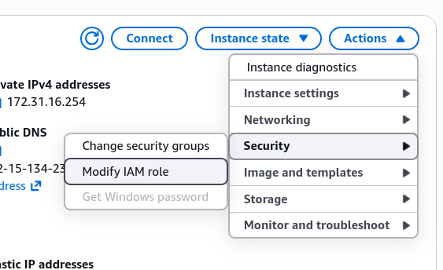
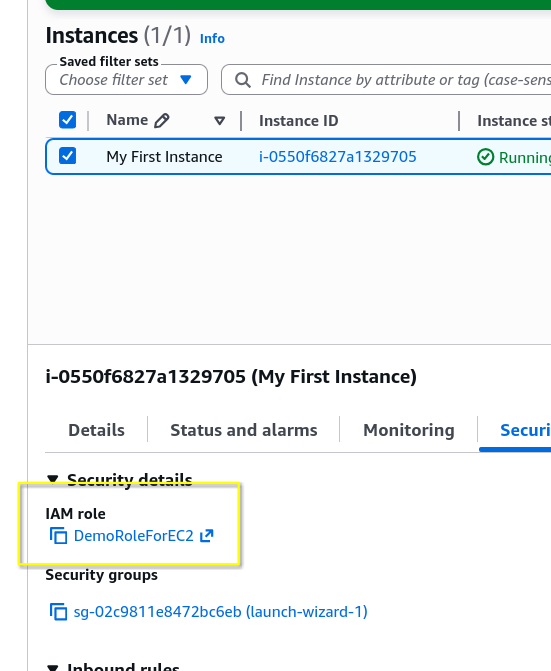
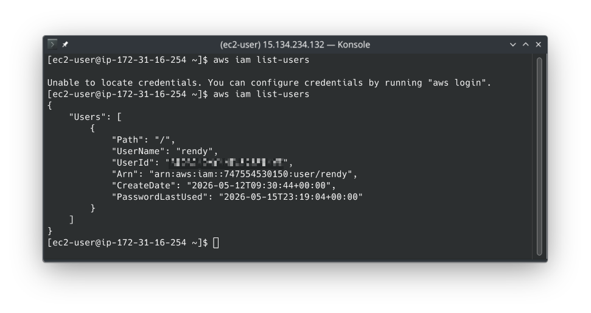

# EC2 Instance Roles Demo

One thing to remember from this section is **Never, ever bake hardcoded API keys into an EC2 instance**. The absolute gold standard is to use IAM Roles.

## Key takeaways

- **The Right Way Vs. The Wrong Way**:
  - **The Wrong Way**: Running `aws configure` and pasting your personal `Access Key ID` and `Secret Access Key` directly onto the instance is a massive security hazard. If someone else logs into that server, they can easily steal your credentials.
  - **The Right Way**: You create an IAM Role, with the specific permissions needed, then attach that role directly to the EC2 instance via the AWS Console. (Actions > Security > Modify IAM Role).
    
- **How the Instance Retrieve Credentials**:
  - Zero configuration: You notice that you didn't need to restart the machine or SSH session. The AWS CLI automatically knows to look at the **Instance Metadata Service** to grab temporary security credentials provided by that role.  
    
- **Permissions are Dynamic**:
  - **Real-time Changes**: Permissions are linked directly to the role, not hard-coded into the machine. When you add/remove permissions from the role, the instance immediately gets those changes without needing a reboot or reconfiguration.
    
