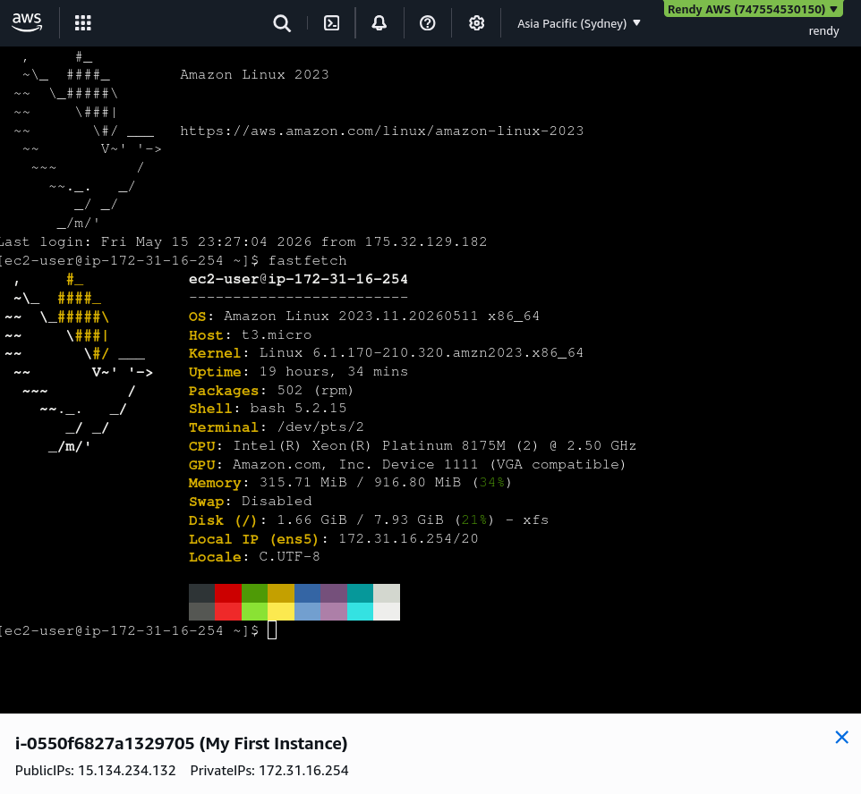

# EC2 Instance Connect

An alternative to SSH that allows you to connect to your EC2 instances directly from the AWS Management Console without needing a key pair.

## Key takeaways

- **Easy Instant Access**: No need to provide `.pem` or `.ppk` files to use it. No need to configure file permissions or your local SSH client.
- **How it works**: When you click "Connect" in the EC2 console, AWS dynamically creates a **temporary SSH key** behind the scenses, pushes it to your instance, and lets you in automatically.
- Remember it's still just SSH under the hood, so your SG must still allow inbound traffic on port **22**.
- If there's still a problem even with Instant Connect, make sure you have both IPv4(`0.0.0.0/0`) and IPv6(`::/0`) allowed for SSH in your SG rules.
  
