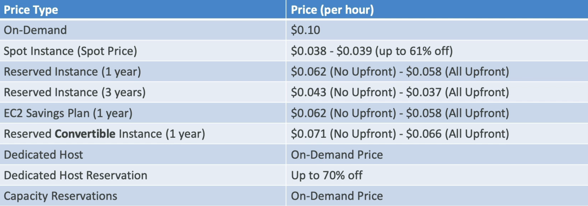

# EC2 Instance Purchasing Options

The "Purchasing Options" looks a bit confusing at first, but at it's core, it's just different ways how to get discounts on EC2 instances and pick the right option based on the workloads.

## Key takeaways

- **The On-Demand Baseline**:
  - **The Vibe**: Pay for what you use by the second (after the fist minute for Linux/Windows).
  - **Pros/Cons**: Highest cost, but absolute freedom, no upfront payments, no long-term commitments.
  - **Best For**: Short-term, unpredictable workloads that cannot be interrupted.
- **Comitted to Long Workloads (1/3 years)**: If your app is running 24/7 (like a production database), going On-Demand is a massive waste of cash. Instead, use these:
  - **Reserved Instances (RI)**: You commit to a specific instance config (OS, region, type) for up to 72% off.
    - _Convertible RI_: Gives you up to 66% off but lets you swap instance families or OS types over time if your tech stack changes.
  - **Saving Plans**: The modern way. Instead of committing to specific hardware specs, you commit to a **dollar amount per hour** (e.g., $10/hour). It's way more flexible across different instance sizes, OS, and sizes while giving the same 72% discount.
- **The "High Risk, High Reward" Move**:
  - **Spot Instances**: Think of these as AWS clearing out its "empty hotel rooms" for dirt cheap. You can get up to **90% off**.
  - **The Catch**: AWS can reclaim (terminate) your instance at any time with only a 2-minute warning if someone else bids higher or they need the capacity back.
  - **Best For**: Fault-tolerant, batch-processing jobs, data analysis, or image rendering. **Never** put a critical app or database n Spot instance.
- **Physical Isolation**: Compliance & Licensing
  - **Dedicated Instances**: You run on hardware that is physically seperated from other AWS customers, but you don't control the exact placement of your VMs.
  - **Dedicated Hosts**: You rent the entire physical server box. You have an absolute control over hardware configuration and instance placement.
    - **Use case**: The only reason to use this is if you have strict compliance requirements or need to bring your own licenses (BYOL) for software that doesn't allow multi-tenant environments.
- **Capacity Reservations**: No discount
  - You pay full on-demand price to "lock down" a room in a specific AZ so you are guaranteed to have it when you launch your app.
  - **The Catch**: You are billed for it whether you are running an instance or not. It doesn't save you money; it just guarantees you won't hit an "out of capacity" error during peak events.

## Quick Cheat Sheet for Exam

| If the scenario says...                                  | Your answer should be...            |
| -------------------------------------------------------- | ----------------------------------- |
| "Predictable, steady-state app running long-term"        | Reserved Instances or Savings Plans |
| "Batch processing / stateless / cheap as possible"       | Spot Instances                      |
| "Bring Your Own License (BYOL) / Per-core billing"       | Dedicated Hosts                     |
| "Testing a new app / short-term / unpredictable traffic" | On-Demand                           |

## Price Comparison Example
Price comparison example for `m4.large` in `us-east-1` (N. Virginia):

