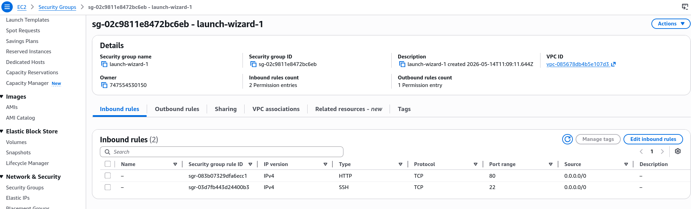

# Security Groups Hands-on

Where we basically break our website on purpose to show how much power security groups have in controlling traffic to our EC2 instances.

## Key takeaways

- **The "Timeout" Rule of Thumb**:
  - **The Symptom**: If you refresh your browser and see te "infinite loading" spinner, that is a Timeout.
  - **The Cause**: We learn that this is **100% a Security Group issue**. When we deleted the Port 80 (HTTP) rule, the instance didn't say "Go Away", it just ignored the request. The browser kept waiting for a response that never came, resulting in a timeout.
    **The Fix**: Add back the rile (Port 80 for HTTP) and the site instantly reachable again.
    
- **SGs are Many-to-Many**:
  - **Multipe SGs per Instance**: You can stack them. If you have an SG for "Web Traffic" and another for "Admin SSH" you can attach both to one instance.
  - **Multiple Instances per SG**: One "Launch Wizard" group can be reused for 50 difference servers.
  - **Additive Logic**: The ruls simply add up. If SG-A allows port 80 and SG-B allows port 22, the instance now allows both.
- **Source Selection: "Anywhere" vs. "My IP"**:
  - **Anywhere (`0.0.0.0/0`)**: Opens the door to the entire internet. Great for web servers, terrible for SSH.
  - **My IP**: A shortcut in the console that detects your current public IP.
  - **Pro-tip**: If you choose "My IP" but your IP changes (e.g., I need to pay extra for a static IP in my case or I access from different networks/locations), you will get a **Timeout**. You have to update the rule from the console.
- **Outbound is "Wide Open"**:
  - By default, the **Outbound rules** allow all traffic to go anywhere.
  - This is how our User Data script was able to download the `httpd` package from the internet during bootstrapping, the instance was allowed to talk to the outside world.
