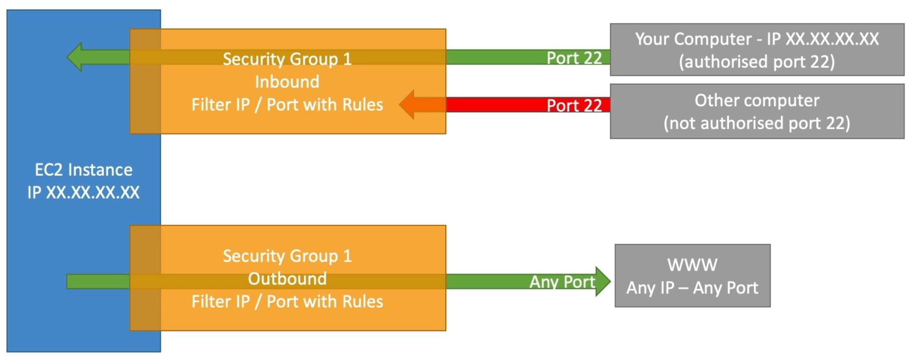
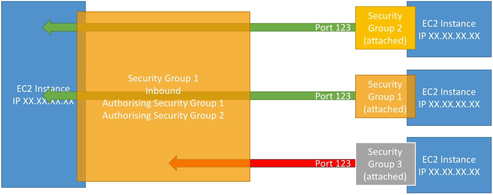

# Security Groups & Classic Ports Overview

Think of **Security Groups** as the "bouncers" of my AWS club. If you aren't in the list| you aren't getting in.

## Key takeaways

- **The Core Concept**:
  - **Default Rule**: Security Groups (SGs) are **deny by default** for inbound traffic. You can only add **Allow** rules| you can't explicitly "block" specific IP (you can| however| block traffic at the network ACL level| but that's a topic for another day). For outbound traffic| it's the opposite: **allow by default**| so you have to add rules to block specific traffic.
  - **Stateful**: This one is important for the exam. If traffic is allowed _in_| it's automatically allowed _out_.
  - **Outside the Box**: SGs live outside the EC2 instance. If the bouncer blocks someone| EC2 doesn't even know they tried to get in.  
    
- **Troubleshooting: Timeout vs Connection Refused**:
  - **Timeout (Infinite Loading)**: This is almost always a **Security Group issue**. The traffic is being dropped before it even hits the server.
  - **Connection Refused**: The security group actually **let the traffic through**| but nothing was listening on that port or app crashed. This is an **Instance/OS issue**.
    
- **Referencing Security Groups**:
  - Instead of whitelisting specific IP address (which change all the time)| you can allow in **Security Group 1** to allow inbound traffic from **Security Group 2**. This is super useful for allowing communication between different layers of an application (e.g| web servers talking to database servers) without exposing them to the internet.
    
    Why this is useful? Let's say you have 100 web servers| you don't need to know their IPs. You just tell the database SG to allow traffic from the web server SG| and any instance that belongs to the web server SG can talk to the database servers.
- **Essential Ports**
  |Port|Protocol|Purpose|
  |---|---|---|
  |22|SSH / SFTP|Log into Linux instances or secure file transfer.|
  |80|HTTP|Standard web traffic (unsecured).|
  |443|HTTPS|Secure web traffic (the standard).|
  |3389|RDP|Remote Desktop—how you log into Windows instances.|
