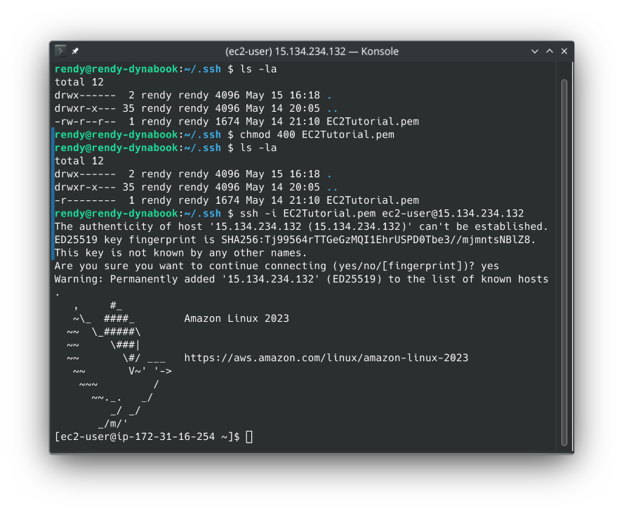

# SSH

This is where we get to fun part, some people say it's notorious for being a headache, but I am confident that after this, you'll be SSHing with your eyes closed.

## Overview

- **The SSH Landscape**: Your computer OS dictates the SSH client you use.
  | OS | SSH | Putty | EC2 Instance Connect|
  |---|---|---|---|
  |Linux|✅| | ✅|
  |Mac|✅| | ✅|
  |Windows >= 10|✅|✅| ✅|
  |Older Windows| |✅|✅|

  Mac/Linux/Windows 10+ have built-in SSH CLI. Older Windows, you'll need to install PuTTY.  
  EC2 Instance Connect is browser-based tool. It's the easiest way because it works on everything and doesn't require any setup.

- **Troubleshooting**: Stephane said a lot of student struggle to get this working, here are some tips:
  - **SGs**: Did you actually open port 22?
  - **IP Whitelisting**: If you used "My IP" option, did your internet connection change?
  - **The Key File**: are you using the correct `.pem` or `.ppk` file you downloaded during instance creation?
  - **Typos**: One wrong character in the IP address or username can cause connection issues.
- **The "One is Enough" Rule**: You don't need to make all three working. Find the one that works for you (Likely SSH or EC2 Instance Connect) and stick with it. If you can get a shell prompt, you've won.

## SSH using Linux or Mac

- **Directory Matters**: You must be in the same folder as your `.pem` file when you run the command, or you have to provide the full path to the file. For example, I have created a special directory `.ssh` in my home folder to store all my SSH keys.
- **No Spaces**: Stephane's tip: Remove any spaces from the file name of the key pair.
- **Double check SG**: Just to be sure, check that port **22** is open to your IP.
- **Permission Denied**: SSH is very strict about file permission. If your key file is "too open", SSH will refuse to use it for security reason. Change the permission to `chmod 400 your-key.pem` to make it readable only by you.
- **Instance IP Address**: Find your instance's public IP address from the EC2 console. We will need it shortly.
- **The Command**: Once your permission is set and you're in the right directory, the magic command is:

  ```bash title="SSH Command"
  ssh -i your-key.pem ec2-user@<Your-Public-IP>
  ```

  You'll likely see "The authenticity of host..." for the first time when you connect. Just type `yes` to add it to you `known_hosts` file.



- **Confirming You're In**: You know you're in when your terminal prompt changes to something like `[ec2-user@ip-1721-31-xx-xx ~]$`
  - `whoami` should return `ec2-user`
  - `exit` to kill the session and return to your local terminal.
