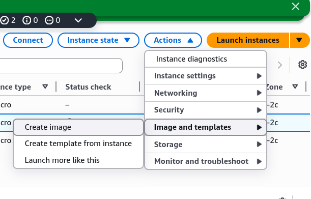
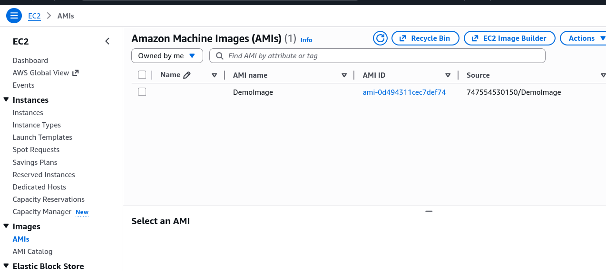
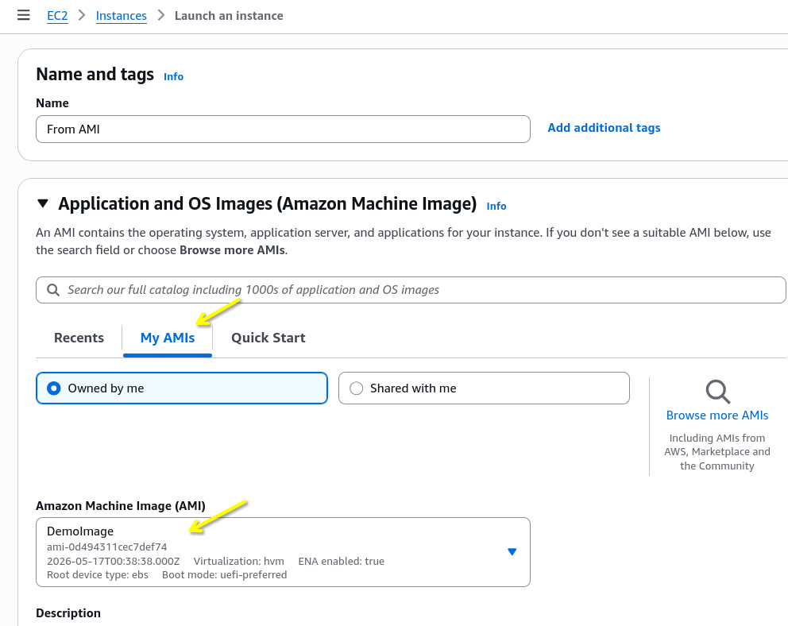

# AMI Hands-On

Stephane explicitly demonstrates the massive performance difference between bootstrapping a raw machine versus launching from a pre-baked image.

## Key Takeaways

### The Strategy: Semi-bootstrapping

- **The Blueprint**: Instead of doing everything via User Data, you can split the work into two phases. First, we launch a base instance and uses the first few lines of the user data script to download and install the Apache web server (`httpd`).
- **The Intentional Delay**: Even when the console says the instance state is `running`, it takes **1 to 2 minutes** for the user data script to finish executing in the background. If you hot the IP too fast, you will get a `Connection Refused` error.

```bash title="User Data Script for Base Instance"
#!/bin/bash
# Use this for your user data (script from top to bottom)
# install httpd (Linux 2 version)
yum update -y
yum install -y httpd
systemctl start httpd
systemctl enable httpd
```

### Baking the Custom AMI

- **The Capture**: Once the Apache test page is verified live, click **Actions > Images and templates > Create Image**.
- **Behind the Scenes**: This registers a custom AMI in your account under the **Pending** status while AWS packages the root volume's underlying EBS snapshot.
  

---


Custom AMI created from the instance

### Launching from the custom AMI

When launching a brand-new instance using your newly minted image, the workflow shifts:

- **Where to find it**: In the launch console, you skip the default Quick Starts and Click the "My AMIs" tab to select your template.
- **Lean User Data**: In the advanced details, you only include the code to echo the "Hello World" index file. You **do not** write the commands to reinstall `httpd`.
- **The Speed-Up**: Because Apache is already backed directly into the AMI's file system, the new instance skips the installation download entirely. The moment the instance hits the `running` state, the web server is live immediately.

---


Now we can launch a new instance from the custom AMI, and it will be up and running with Apache in seconds without waiting for user data to finish.

---

```bash title="User Data Script for Custom AMI"
#!/bin/bash
echo "<h1>Hello World from $(hostname -f)</h1>" > /var/www/html/index.html
```

We don't need to include the installation commands in the user data script anymore, since everything is pre-packaged in the AMI. This is the key advantage of using custom AMIs for faster boot times.

---

## Exam Tips

**Bootstrapping vs Golden AMI**: The exam will constantly test your understanding of this trade-off.

- **User Data (Bootstrapping)**: Slow boot times (waiting 2+ minutes for updates/packages to install). Bad for rapid scaling.
- **Custom AMI (Golden Image)**: Fast boot times (everything is pre-installed). **This is the correct architectural choice for Auto Scaling Group (ASG) that needs to react quickly to traffic spikes.**
