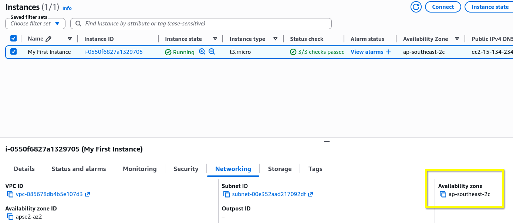
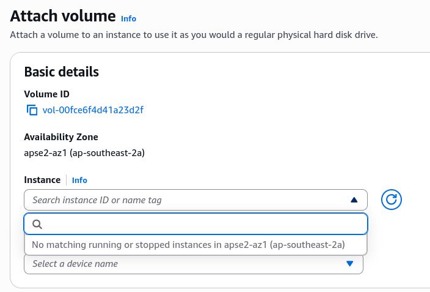
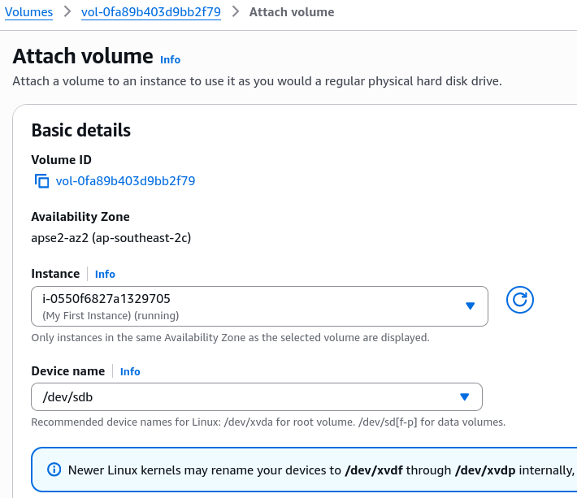
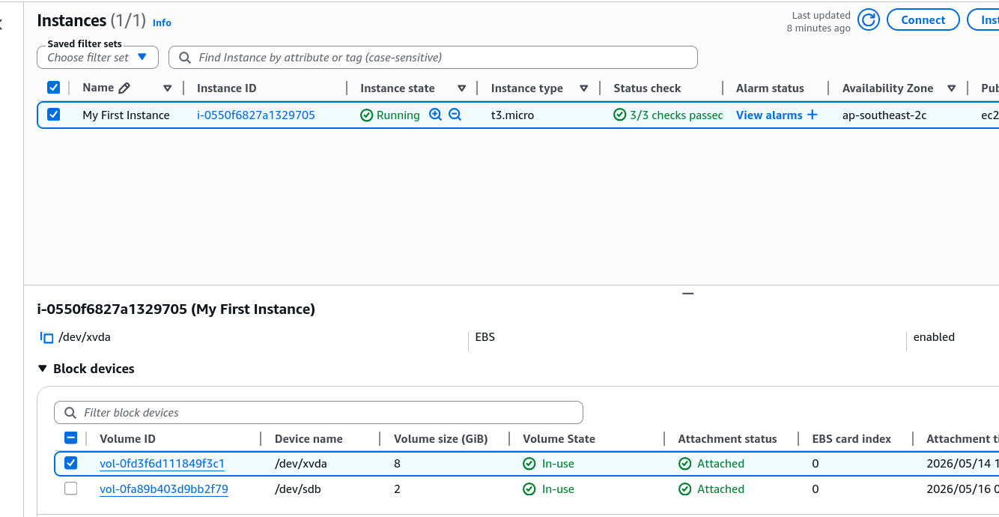

# EBS Hands-On

Show and tell for how Elastic Block Store (EBS) volume behave in the real world.

## Key Takeaways

- **The Strict AZ-Lock Rule**: Just a quick reminder that Region is a collection of Availability Zones (AZs). So we need to make sure our EBS volume and EC2 instance are in the same AZ. For example, my instance is in `ap-souteast-2c`.
  
  - **The Experiment**: When I create a 1 GB EBS volume in `ap-southeast-2a` and try to attach it to my instance in `ap-southeast-2c`, the console straight up hide the instance from the dropdown list.
    
  - **Takeaway**: EBS volumes are strictly bound to their specific **Availability Zone (AZ)**. If the drive and the server aren't in the exact same AZ, they can't talk.
- **Multi-Drive Capability (The USB Stick Analogy)**:
  - **The Setup**: You can easily stack multiple EBS volumes onto a single EC2 instance, I am able to follow Stephane example of adding a secondary 2 GB data drive.
  - **The Catch**: Just because you attached the volume in the AWS Console doesn't mean it's ready to use. In the real world, you still have to log into the Linux OS, format the drive, and mount it to a directory. Follow [AWS Documentation](https://docs.aws.amazon.com/ebs/latest/userguide/ebs-using-volumes.html) for the step-by-step instructions. Stephane mention that the formatting is out of scope for the course, but skimming through the documentation, it appears similar how you would format and mount a physical drive on a regular Linux machine.

### Attaching EBS Volume to EC2 Instance in the Same AZ

### Results in the Console

- **Delete on Termination**: This is the most important part of the hands-on.
  - **Root Volume**: Had `Delete on Termination` enabled by default. This is AWS default for root drive. The second the instance terminates, this volume is permanently deleted from the account.
  - **Secondary Volume**: Had `Delete on Termination` disabled by default. When the instance dies, this drive survives, detaches itseld, and change its status to `available`.
- **The "Ghost Volume" Financial Trap**:
  - **Beware**: After the instance is terminated, that secondary EBS volume is still floating around in the console.
  - **The Rule**: AWS charges you for provisioned storate whether it's attached to an instance or not.

## Exam Tips

If a scenario question asks how to keep your application data safe when an auto-scaling group scales down or terminates instances, the answer is to make sure your data volume have `Delete on Termination` set to `False`, or use decoupled storage like S3/EFS.
