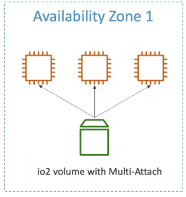

# EBS Multi-Attach

**EBS Multi-Attach** is a feature that allows a single EBS volume to be attached to multiple EC2 instances simultaneously.

## Key Takeaways

### The Core Mechanic

- **Breaking the Rule**: Normally, an EBS volume is stricty tied 1:1 to a single EC2 isntance. Multi-Attach completely shatters this constraint by letting you hook up the **exact same EBS volume to multiple EC2 instances at the same time**.
- **Full Permissions**: Every single attached instance get concurrent, full **Read and Write** access to raw volume block simultaneously.

### Strict Limitations (The Filter Criteria)

To use multi-attach, your architecture must check some incredibly strict boxes:

- **The Family Constrant**: It is **exclusively available** for the provisioned IOPS families (`io1` and `io2`). You _cannot_ use it with `gp2`, `gp3` or HDD volumes.
- **AZ Locked**: Even with multi-attached turned on, the volume is still completely bound to a single AZ. All instances sharing the drive **must** reside in the exact same AZ.  
  
- **The Magic Number (16)**: You can concurrently attach the shared volume to a maximum of \*_16 EC2 instances_ at any one time.
- **Hardware Requirement**: Under the hood, this only works on **AWS Nitro System-based** EC2 instances, which means you need to be using a Nitro-based instance type (e.g., `c5`, `m5`, `r5`, etc.) to take advantage of this feature.

### The Developer Responsibility:Cluster-Aware Filesystems

- **Data Corruption Trap**: Standard file systems (like Linux `ext4` or `XFS`) have no idea that other computers are writing to the exact same disk blocks. If two instances try to write to the same sector simultaneously using standard file systems, your data will get instantly corrupted.
- **The Fix**: You **must** deploy a **cluster-aware file system** (Like `GFS2` or `OCFS2` on Linux) or let a cluster volume manager handle concurrent write operations at the application layer.

### Ideal Use Cases

- Clustered Linux Applications (e.g., Teradata setups)
- Active-active or active-standby application architectures require rapid, zero-delay storage failover.
- Applicaitons explicitly engineered to handle concurrent write operations at the software layer.

## Exam Tips

- If the question says **"Clustered Linux Application", "Concurrent raw block storage writes"** or **"lowest block-level latency"** look for **EBS Multi-Attach (`io1`/ `io2`)**.
