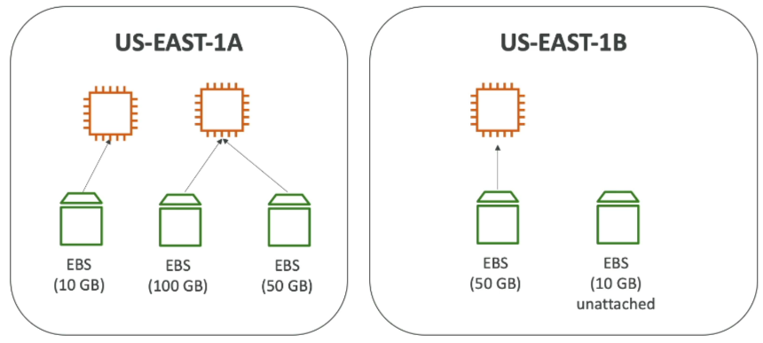

# EBS Overview

Stephane's analogy that it's like a "network USB stick", is perfect to make us understand the concept of EBS. There is one major detail that Stephan mention that it can only "be mounted one instance at a time" is a constraint for the CCP level exam, for a Developer, there's an exception to this rule.

## Key Takeaways

- **The Core Mechanics**:
  - **What is is**: Elastic Block Store (EBS) is a _network drive_ (not a physical drive directly inside the host). Because it talks over the network, it can introduce a tiny bit of latency compared to hardware-attached storage.
  - **The Blueprint**: It allows you to persist data. If your EC2 instance crashes or gets terminated, the data on your EBS volume stays safe and can be remounted onto brand-new instace.
  - **AZ Locked**: EBS volumes are strictly bound to a single **Availability Zone (AZ)**. An EBS volume created in `ap-southeast-2a` (Sydney AZ 1) **cannot** be directly attached to an EC2 instance sitting in `ap-southeast-2b` (Sydney AZ 2). To move it, you have to take a **Snapshot** first.
    
- **DVA-C02 Level Exception**:
  - While standard EBS volumes hook up 1:1 with an instance, AWS has a developer feature called **EBS Multi-Attach**.
  - This lets you attach a single EBS volume to multiple EC2 instances at the same time, we will cover this in the upcoming section.
- **Provisioning & Billing**
  - You must define your capacity (Gigabytes) and your **IOPS** (Input/Output Operations per Second) ahead of time.
  - **The Catch**: You are billed for what you **provision**, not what you actually use. If you allocate a 100GB volume and only write 2GB of code to it, you're still paying for all 100GB. You can dynamically increase the size later if your app grows.
- **Delete on Termination Attribute**: This is a classic exam "gotcha".
  - **Root Volume**: The primary drive containing the OS. By default, **Delete on Termination is ENABLED**. When you terminate the EC2 instance, the root drive gets wiped instantly.
  - **Extra Volumes**: Any secondary data drives you attach later. By default, **Delete on Termination is DISABLED**. If you kill the instance, these volume persist in your account (and keep racking up charges until you delete them manually).
  - You can override these defaults in the Console/CLI at launch time to preserve logs or database files on the root volume when an instance is torn down.
