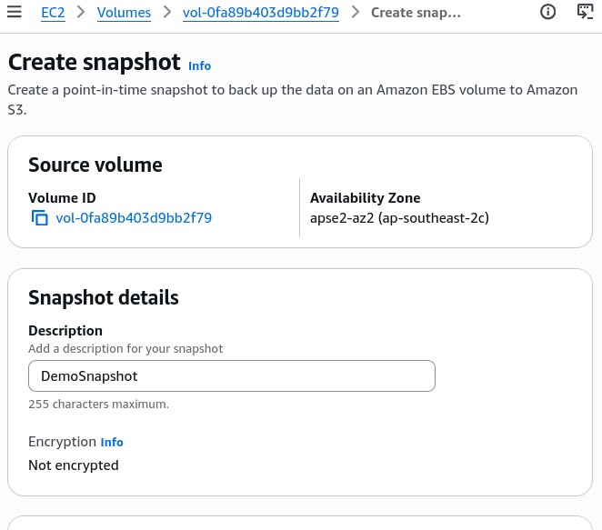
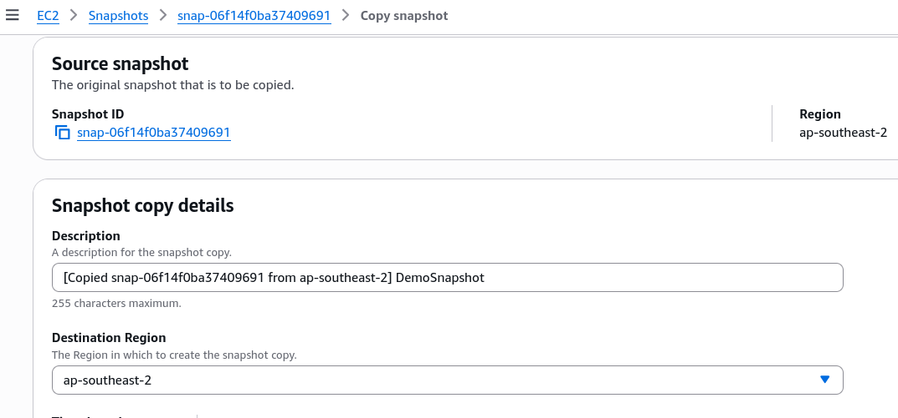
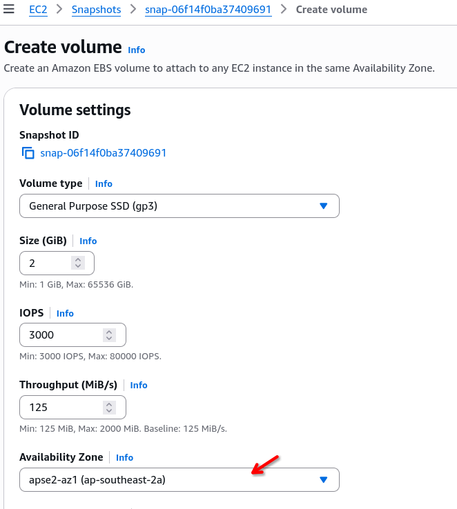
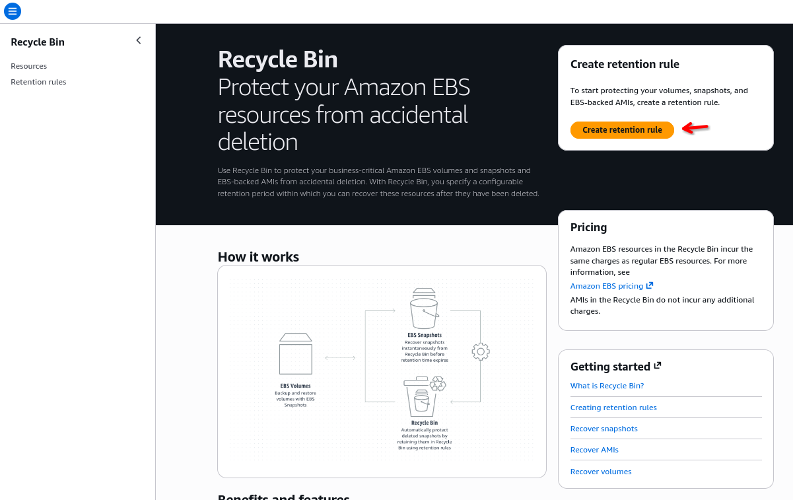
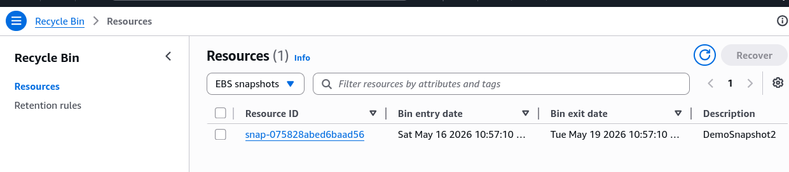

# EBS Snapshot - Hands-on

This hands-on session cover the steps for managing EBS snapshots, as well introduces the practical setup for the **Recycle Bin**.  

## Key Takeaways

### Cross-Region Copying & Disaster Recovery (DR)

- **The Action**: Snapshots can be copied directly to any destination AWS region via the console/API.
- **The Use Case**: This is a fundamental mechanic for building **Cross-region Disaster Recovery (DR)** strategies, ensuring data durability outside of your primary operating region.
  

### Restoring and Migrating Across AZs

- **The Action**: When creating a brand-new EBS volume from an existing snapshot, you can manually override and select any target AZ within that region (e.g., shifting from `ap-southeast-2a` to `ap-southeast-2b`).
- **The Use Case**: This is the standard method for migrating data across AZs, since EBS volumes are locked to a single AZ.  
  

### Recycle Bin and Retention Rules

- **The Feature**: The Recycle Bin aces as a buffer layer against accidental deletion for both **EBS Snapshots** and **AMIs (AMazon Machine Images)**.
- **Configuration**: You must create a **retention rule** (e.g., setting a retention period like 1 day) and apply it to your resources.
- **Rule Lock Setting**: Leaving a rule "unlocked" means you retain the administrative privilege to delete the rule itself later.
- **The Recovery Workflow**: Deleting a snapshot while a rule is active moves it to the Recycle Bin instead of vaporizing it. From there, you can issue a `Recover` command to restore it instantly to your active EC2 snapshot list.

## 

---

### Storage Tiering (Standard vs Archive)

- **Standard Tier**: The default fast-access tier for active snapshots.
- **Archive Tier**: Moc=ving a snapshot to the archive tier alter its pricing level (making it up to 75% cheaper), but changes the restoration performance constraint. You lose immediate access and must accept a **24 to 72-hourdelay** to restore the data back to usefulness.

## Exam Tip

If a question asks how to implement a safeguard against accidental developer deletion of deployment images or database backups without managing complex custom backup scripts, look for **AWS Recycle Bin retention rules** mapped to snapshots and AMIs.
