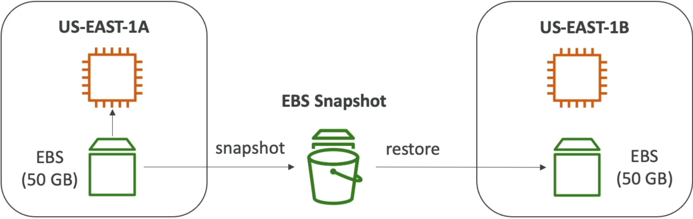

# EBS Snapshot

If an EBS volume is a "USB stick", a snapshot is like taking a full digital backup image of that stick and saving it in a global vault.

## Key Takeaways

### Snapshot Basics & Migration Mechanics

- **Point-in-Time Backup**: A snapshot captures the exact state of your EBS volume at a specific moment.
- **Live Snapshots**: You do _not_ have to detach the volume from a running instance to take a snapshot, though doing so is recommended to ensure data consistency.
- **Bypassing the AZ Lock**: Because EBS volumes are locked to a single AZ, taking snapshot is te standard method to clone or move volume's data to a different AZ or an entirely different AWS region.
  

### EBS Snapshot Archive Tier

- **Cost Optimization**: You can move long-term, rarely accessed snapshots to an archive tier for a massive discount (up to 75% cheaper).
- **Trade-off**: This is not an immediate restore. It takes **24 to 72 hours** to retrieve and restore an archived snapshot.
- _Exam-tip_: If a scenario asks for immediate recovery or a low **Recovery Time Objective (RTO)**, the arhive tier is the wrong answer.

### Recycle Bin for EBS Snapshots

- **Accidental Deletion Protection**: Instead of instantly deleting a snapshot permanently, you can configure them to go into a _Recycle Bin_ first.
- **Retention Configuration**: You can set the rules to keep deleted snapshots available for recovery anywhere from **1 day to 1 year**.

### Fast Snapshot Restore (FSR)

- **Eliminating Latency**: Standard EBS volumes restored from snapshots experience a performance hit (pre-warming latency) the first time each block of data is accessed. FSR forces full initialization immediately so the volume delivers maximum performance on day one.
- **The Catch**: It is great for large snapshots or rapidly scaling workloads, but it is highly expensive.
- _Exam-tip_: Look for FSR in question dealing with performance optimization, minimizing initialization for large data sets, or fast-scaling microservices.
