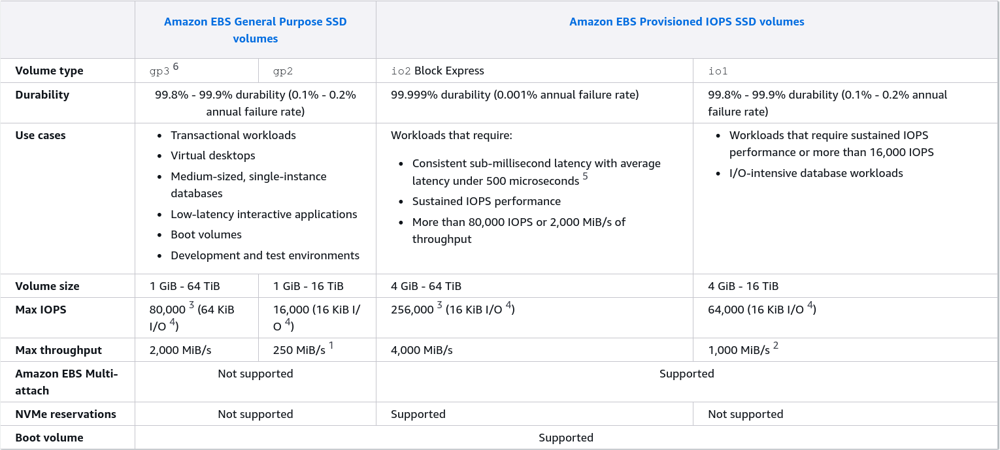
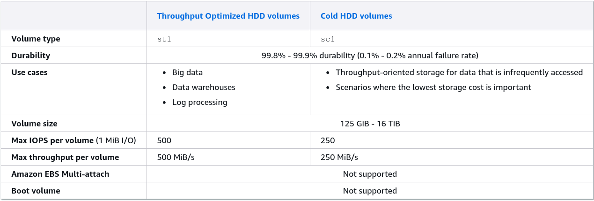

# EBS Volume Types

A guide to picking the right storage drive based on performance needs and cost considerations.

## Key Takeaways

### The Boot Volume Constraint

- **The Rule**: Only **SSD-based** volumes can be used as root/boot volumes to run the operating system.
- **Allowed**: `gp2`, `gp3`, `io1` and `io2`.
- **Banned**: `st1` (Throughput Optimized) and `sc1` (Cold HDD) **cannot** be used to boot an instance under any circumstances.

### General Purpose SSDs: gp2 vs. gp3

- **gp2 (Older gen)**: Storage size and performance are **linked**. If you want more IOPS, you are forced to pay for a bigger volume size (you get 3 IOPS per GB up to a max of 16,000 IOPS).
- **gp3 (Newer gen)**: Storage size and performance are **decoupled**. It gives you a baseline of 3,000 IOPS and 125 MB/s throughput out of the box, and you can scale those performance numbers up independently without buying more gigabytes.
- _Use Cases_: Dev/test environment, virtual desktop, low-latency web server backends.

### Provisioned IOPS SSDs: io1 vs io2 Block Express

WHen `gp3` isn't fast enough and you need sustained mission-critical performance:

- **The Metrics**: Use these if you need **more than 16,000 IOPS** per volume. `io1` maxes out at 64,000 IOPS, while `io2 Block Express` goes wild up to **256,000 IOPS** with sub-millisecond latency.
- **Developer Superpower**: Only the `io1` and `io2` families support **EBS Multi-Attach** (allowing the raw network rive to be hooked up to multiple Nitro instances at once).
- _Use Cases_: Critical business applications, heavy write relational databases (like large PostgreSQL or MySQL setups).

### Hard Disk Drives (HDDs): st1 vs sc1

These are completely focused on **Throughput (MB/s)** rather than IOPS (speed of small reads/writes).

- **st1 (throughput optimized)**: Built for processing massive, sequential blocks of data fast.
  - _Use Cases_: **Big data, data warehousing, MapReduce, Log processing/aggregation**.
- **sc1 (cold HDD)**: The absolute lowest cost block storage option on AWS. Designed for data you don't touch often.
  - _Use Cases_: **Infrequently accessed archives, cold storage backup files.**

## Exam Tips

**The Database Clue**: If an exam question describes a high-performance database cluster running on EC2 that needs consistent, ultra-low latency and maximum storage performance, skip `gp3` and look for **provisioned IOPS** (`io1` or `io2`).

**The Big Data Clue**: If the scenario mentions streaming massive log files, running Apache Kafka/Hadoop clusters, or streaming big data processing workloads where _cost efficiency_ for _large streams_ matters most, look for **Throughput Optimized HDD (`st1`)**.

**The Cost Architecture Trap**: If a question asks how a developer can increase a volume IOPS without spending money on unneeded storage space, the correct answer is to switch from `gp2` to `gp3`, since `gp3` allows independent IOPS configuration.
