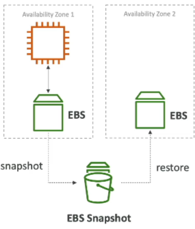
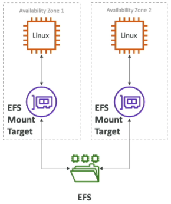

# EBS vs EFS

Let's reiterate the key differences between EBS and EFS

## Key Takeaways

### Amazon EBS (Elastic Block Store)

- **The Blueprint**: Acts like a network-attached USB stick. It is built strictly for 1:1 **mapping** with an EC2 instance.
- **The Multi-Attach Exception**: The only way to bypass the 1:1 rule is by using `io1` and `io2` volumes, which allow up to 16 Nitro instances to connect concurrently, but it's purely for highly specific clustered workloads.
- **AZ boundaries**: EBS is completely **locked to a single AZ**. If you want to move that data to another AZ, you _must_ take an EBS Snapshot first and restore it into the new target zone.  
  
- **Performance Scaling**:
  - On `gp2`, your IOPS are chained to the disk size (bigger disk = faster drive).
  - On `gp3` and `io1/io2`, you can scale your IOPS independently without buying more storage space.
- **Backup Caution**: Taking an EBS backup **consumes I/O capacity**. Avoid triggering snapshots during peak production traffic hours, or your app's performance could catch a massive lag.
- **Lifecycle Default**: When an isntance is terminated, its **root EBS is deleted by default**, though you can manually change this behavior.

### Amazon EFS (Elastic File System)

- **The Blueprint**: Acts like a massive, shared cloud network drive (like standard NAS storage).
- **The Scaling Flex**: It is built from the the ground up to be mounted concurrently by **hundreds or thousands of EC2 instances across multiple AZs** simultaneously.
- **OS Restriction**: It relies on the POSIX file system and the NDS protocol, meaning it is **exclusively compatible with Linux instances**.
- **Cost Control**: It carries a significantly higher price tag than EBS. However, you can neutralize this by using **Storage Tiers and Lifecycle Policies** to automatically drift old, untouch files into cheaper Infrequent Access (IA) or Archive storage.  
  

### EC2 Instance Store (Ephemeral Storage)

- **The Blueprint**: Physically attached directly to the underlying bare-metal hardware server hosting your virtual machine.
- **The Catch**: It is entirely **ephemeral**. If your instance encounter a hardware crash, gets stopped, or gets terminated, the data is instantly wiped out. It only lives as long as the instance stays active or undergoes a basic OS reboot.

## Exam Tips

| If the app needs...                                                                                                | Your choice is...  |
| ------------------------------------------------------------------------------------------------------------------ | ------------------ |
| "Core OS boot drive, local database storage, standard dev/test environments."                                      | Amazon EBS         |
| "Shared content management (WordPress), data sharing across thousands of Linux nodes in multiple AZs.",            | Amazon EFS         |
| "High-speed caching, temporary buffers, scratch space demanding millions of IOPS with zero care for persistence.", | EC2 Instance Store |
