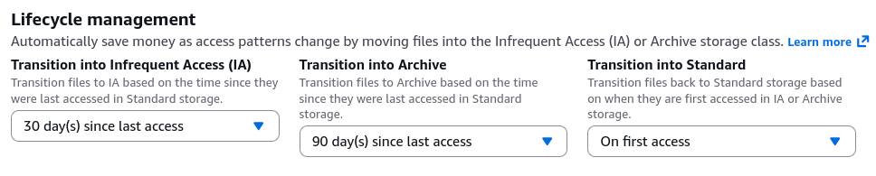
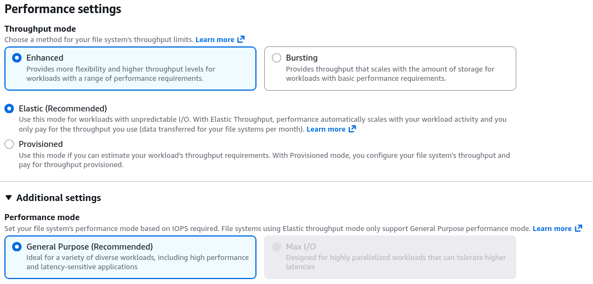
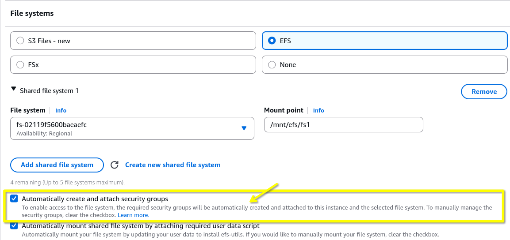
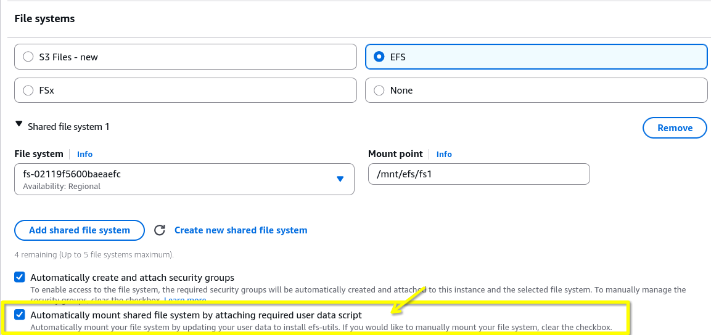
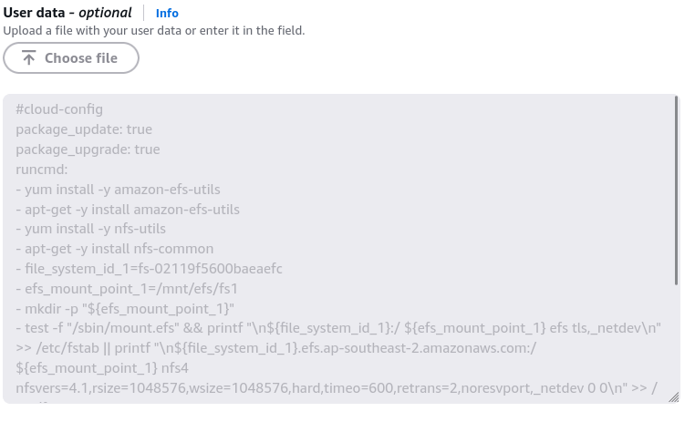

# EFS Hands-On

## Key Takeaways

### The Core Lifecycle Setup

- **The Restorative Logic**: Stephane demonstrates setting up policies to transition files into **Infrequent Access (IA)** or **Arhive** tiers bsed on age (e.g., 30 or 90 days of no activity). Critically, you can set an option to transition files **back to Standard on first access** if you expect them to be heavily reused once woken up.  
  
- **Throughput Decoupling**: Stephance clarifies the layout of the three modes: **Bursting** (scales with storage size), **Provisioned** (you pay to lock in a specific baseline speed), and **Elastic** (the modern recommended default that scales instantly from 0 to hundreds MB/s - perfect for unpredicable I/O).
  

### The Security Group Setup

- **The inbound rule**: For your EC2 instance to talk to EFS, the EFS mount targets must allow **NFS traffic on port 2049**.
- **Security Group referencing**: instead of whitelisting specific IP blocks, AWS automatically creates an EFS Security Group (`efs-sg-x`) that whitelist the **EC2 instance's security group ID** as the source.
  

### Automated bootstrapping via EC2 launch

- In the past, you had to log into Linux and type out mount commands manually.
- Now, you simply assign your subnet, check the **"Automatically mount EFS file system"** box in the EC2 wizard and define a mount point (like `/mnt/efs/fs1`).
- AWS handles the heavy lifting by injecting the exact required mount scripts directly into the instance's **User Data** automatically.
  
  ***
  

### Cross-AZ Live Verification

We can proves that EFS is truly multi-AZ by launching two EC2 instances in different AZs, mounting the same EFS file system on both.

- **Instance A**: Creates a new instance called `instance-a`, In the network settings, select the **Subnet** that belongs to `ap-southeast-2a`. Attach the EFS file system that you have created before and specify the mount point (e.g., `/mnt/efs/fs1`).
  - After the instance is up, SSH into it and create a new file
  ```bash
  echo "hello world" > /mnt/efs/fs1/hello.txt
  ```
- **Instance B**: Create another instance called `instance-b`, but this time select the **Subnet** that belongs to `ap-southeast-2b`. Attach the same EFS file system and specify the same mount point.
  - After the instance is up, SSH into it and check if the file created by `instance-a` is visible in `instance-b`
  ```bash
  cat /mnt/efs/fs1/hello.txt
  ```
- **The Takeaway**: This confirms true **concurrent multi-AZ reading and writing** over a POSIX-compliant file system.

## Clean-up

Stephane reminds us to clean up resources to avoid stray costs:

1. Termnate both EC2 instances (`instance-a` and `instance-b`).
2. Delete the EFS file system
3. Delete any security groups that were automatically created for EFS (e.g., `efs-sg-x` and `instace-sg-x`)
