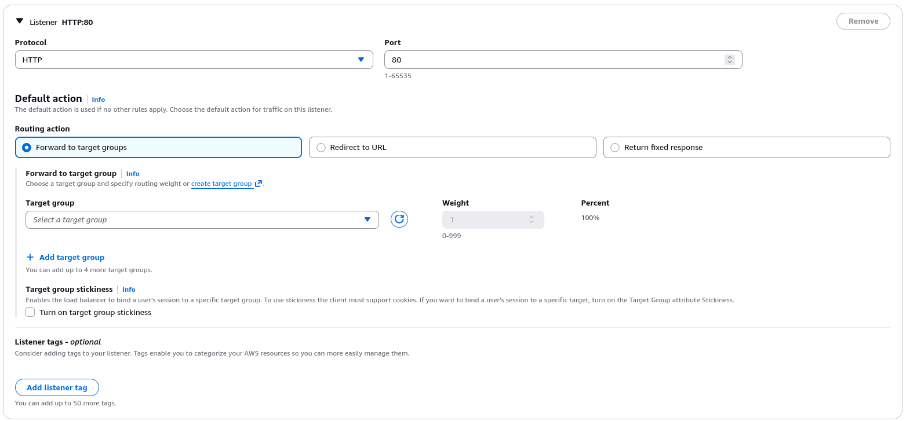
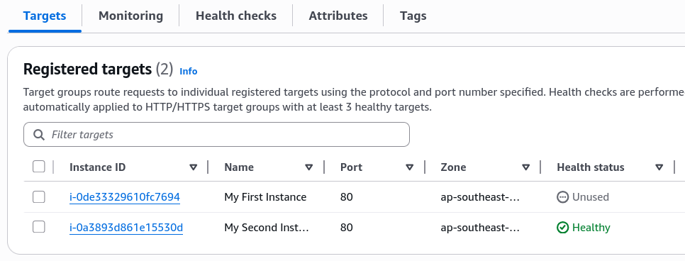
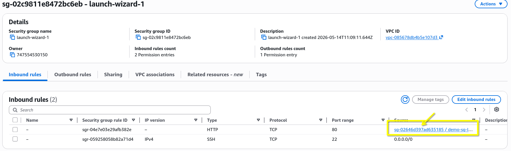

# Application Load Balancer (ALB) - Hands-On Part 1

By the end of this hands-on lab, you'll have a solid understanding how an ALB manages traffic distribution, dynamically handle server failure, and shields backend servers from public internet.

## Key Takeaways

### Unified Entry Point via DNS

- **The Problem**: We launched two EC2 instances with it we have two different public IPv4 addresses and distinct web pages.
- **The Fix**: The ALB provides a single, permanent **DNS Name** (e.g., `DemoALB-xxxx.amazonaws.com`). Users connect only to this single endpoint.
- **The Proof of Balancing**: When you hit the ALB's DNS name in a browser and repeatedly refresh the page, the underlying instance ID changes. This proves the ALB is actively round-robinning traffic across your backend fleet.

### High-Performance Load Balancer Comparison

Three tiers of AWS load balancers:

- **ALB**: Built for **HTTP and HTTPS** traffic at Layer 7
- **NLB**: Engineered for **TCP, UDP, and TLS** traffic at Layer 4. Choose this when you need **ultra-high performance, millions of requests per second**, and ultra-low latency.
- **GWLB**: Operates at Layer 3 (IP Protocol) to analyze raw network traffic, handle intrusion detection, and manage firewalls.

### Target Groups & Health Vetting Actions

- **The Layout**: You configure the listeners on the ALB (e.g., HTTP:80) to forward request to a **Target Group** (`demo-tg-alb`). The target groups holds the actual registered EC2 instances.
  
- **Dynamic Healing**: When you manually stop one of the EC2 instance, the target group's health check catches the failure. Its status shifts from `healthy` to `unhealthy` or `unused`, and the ALB automatically stop sending traffic to that instance.
- **The Traffic Shift**: The moment an instance is flagged as unhealthy, the ALB is smart enough to stop sending traffic to it. Users refreshing the page _only_ see responses from the remaining healthy server, preventing application downtime.
  
- **Automatic Recovery**: Once the stopped instance is started again and passes its initial warm-up phase (`initial`), the target group automatically marks it `healthy`, and the ALB immediately resumes routing traffic to it.

## Exam Tips

- **The Network Mapping Blueprint**: When creating an internet-facing ALB, you must select **at least two AZs (subnets)** in the region to launch it. This ensures the load balancer itself is highly available and can route traffic even if an entire AWS data center goes down completely offline.

- **The Security Group Lockdown**: This will be touched in the next lecture, but the ideal security group configuration for an ALB is to have the EC2 instance's security group only allow inbound traffic from the ALB's security group. This ensures that all traffic to the backend servers must pass through the ALB, preventing users from bypassing the load balancer and hitting the servers directly. This is a common exam question scenario, so make sure to understand this pattern.
  
