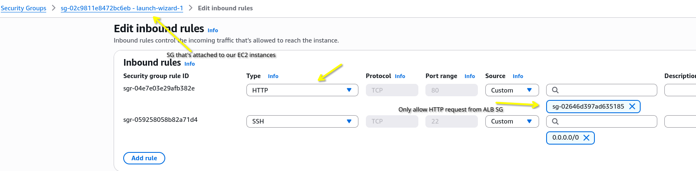
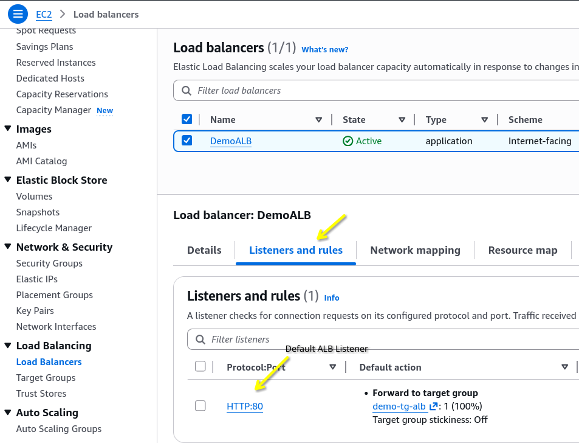
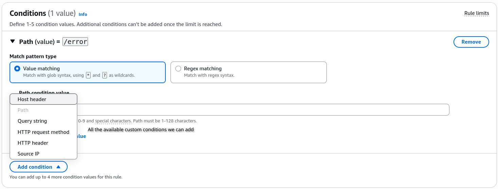
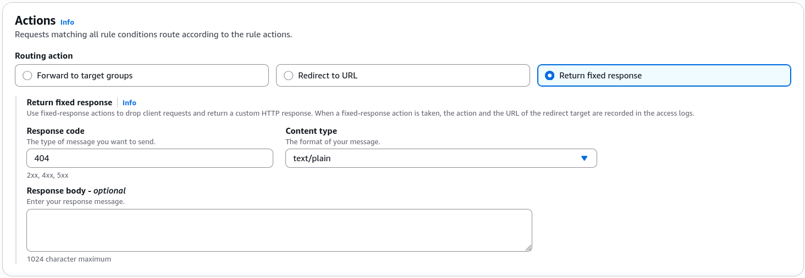
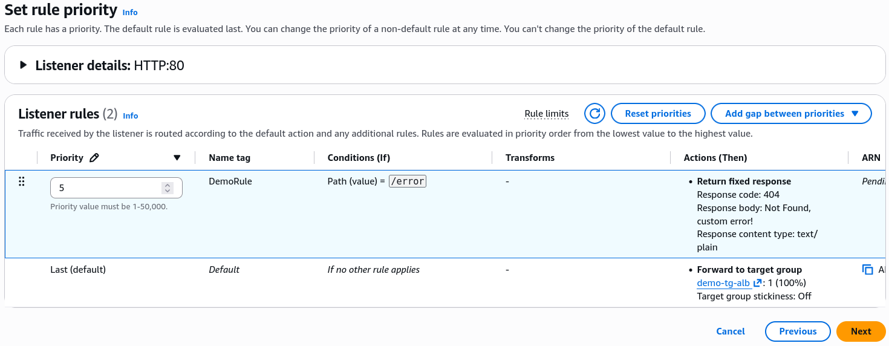

# Application Load Balancer (ALB) - Hands-On Part 2

In the second part of this hands-on lab, we dive deeper into tightening the security of our ALB and advanced listener rules.

## Key Takeaways

### Tightening Network Security (Security Group Chaining)

Before this step, your backend EC2 instances were exposed to the public internet because their Security Group had port 80 wide open to`0.0.0.0/0`.

By removing that rule and replacing the source with the **Load Balancer's Security Group ID**, you achieved a massive security win:

- **The Result**: Trying to access the EC2 instance directly via its public IPv3 address now completely **times out**. The front door is officially locked to the public.
- **The Magic**: The ALB can still talk to the instances perfectly fine. The isntances now implicitly trust _only_ traffic that has passed through and originated from the ALB.
  

### Advanced Listener Rules (Layer 7 Routing)

Every ALB comes with a **Default Rule** (a catch-all that forwards unmatched traffic to your main target group). In this lab, you added a custom conditional **Listener Rule** ahead of it:

- **The Condition**: `Path = /error` (Layer 7 path-based inspection).
  
- **The Action**: Instead of forwarding the request to a backends server, the ALB bypassed the instances entirely and natively generated a **Fixed Response** (`Status Code: 404`, Body: "Not Found", Content-Type: text/plain).
  
- **Rule Evaluation Priority**: AWS evaluates rules in order of their **Priority number** (e.g., Priority `5` gets evaluated before the catch-all default rule). As soon as a request matches a high-priority rule's condition, the ALB executes the action and stops evaluating further rules.
  

## Exam Tips

- **The Security Group Troubleshooting Scenario**: If a scenario says, "You chained your EC2 SG to allow inbound traffic only from the ALB's SG, but now your target group health checks are failing and reporting 0 healthy hosts,: look for an answer pointing to a broken outbound rule. The **ALB's SG must have an outbound rule that allows traffic out of the EC2 instances on the health check port**.

- **The Static Content Offloading Trap**: The exam loves to ask how to minimize load on backend EC2 instances when an application needs to server a static "Maintainance Underway" page or a customized "404 Not Found" page.
  - _The Wrong Move_" Writing custom routing logic inside your Express/Next.js/Java backend code
  - _The Correct Move_: **Configure an ALB listener rule to return a fixed response natively at the load balancer level**. This offloads the entire computing strain from your servers!.
