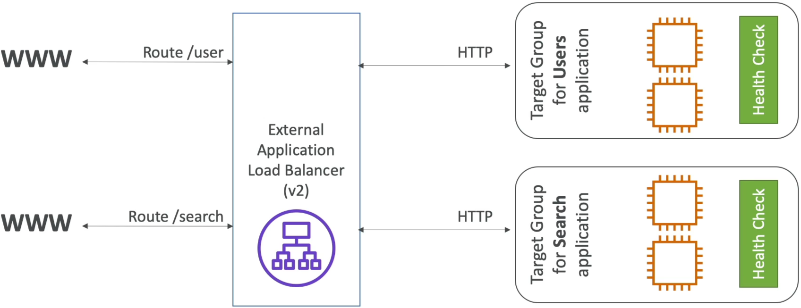
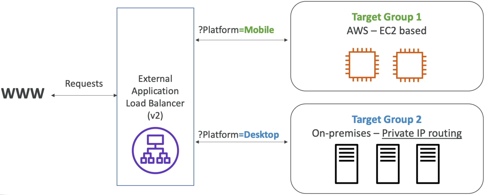
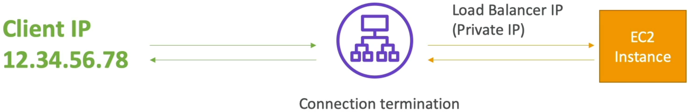

# Application Load Balancer (ALB)

This lecture marks the jump from generic traffic routing to intelligent, application-aware microservice management. ALB sits directly in front of modern containerized and serverless app stacks.

## Key Takeaways

### Layer 7 (Application)

Unlike lower-level network balancers, the ALB inspects the actual HTTP/HTTPS data inside the network packets. Because it can read your application headers and URLs, it can intelligently split traffic behind a **single fixed DNS host name** using **Listener Rles**:

- **Path-Based Routing**: Sending traffic to different target groups based on URL path (e.g., `res.id.au/api/users` routes to the user microservice, while `res.id.au/api/products` routes to the product microservice).
  
- **Host-Based Routing**: Routing based on the incoming domain name (e.g., `one.res.id.au` routes to target Group A, while `other.res.id.au` routes to Target Group B).
- **Query String & Header Routing**: Inspecting parameters right in the URL or request metadata (e.g., routing traffic to separate mobile or desktop target groups based on `?platform=mobile` or custom HTTP headers).
  

### Supported Target Groups

An ALB can forward requests to multiple types of downstream targets grouped into **Target Groups**:

- **EC2 Instances**: Standard servers (often managed dynamically by an Auto Scaling Group).
- **ECS Tasks**: Container instances running docker (ALB leverages port mapping to dynamically find and route traffic to randomly assigned container ports).
- **Lambda Function**: Allowing HTTP requests to natively trigger serverless, backend code execution.
- **Private IP Addresses**: Can route traffic to on-premises physical servers, provided they use private IP address routing.

### Native Redirection & Protocol Perks

- **HTTP to HTTPS Redirects**: You can handle SSL/TLS termination directly at the ALB layer and configure a rule to automatically bounce raw port 80 (HTTP) traffic to port 443 (HTTPS) without needing to set up redirection logic on your backend servers.
- **Modern Protocols**: Standard OOTB support for highly efficient **HTTP/2** and persistent, two-way connection streaming over **WebSockets**.

### Connection Termination & The Forwarded Headers

Because the ALB intercepts and terminates the incoming client connection, a major procy masking effect occurs:

- **The Masking Effect**: The backend EC2 instances _only_ see the private IP address of the load balancer as the source of incoming traffic.
- **The Solution**: To help your application code read the real client data for logging or security tracking, the ALB automatically injects three critical headers into the forwarded request:
  - `X-Forwarded-For`: Contains the true public IP address of the originating client.
  - `X-Forwarded-Proto`: The protocol the client used to connect (e.g., `HTTP` or `HTTPS`).
  - `X-Forwarded-Port`: The port the client used to connect (e.g., `80` or `443`).
    

## Exam Tips

- **The Client IP Tracking Clue**: If an exam question describes a scenario where an application behind an ALB needs to block or log bad users based on their geolocation or actual public IP, but the application logs are only showing internal AWS private IPs, the correct developer fix is to **modify the application code to read the `X-Forwarded-For` HTTP header** instead of socket's default remote IP.

- **Health Check Levels**: Remember that health checks are always configured and evaluated at the **Target Group level**, not the overall ALB level. This allows your User target group to have completely different health checking routes (e.g., `HTTP:80/health`) than your Admin target group (e.g., `HTTP:8080/admin-health`).
