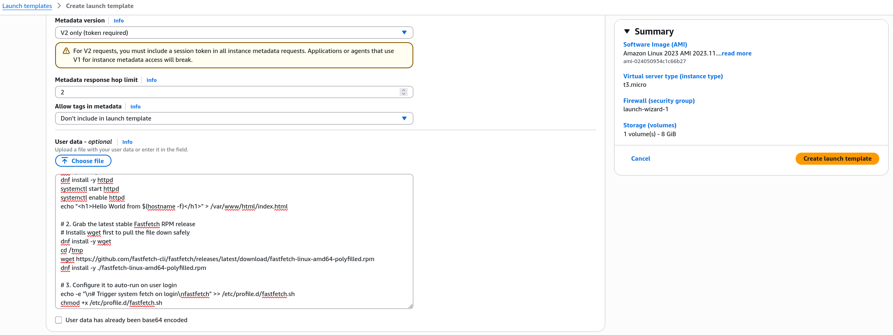
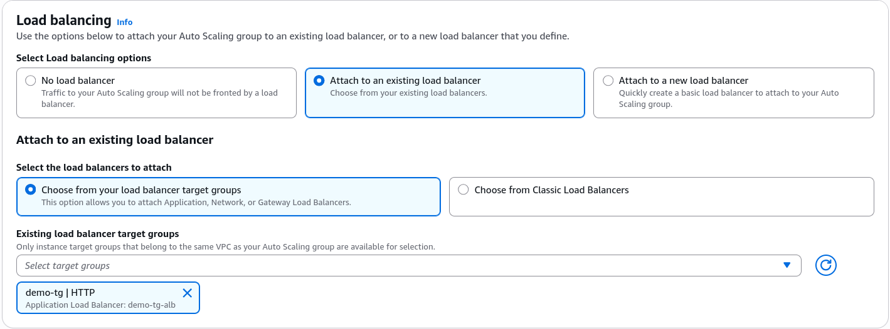
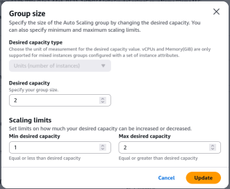
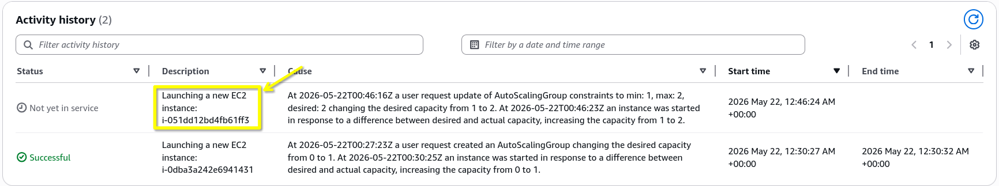
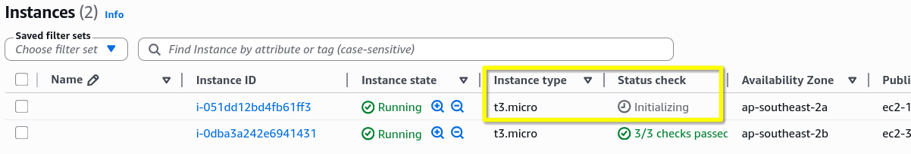
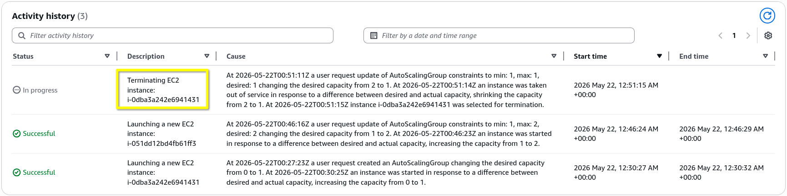

# Auto Scaling Groups Hands-On

Let's turn all that abstract scaling theory into real-world practice.

## Key Takeaways

### High-Level Summary

The lab walks through building a complete, self-contained auto-scaling ecosystem from scratch. By starting with zero active servers, creating a version-controlled **Launch Template**, defining multi-AZ subnets, linking an existing ALB target group, and manually adjusting the capacity fields, Stephane demonstrates the full lifecycle of automated instance scaling out and scaling in.

### Launch Templates vs. Live Provisioning Mechanics

When you build out your ASG infrastructure, the console divides the process into distinct configuration pillars:
- **The Blueprint Specification**: When creating ASG, you have the option to select/create a launch template. You define the DNA of your instances (Amazon Linux 2023 AMI, t3.micro sizing, standard 8GB EBS boot volume and Bootstrap shell script in the **User Data** field). For example I created a new Laucnh Template called `MyDemoTemplate` with specification below:

- **The Subnet Mapping**: You pick your target VPC and explicitly check multiple AZs. Stephance chose **Balanced Best Effort**, which tells the ASG to intelligently distribute your instances across all checked AZs to ensure maximum fault isolation and high availability.
- **The Target Group Handshake**: Instead of manually registering instances to your load balancer like we did in the ELB labs, you simply point the ASG directly to your ALB Target Group (`demo-tg-alb`). The ASG takes over the registration heavy lifting instantly upon server boot.

### The Lifecycle States (Tracking the Activity History)
Stephane demonstrates how the ASG reacts in real time to modifications of the capacity settings:

- **The Scale-Out Phase**: Changing the desired capacity from 1 to 2 triggers a new lifecycle entry in the **Activity History**. The ASG executes a launch call, provisions a new EC2 instance, runs the user data script, and forces the ALB TG to register it.  

- **The Bootstrap Buffer**: The TG initially flags the new node as unhealthy while the Apache server initializes. The moment the bootstrap script finishes, the health check flips to healthy, and the ALB automatically balances traffic between both server IPs.

- **The Scale-In Phase**: Changing the desired capacity back to 1 forces the ASG to select an active instance, move it to a draining/termination state, remove it from the target group pool, and permanently delete the compute resource.

## Exam Tips

- **The "Infinite Loop" Failure Scenario**: If an exam question states, "You deployed a new application update via an ASG, but looking at the Activity History, you see an infinite loop of instances launching, failing health checks being terminated by the ASG, and launching again", you are looking at an instance misconfiguration. **The problem is almost always that your EC2 instances have an incorrect SG (blocking the ALB's Health check pings) or a broken/buggy User Data script that is failing to start the web app software**.

- **The ELB Health Check Prerequisite**: Remember, if you do not check the **"Enable Load Balancer Health Checks"** box during ASG creation, the ASG will _never_ replace an instance whose web server crashes. It will only replace it if the physical hardware dies. For a robust developer architecture, you must always couple ASG health check with your ELB health check logic.