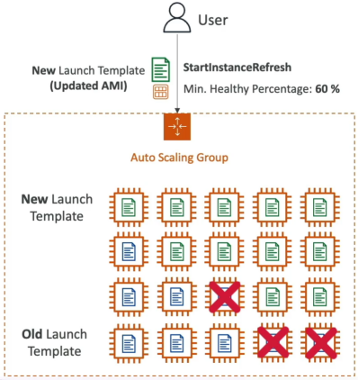

# ASG - Instance Refresh

Absolute game-changer for rolling updates, it solves one of the biggest headaches developers face when updating a live application.

Historically, if you updated your code or patched an AMI, updating your ASG meant manually hunting down and killing old instances one by one, or doing a massive infra swap. **Instance Refresh** automates the entire rolling deployment loop natively inside the ASG.

## Key Takeaways

### High-Level Summary
Instance Refresh is a native ASG orchestration tool used to update an enire server fleet automatically after a new version of a **Launch Template** is released (like pushing an application update or an OS security patch). Instead of dropping your site offline, the ASG executes a controlled rolling update - terminating a subset of old instances and spinning up new ones in waves until the entire fleet is fully modernized.

### The Two Core Configuration Knobs
To ensure your production site stays alive during the update, you must configure two vital parameters when triggering the StartInstanceRefresh API call:
- **Minimum Healthy Percentage**: This is your structural safety floor during the rollout. It defines the minimum percentage of the ASG's desired capacity that _must_ remain completely online, healthy, and actively serving traffic at any given second during the refresh.
    - _Example_: If your desired capacity is **10 instances** and you set this to **60%**, the ASG knows it has permission to terminate a maximum of **4 instances at a time** in the first wave. It will not touch the ramining 6 until the new replacements pass their health checks.
- **Instance Warm-up Time**: This tells the ASG how long to pause and wait after a new instance boots up before assuming it is ready to handle real users. This gives your code ample time to run its User Data scripts, pull packages, and stabilize before the ASG moves on to terminate the next wave of old servers.

## Exam Tips
- **Zero-Downtime Rolling Update Clue**: If an exam scenario states, "You have a production web application running inside an ASG, and you need to update the underlying AMI to a patched version with absolute zero downtime while ensuring that at least half of your capacity remains active to handle standard user traffic throughout the deployment process", the correct answer is to **update the ASG's Launch Template to the new AMI version and trigger an Instance Refresh with a Minimum Healthy Percentage set to 50%**
- **The Failed Deployment Safety Trap**: The exam loves to throw edge cases at you. What happens if your new code version has a bug and fails to start?. If your new instance boot up but constantly fail their ALB health checks, **the Instance Refresh process will completely stall out**. It will not continue to terminate the remaining old, working instances, protecting your cluster from a total self-inflicted outage.