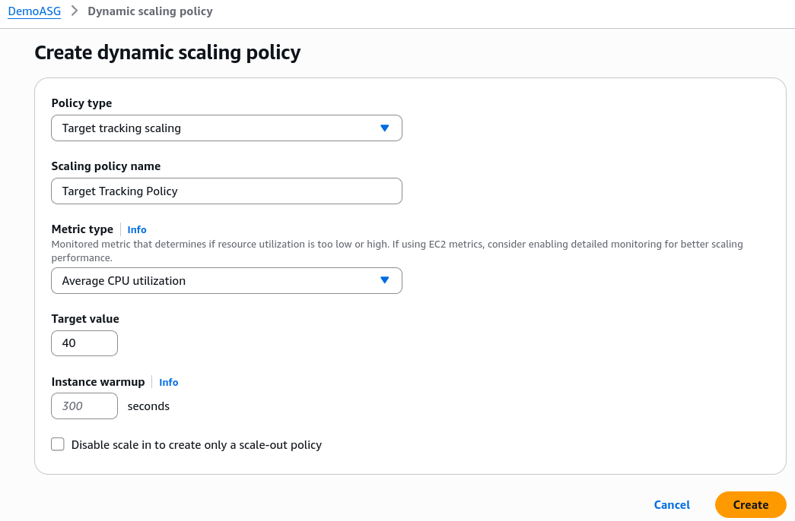
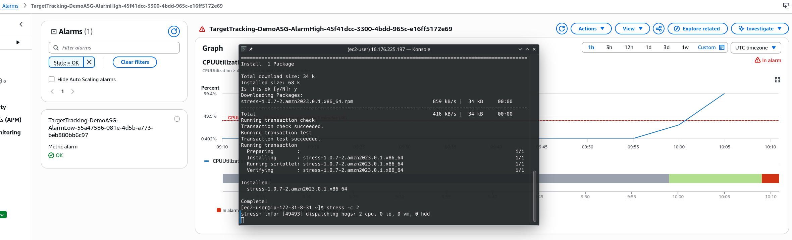
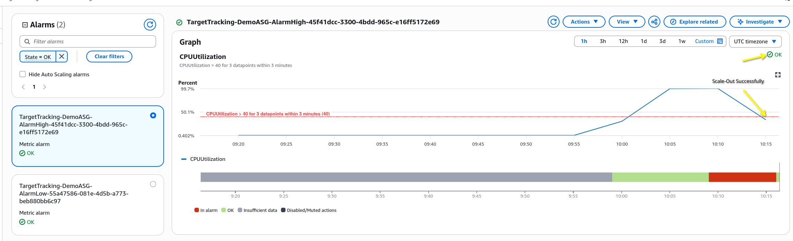
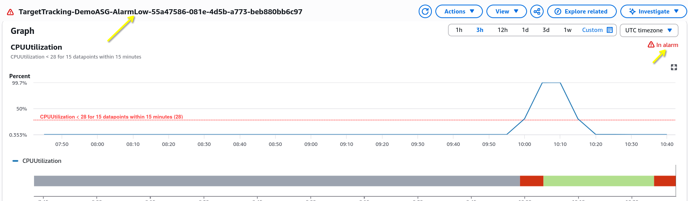
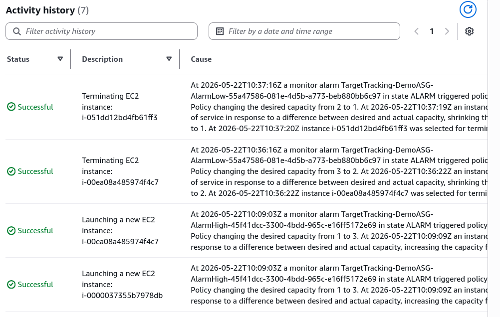

# ASG - Scaling Policies Hands-On
Let's practice the mechanics of ASG scaling policies in a real-world lab environment.

## Key Takeaways

### High-Level Summary
The lab showcases how a **Target Tracking Scaling Policy** removes manual operations by automatically managing its own infrastructure triggers. When an EC2 instance experiences intense compute strain (simulated via the Linux stree utility), the target tracking engine detects the anomaly, cross-references it with automatically generated system alarms, and forces the ASG to aggresively add capacity units until the load stabilizes.

### Under the Hood: The Automated CloudWatch Handshake
The absolute biggest "aha!" moment in this lecture is showing how Target Tracking hides the underlying complexity of monitoring. When Stephane creates a single tracking policy targeting **40% CPU Utilization**, AWS quietly maps two hidden **Cloudwatch Alarms** into your account:

- **The Scale-Out Alarm (AlarmHigh)**: Evaluates whether the average group CPU crosses above 40%. To prevent false flags from momentary micro-spikes, it uses an aggresive window requirement: it must breach the target threshold for **3 consecutive data points within 3 minutes** before executing a scale-out action.

***

- **The Scale-In Alarm (AlarmLow)**: Automatically calculates a baseline lower safety floor (in this case, **28% CPU**). Because shutting down servers too quicky can cause massive system instability, it enforces an ultra-conservative cooling buffer: the metric must stay completely under the threshold for **15 consecutive data points** before it allows a single insance to be terminated.

### The Lifecycle Sequence: Stress, Overshoot, and Recovery
The lab perfectly visualized the mechanical chain reaction of a flash-flood load spike:
- **The Overshoot Effect**: Because Stephane's single `t2.micro` core was completely locked at 100% processing capacity, the AlarmHigh was triggered so aggressively that the ASG immediately jumped from 1 to 2 instances. Because metric takes time to aggregate, the alarm stayed high for one more cycle, causing the ASG to fire a second scale-out action, instantly maxing out the group at 3 instances.
- **The Self-Healing Scale-In**: Once Stephane issued an administrative reboot command to kill the active stress process threads, the system metrics cratered back down to 0%. After waiting out the required multi-minute confirmation buffer, the AlarmLow toggled to an active state, cleanly winding the fleet down from 3 to 2, and finally landing safely back at the baseline of 1 active instance.

## Exam Tips
- **The "Thrashing" (Flapping) Architecture Pattern": If a test scenario says says, "Your infrastructure experiences sudden 2-minute spikes in CPU every 10 minutes, causing your simple scaling policies to constantly spin up instances and immediately turn them back off, resulting in erratic performance and high data overhead", you are experiencing a configuration flaw called **flapping**. The correct answer is to **leverage Target Tracking or adjust the evaluation periods on your custom CloudWatch scale-in alarms to require a longer sustained cooling timeframe (like the 15-point window seen in the lab)** to ensure the load has fully stabilized before removing compute power.**
- **The Testing Component Question**: If an exam scenario asks you how a developer can validate that a newly deployed ASG scaling policy works correctly without waiting for real production users to hit the site, look for answers that mention installing toolsets like **stress** or **lookbusy** via SSM Terminal or User Data to artifically choke the instance's OS threads.