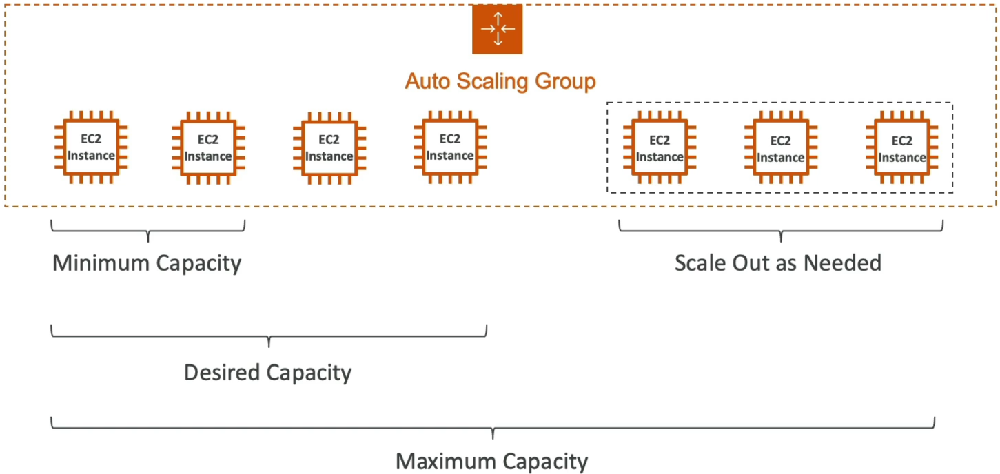
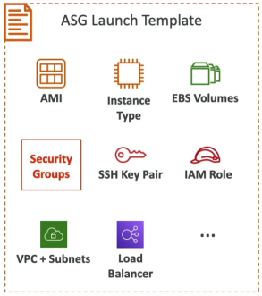
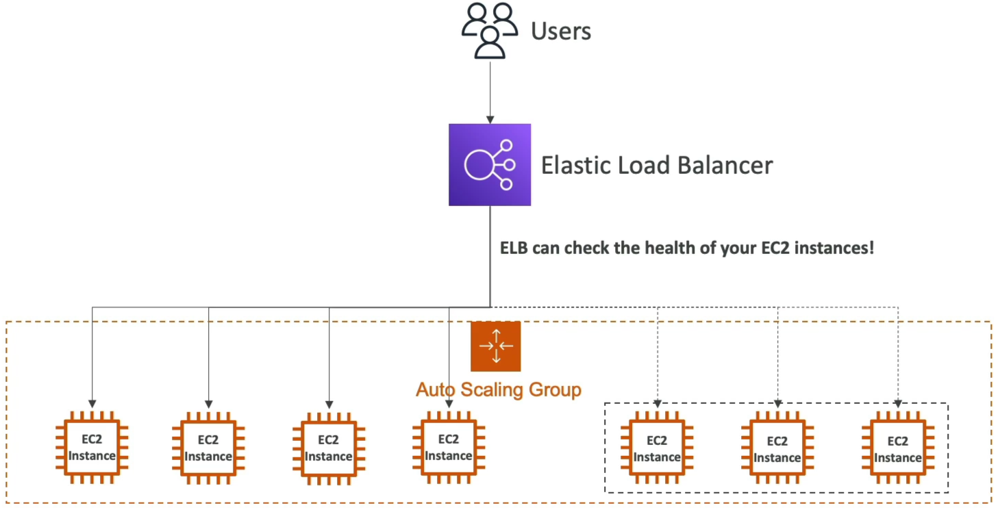
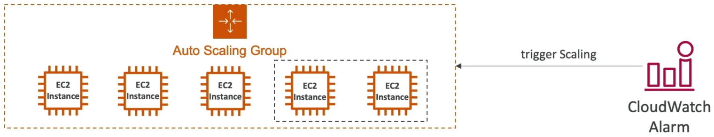

# Auto Scaling Groups

If ELB is the traffic controller of the cloud, **Auto Scaling Groups (ASGs)** is the muscle. It autoates the raw elasticity of AWS so you never have to manually scalte out/in a fleet of EC2 instance in the middle of traffic spike again.

## Key Takeaways

### High-Level Summary

An Auto Scaling Group is a logical clustering of EC2 instances running across multiple AZs. Its core purpose is twofold: **Scale Out** (add servers automatically when load increases) and **Scale In** (terminate servers automatically when traffic drops to save money). It acts as a self-healign system that continously maintains a target fleet size based on health metrics and capacity boundaries.

### Key Architecture & Capacity Controls

To control how big or small your server fleet can get, you define three hard boundaries on the ASG:

- **Minimum Capacity**: The absolute floor. The ASG will never scale in below this number, ensuring your baseline traffic has a home.
- **Desired Capacity**: The target state. The ASG initializes with this number of instances. Scaling policies actively adjust this value up or down based on load.
- **Maximum Capacity**: The absolute ceiling. Even during a massive DDoS attack or viral traffic spike, the ASG will stop spawning servers at this cap to protect your bank account.
  

### The Blueprint: Launch Templates vs. Launch Configurations

To spawn an EC2 instance automatically, the ASG needs an exact blueprint file telling it how to construct the machine.

:::warning
**Deprecation Warning**  
On the exam, Launch Configurations are completely legacy. Always choose **Launch Templates**.
:::

| Feature                    | Launch Configurations (Legacy)                                                                             | Launch Templates (Modern Best Practice)                                                                    |
| -------------------------- | ---------------------------------------------------------------------------------------------------------- | ---------------------------------------------------------------------------------------------------------- |
| Versioning                 | ❌ No. To change an AMI or instance type, you must create a brand-new file from scratch and remap the ASG. | ✅ Yes. Supports multiple numbered versions. You can point your ASG to $Latest or $Default effortlessly.   |
| Mixed Instance Types       | ❌ Only supports launching one exact instance type (e.g., only t3.micro).                                  | ✅ Yes. Allows you to mix different instance sizes and combine On-Demand and Spot instances in one ASG.    |
| Parametrized Configuration | ❌ Hardcoded variables only.                                                                               | ✅ Yes. Fully integrates with advanced features like Capacity Reservations and Systems Manager parameters. |

### Integration Superpower (ELB + CloudWatch)

- **The ELB Health Handoff**: By default, an ASG only check if an EC2 instance is physically powered on (EC2 Status Checks). If your Apache web server crashes inside the OS, the ASG think it's perfectly fine. By pairing with an ALB, you can configure **ELB Health Checks**. If the ALB sees a server returning HTTP 502s, it tells the ASG, and the ASG instantly terminates that exact bad instance and spins up a fresh, healthy one to replace it.
  

- **CloudWatch Alarm Automation**: Alarm track global capacity metrics across the whole group. If your group's Average CPU Utilization crosses 80% for more than 5 minutes, CloudWatch fires an alarm that triggers a **Scale-Out Policy** to increment your Desired Capacity. Once the rush passes and CPU drops below 30%, it triggers a **Scale-In Policy** to clean up the extra instances.
  

## Exam Tips

- **The Self-Healing DB Trap**: The exam loves to test your understanding of ASG Auto-recreation behavior. If a question says, "You have a specialized backend application instance inside an ASG, you need to perform manual troubleshooting on its local system logs without the ASG terminating it or trying to spawn a duplicate node", your play is to **Put the instance into Standby state**. This temporarily removes it from the load balancer and ASG health logic without deleting the underlying server.

- **The Cost Optimization Play**: If a scenario demands a high-volume processing architecture that must scale out massively but at the absolute lowest cost imaginable, look of a **Launch Template** setup configured to utilize **Spot Instance** for the scale-out capacity, matched with an ASG policy that triggers via custom CloudWatch metrics.
