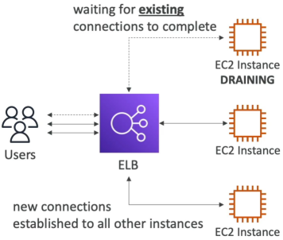
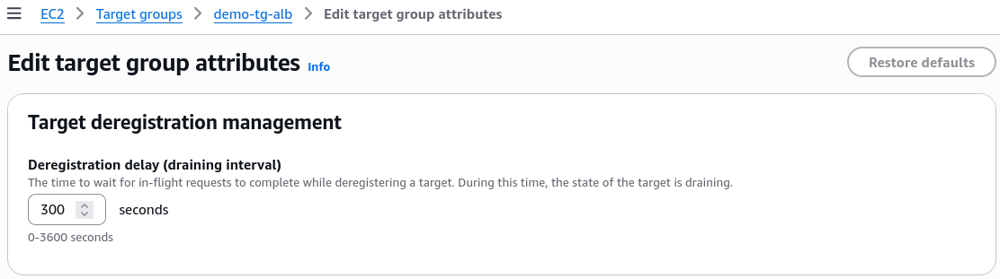

# Connection Draining

Connection Draining (or **Deregistration Delay** as you'll it called on modern ALBs and NLBs) is an absolute lifesaver for user experience. Think of it like a polite server in a restaurant, they lock the front door so no new customers can walk in, but they don't kick out the customers still dining inside - they give them a few minutes to finish their meal before they close up.

## Key Takeaways

### The Dynamic: In-Flight Safety
When an instance is marked for removal (either because it failed a health check, you planned to take it down for updates, or an Auto Scaling Group is scaling down because traffic dropped). The load balancer flips that instance into a **"draining"** state.
- **No New Traffic**: The ELB instantly stops sending any _new_ incoming requests to that instance.
- **In-Flight Grace Period**: The ELB keeps the existing network pipes open just long enough for active users to finish their current transacions(like uploading a file, completing a checkout, or executing a heavy database query).

### Tuning the Deregistration Delay (The Developer Trade-Off)
You configure this timer on the **Target Group** settings. The parameter range is highly testable:
- **The Range**: You can set the timer anywhere from **1 to 3600 seconds** (1 hour).
- **The Default**: OOTB, AWS sets this to **300 seconds (5 minutes)**.
- **Turning it off**: Setting the value to `0` completely disables draining. The moment an instance is deregistered, all current connections are immediately terminated, resuling in `502 Bad Gateway` or `504 Gateway Timeout` errors for those active users.

### How to optimize the timer based on your app workload
|Workload Type|Ideal Draining Timer|The Reasoning|
|---------------|---------------------|-------------|
|"Short Requests (e.g., REST APIs, microservices returning quick JSON payloads)"|Low (e.g., 20–30 seconds)|Your active users finish their requests in milliseconds. Setting a low timer lets AWS destroy the old instance rapidly, speeding up your deployment loops.|
|"Long-Lived Requests (e.g., Heavy file uploads, video rendering, long streaming polls)"|High (e.g., 15–30+ minutes)|Prevents cutting off users in the middle of a massive file upload, but forces your automated deployment pipeline to wait longer to fully clean up old servers.|

## Exam Tips

- **The Broken Session/502 Error Clue**: If a scenario says, "You are performing a rolling deployment using an Auto Scaling Group behind an ALB. During the update, users randomly report that their active sessions drop or they encounter 502 Bad Gatewat erros right as old instances are terminated", the diagnosis is clear: The **Deregistration Delay** is either set to 0 or is configured to a duration shorter than the time it takes for your application to finish a standard user request.

- **The Slow Deployment Clue**: If a developer complains, "Our CI/CD pipeline takes over 10 minutes to complete a green/blue deployment because the old instances take forever to terinate, even though our application only servers lightning-fast API responses", the architectural fix is to **go into the Target Group attributes and lower the Deregistration Delay down from the 300-second default.**