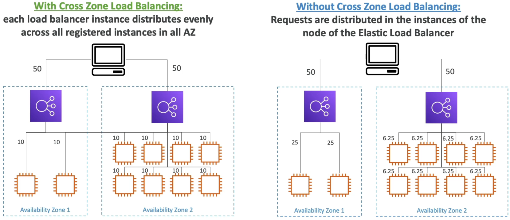
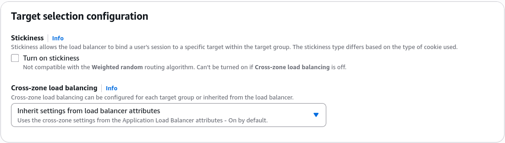
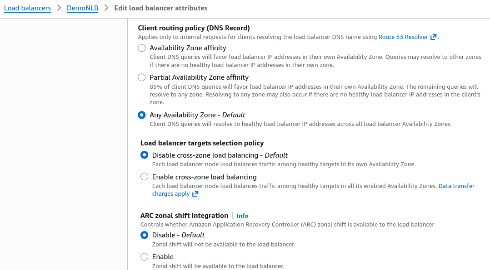

# Elastic Load Balancer - Cross-Zone Load Balancing

Cross-Zone Load Balancing concept handles the scenario where you have an uneven distribution of backend servers across your AZ.

## Key Takeaways

### What is Cross-Zone Load Balancing?

Imagine your DNS splits incoming traffic 50/50 between two AZs nodes.

- AZ-A has **2 instances**
- AZ-B has **8 instances**
- **WITHOUT Cross-Zone LB**: The load balancer node in AZ-A can _only_ talk to the 2 istances in its own zone. This means those 2 lucky instances are taking a massive **25% of total global traffic each**. Meanwhile, the node in AZ-B spreads it 50% across its 8 instances, meaning they only take **6.25% of traffic each**. Your AZ-A instances are getting absolutely slammed.
- **With Cross-Zone LB**: Each load balancer node pools all **10 instances** together globally. It will route traffic across AZ boundaries to ensure every single server across the entire region takes an exact, perfectly equal **10% share of total traffic**.
  

### The Big Balancer Matrix (Default & Costs)

This is exactly where the exam try to test your understanding of the default behavior and cost implications of cross-zone load balancing:
|Load Balancer Type|Cross-Zone Default|Inter-AZ Data Transfer Cost|Where to Configure
|---|---|---|---|
|ALB (Application)|Enabled (On)|$0 (Completely Free)|Target Group level attributes
|NLB (Network)|Disabled (Off)|Paid ($0.01 per GB)|Load Balancer OR Target Group attributes
|GWLB (Gateway)|Disabled (Off)|Paid ($0.01 per GB)|Load Balancer attributes

### Console Specifics & Console Layout Quirks

- For the **ALB**, if you check the Load Balancer attributes, it looks like it's locked to "Always On". To Actually turn it off you have to navigate down to the **Target Group Attributes** page. There, you can override it by switching the setting from _Inherit_ to _Off_.
  
- For the **NLB** and **GWLB**, it defaults to off because cross-zone traffic incurs standard inter-AZ data transfer fees (~0.01/GB). AWS leaves it off OOTB so you don't accidentally run up a high networking bill without knowing.
  

## Exam Tips

- **The Imbalance Target Alert**: If a question states, "You have a backend fleet behind an NLB where isntances in AZ-A are spiking to 100% CPU, while identical AZ-B are idling, even though your global request volume matches your total capacity", look for the answer that says: "Enable Cross-Zone Load Balancing on the NLB".

- **The Cost Optimization Constraint**: If a scenario demands that you design an ultra-high throughput architecture handling hundreds of terabytes of data, but must keep **inter-AZ data transfer costs at absolute zero**, your place is to **use an NLB, leave cross-zone Load Balancing disbaled, and ensre your Auto Scaling Group deploys an equal number of identical across all utilized AZs**.
