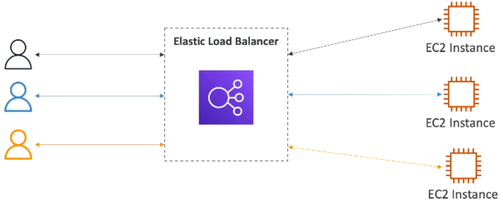
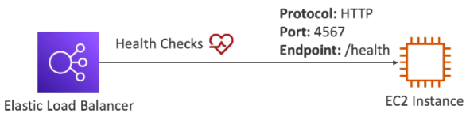
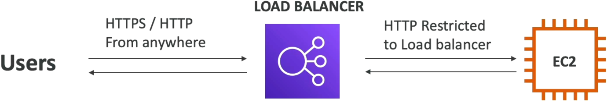
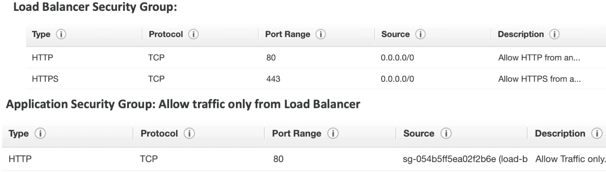

# Elastic Load Balancing (ELB) Overview

**Elastic Load Balancng (ELB)** is the traffic cop of AWS, it distributes incoming application traffic across multiple targets, such as EC2 instances, containers, and IP addresses, in one or more Availability Zones.

## Key Takeaways

### Why Leverage an ELB?

- **Single Point of Entry**: Users only one unified DNS endpoint. They never touch or see the private, changing IP addresses of your individual backend EC2 instances.
- **Seamless Failure Handling**: The ELB constantly vets your downstream instances using **Health Checks** (pingin a specific protocol, port, and route like `HTTP:80/health`).
  
- **The Vetting Rule**: If a backend instance returns anything other than a **200 OK** status code, the ELB marks it as unhealthy and immediately stops routing user traffic to it.
- **Managed Scalability**: AWS handles all the underlying server updates, high availability, and scaling for the load balancer itself. It integrates natively with Auto Scaling Groups (ASGs), Route 53, and ACM (SSL Certificate Manager).

### The Four Flavors of Managed Load Balancers

| Load Balancer Type | OSI Layer             | Protocols Handled         | Perfect DVA-C02 Use Case                                                              |
| ------------------ | --------------------- | ------------------------- | ------------------------------------------------------------------------------------- |
| ALB (Application)  | Layer 7 (Application) | "HTTP, HTTPS, WebSockets" | Standard web apps, microservices, path/query-based routing.                           |
| NLB (Network)      | Layer 4 (Transport)   | "TCP, UDP, TLS"           | Ultra-low latency, handling millions of requests/sec, gaming backends, static IPs.    |
| GWLB (Gateway)     | Layer 3 (Network)     | IP                        | Routing traffic through a fleet of 3rd-party virtual security appliances/firewalls.   |
| CLB (Classic)      | Layer 4 & 7           | "HTTP/S, TCP"             | Deprecated older generation. Avoid this completely unless dealing with legacy setups. |

### The Ultimate Security Group Pattern

Stephane maps out the ideal security design that prevents users from bypassing your load balancer and hitting your server directly:

- **The ELB Security Group**: Open to the world (`0.0.0.0/0`) on port 80 (HTTP) or 443 (HTTPS) so clients can connect
- **The EC2 Instance Security Group**: Instead of whitelisting an IP address range, the **Instance's security group explicitly references the ELB's Security Group ID as its inbound source** on Port 80.
- **The Payoff**: This ensures the EC2 instances _only_ accept traffc that has been successfully filtered and forwarded from your ELB.

## Exam Tips

**The IP vs SG Trap**: Look out for questions asking how to lock down backend web servers. The incorrect answer will suggest restricting ingress to the public IP of the load balancer (which can dynamically change). **The correct developer answer is alwaus to configure the backend EC2 Security Group to only allow inbound traffic where the source is the ELB's SG**.
