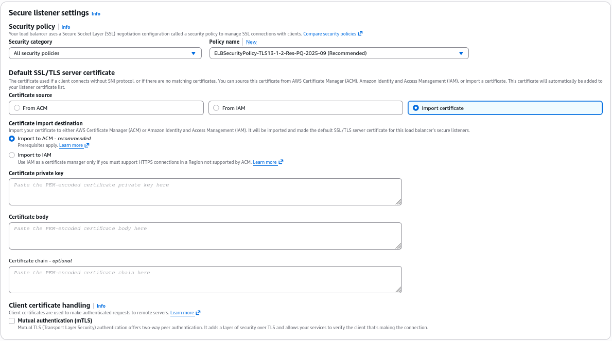
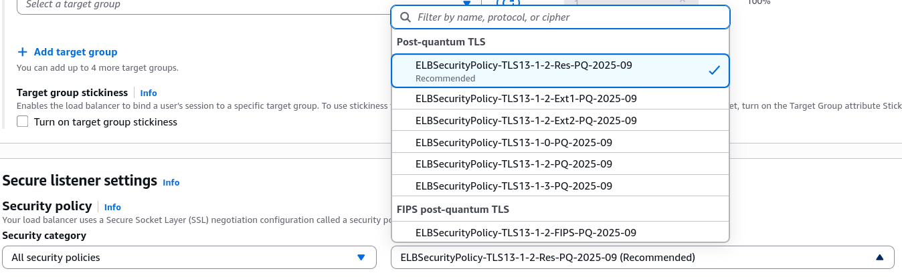

# SSL Certificate - Hands-On

This hands-on lab will walk you through the process of configuring SSL/TLS encryption for your ALB.

## Key Takeaways

### The HTTPS Configuring Lane (ALB)
To Secure an ALB, you add a brand new **Listener** directly to the front-end rules:
- **Protocol & Port**: You flip the traffic type from HTTP to **HTTPS**, which automatically defaults the destination inbound gte to **Port 443**.
- **The Default Action**: You tell the listener to take that decrypted payload and forward it downstream to your standard target group (on Port 80, over the secure internal VPC network).
  

### Tuning Ciphers (The Security Policy)
The Console exposes a dedicated dropdown for your **SSL Security Policy**.

- **What it does**: This controls the exact negotation ciphers and protocol handshakes allowed between your clients and the load balancer.
- **Legacy vs Modern**: If you have ancient legacy clients or old mobile apps that don't support modern encryption, you can select an older, looser security policy. If your security compliance team demands absolute lockdown, you can pick a modern policy to force **TLS 1.3 only**.
    

### Certificate Sourcing Strategy
Unfortunately, Stephane doesn't bring a live domain or pre-bought certificates during the quick demo, however he highligts the three pathways AWS gives you to srouce your X.509 keys:
- **From ACM (Amazon Certificate Manager)**: The absolute gold standard best practice. You just pick your domain's managed certificate out of a dropdown meny, and AWS handles auto-renewal for your completely free.
- **From IAM**: An older legacy repository method. AWS explicitly tells you in the console that hosting public certificates inside IAM is **not recommended**.
- **Direct Import**: If you bought an SSL certificate from an outside third-party vendor (like GoDaddy, Comodo, or DigiCert), you can click "import" and psate your raw PEM-encoded text blocks (Certificate Private key, Certificate Body and Certificate Chain) right into the text boxes. The console will instantly bundle them up and import them straight into ACM for you.

### The Layer 4 Equivalent (NLB TLS Listeners)
The process for a NLB mirros the ALB, but with Layer 4 terminology:
- Instead of picking an HTTP protocol, you create a **TLS Listener** on Port 443
- The NLB pulls the same ACM certificates, handles the heavy decryption at the connection layer, and forwards the raw unencrypted TCP strem straight to your backend compute instances.

## Exam Tips
- **The Certificate Storage Best Practice Trap**: The exam loves to test your compliance knowledge on where certificates _should_ live. If a question suggests uploading SSL certificates to an IAM server certificate store for an ALB, flag it as wrong. **Always manage, store, and provision SSL/TLS certificates using AWS Certificate Manager (ACM)**.

- **ALB vs NLB Protocol Mapping**: Pay close attention to the protocols when creating listeners.
    - An ALB can listen on **HTTP and HTTPS**
    - An NLB can listen on **TCP, UDP, and TLS**. If an exam question mentions encrypting a custom non-web socket database connection or a raw TCP application stream, you _cannot_ use an HTTP listener on an ALB; **you must deploy a TLS listener on a Network Load Balancer (NLB)**.