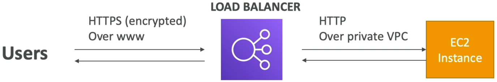

# SSL Certificates

Serves as a critical component for securing your web applications by enabling encrypted communication between clients and the load balancer.

## Key Takeaways

### In-Flight Encryption & SSL Termination
- **The Mechanic**: When a user vists an `https://` endpoint, the traffic moving across the public internet is completely encrypted.
- **SSL Termination**: The ALB/NLB loads an X.509 security certificate (managed natively via **AWS Certificate Manager (ACM)**). The load balancer handles the heavy compute strain of decrypting that incoming packet.
- **The Backend Handoff**: Once decrypted, the load balancer routes the traffic over the internal AWS network to your backend EC2 instances using standard, unencrypted **HTTP**. Because the VPC internal network is isolated and secure, your application code doesn't have to waste CPU cycles running decryption over and over.

### Server Name Indication (SNI) Support
SNI completely revolutionized how modern load balancers handle multi-tenant or multi-domain routing.
- **The Core Problem**: Historically, a web server could only load one SSL certificate per IP address. If you wanted to run `rendy.com` and `rendy.au` on the same machine, you were stuck buying separate public IPs or load balancer for each.
- **The SNI Fix**: SNI is an extension to the TLS protocol where the client's browser explicitly states the **hostname** it want to reach (e.g., _"Hey, I'm trying to connect to `rendy.com`"_) during the very first step of the connection handshake.
- **The Smart Selection**: Because of the ALB or NLB reads this hostname metadata immediately, it can scan its custom certificate list, pull the exact matching SSL certificate, and execute the handshake flawlessly, all behind **one single load balancere endpoint**.

### The Load Balancer Support Matrix
|Load Balancer|SNI Support?|SSL Capability
|-------------|------------|-------------|
|ALB (Layer 7)|YES|Can host multiple domains and multiple certificates natively via SNI smart selection.|
|NLB (Layer 4)|YES|Supports TLS listeners with multiple certificates via SNI.|
|CLB (Classic)|NO|"Legacy tier. Strict 1 certificate per listener limit. To host multiple domains, you are forced to deploy multiple CLB instances."|

## Exam Tips

- **The Multi-Domain Consolidation Trap**: If an exam question asks how to optimize costs for an organization runing 10 distinct web application with 10 different domain names (each requiring its own SSL certificate), the _wrong play_ is deploying 10 separate load balancers. **The correct cloud answer is to deploy a single ALB, attach 10 ACM certificates to its HTTPS listener, and use SNI to automatically serve the correct certificate based on the client's hostname**.
- **Security Policy (Ciphers)**: If a security compliance auditor flags your application for using outdated, vulnerable TLS protocols (like TLS 1.0 or 1.1), you don't rewrite the applicaiton code. **You simply updated the Predefined Security Policy on the ALB's HTTPS listener to enforce modner ciper suites like `ELBSecurityPolicy-TLS13-1-2`**.