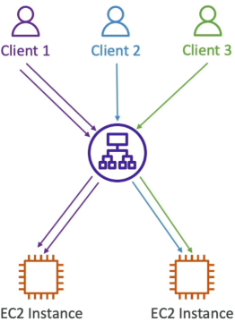
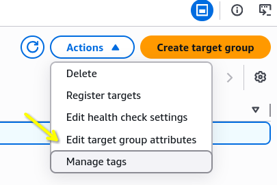
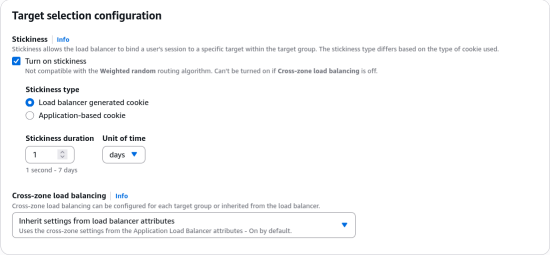
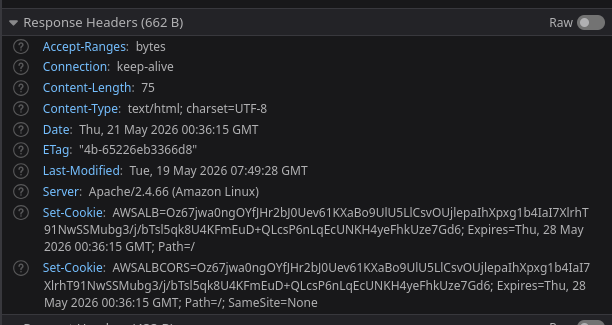

# Elastic Load Balancer - Sticky Sessions

By default, an ALB used a round-robin routing algorithm to distribute traffic evenly. However, if your app stores a user's login session or shopping card data locally inside the memory of a specific instance, routing that user's next click to a different instance will completely break their experience and log them out.

## Key Takeaways

### The Core Mechanical Shift

- **Default Behavior**: Without Stickiness, the ALB distributes incoming HTTP requests across all healthy targets (like a round-robin rotation).
- **Sticky Behaviour**: Once activated, the ALB forces a specific browser client to stay locked to the **exact same backend EC2 instance** for all subsequent requests, bypassing the default traffic distribution.
  

### Deep Dive: Cookie Classifications

Two distinct ways the stickiness cookie can be managed:

- **Load Balancer-Generated Cookies (Duration-Based)**:
  - The ALB handles 100% of the heavy lifting
  - It injects its own tracking cookie named `AWSALB`
  - You define a rigid lifespan constraint directly in the console, ranging from **1 second up to 7 days** (defaults to 1 day)
- **Application-Based Cookies**:
  - **Custom Cookie**: Your actual backend target application code creates the cookie. You tell the TG the exact name of your app's custom session cookie (e.g., `MyStoreSessionID`).
  - **Reserved Names Warning**: You **must not** name your custom app cookie `AWSALB` or `AWSALBAPP` or `AWSALBTG` because those are strictly locked and reserved by the Elastic Load Balancing service itself.
- **ALB Mirror Cookie**: When you use an app-driven cookie, the load balancer reads it and injects its own companion cookie named `AWSALBAPP` to mirror the state and route the client appropriately.

### Real-Time Verification (The Browser Test)

- **The Activation Step**: Target group (TG) stickiness is configured exclusively under **Target groups dashboard > Action > Edit target group attributes**  
  
  ***
  
- **The Network Proof**: When stickiness is toggled on, refreshing the page locks the user onto one single instance ID
- **The headers**: Inspecting the browser's developer tools under the **Network** tab reveals:
  1. The ALB sends a `Set-Cookie` response header down to the browser with the expiration timestamp.
  2. On every subsequent request, the browser wraps that cookie inside its `Request Cookies` metadata header and fires it back up to the ALB.  
     

## Exam Tips

- **The Cookie Name Gotcha**: If an exam question presents a snippet of application code or an architectral configuration where a developer is attempting to set up custom application based stickiness, but the ALB keeps throwing errors or ignoring the session, check the cookie name. **If they named their code's cookie `AWSALB`, it will fail because that namespace is explicitly reserved by AWS**.

- **The Operatioal Risk**: Always remember about **Imbalanced Load**. If you have an instance that gets paired with a "heavy user" or high-volume client API script, that single backend server can quickly spike to 100% CPU utilization while your other instances sit completelu idle.
