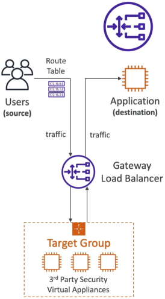
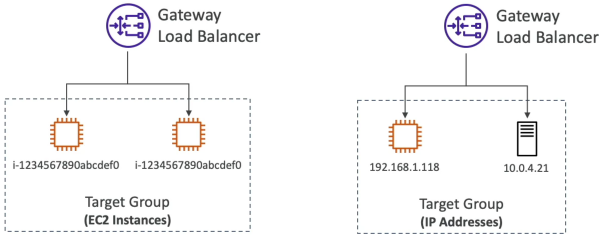

# Gateway Load Balancer (GWLB)

GWLB is a completely different breed of load balancer. You can think of it as a **"Security Checkpoint"** for your entire cloud network rather than a standard traffic manager.

## Key Takeaways

### The Core Purpose: "Bump-in-the-Wire" Security

- **What it Does**: It acts as a transparent middleman designed specifically to route all incoming and outgoing network traffic through a fleet of **third-party virtual appliances** before it ever reaches your actual web applications.
- **The Appliances**: These are specialized software firewalls or inspection machines (like Palo Alto, Check Point, or custom Linux security nodes) running on standard EC2 instances inside your target group.  
  
  ***
  

#### The Workflow

1. A packet comes in form the internet
2. Your updated VPC Route Tables intercept it and send it directly to the GWLB
3. The GWLB balances the load across your security firewalls for deep packet analysis
4. If the firewall drops the packet, the attack is stopped. If the firewall approves the packet, it hands it back to the GWLB, which seamlessly routes it to your web backend.

### Layer 3 Operations

- Unlike the ALB (Layer 7 - HTTP/HTTPS) or the NLB (Layer 4 - TCP/UDP), the GWLB operates at **Layer 3 (Network Layer)**.
- It deals exclusively with raw **IP Packets**. It doesn't listen on a specific app port like port 80; it listen to all ports and _all_ traffic passing through the IP layer.

### The Two-in-One Identity

The GWLB combines two architectural functions:

- **Transparent Network Gateway**: A single, hidden entrance and exit lane for all data blocks moving inside your VPC.
- **Load Balancer**: Automatically scales and alternates traffic across your pool of virtual security appliance server to prevent a single firewall box from becoming a bottleneck.

## Exam Tips

The good thing about the GWLB is that for the Developer Associate exam, the questions at a very high level. You don't need to know how to configure the complex routing tables, you just need to spot the keywords:

- **The Third-Party Appliance Clue**: If an exam question mentions deploying a fleet of **"Third-party virtual security appliances**, **Deep Packet Inspection (DPI)**, **Intrusion Detection/Prevention System (IDS/IPS)**, or running _all corporate traffic through a centralized firewall cluster_, **Gateway Load Balancer (GWLB)** is always the correct choice.

- **The Secret Protocol Trap**: This is the easiest point you will get on the test. If a scenario explicitly mentions checking traffic using the **GENEVE protocol on Port 6081**, stop reading right there. Geneve + Port 6081 is the exclusive fingerprint of the GWLB.
