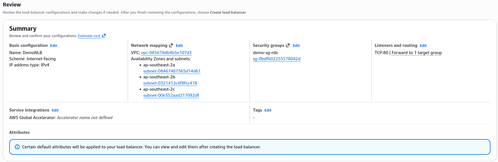
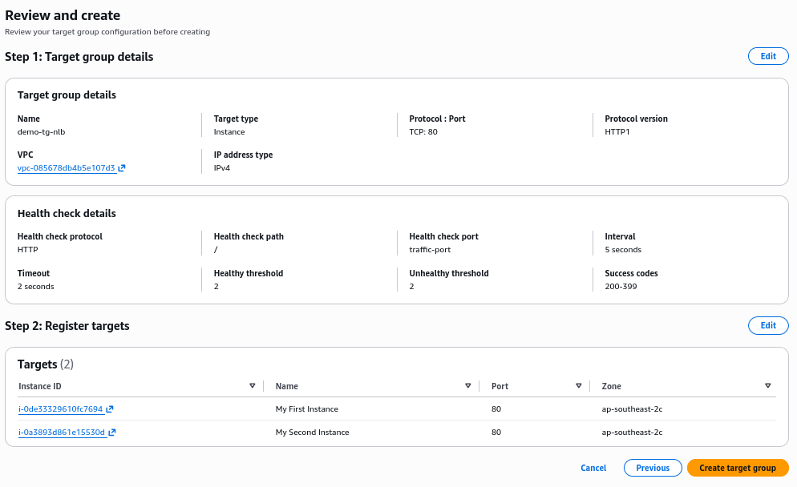
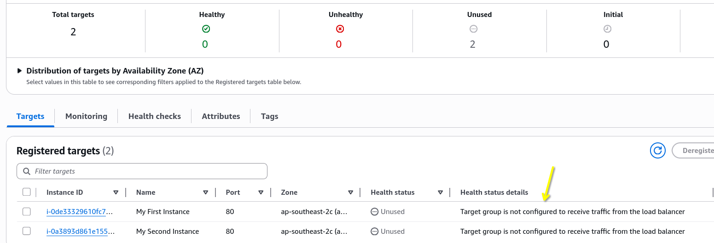
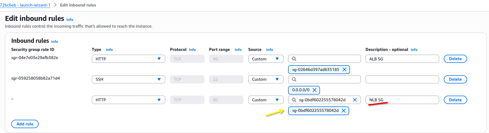
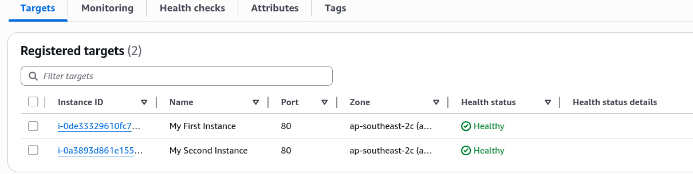

# Network Load Balancer (NLB) - Hands-On

Let's get our hands dirty with the Network Load Balancer (NLB) in this practical lab. We'll set up an NLB, configure its target group (TG) and security group (SG).

## Key Takeaways

### Hardcoded IP Stability

- **The Mechanic**: When configuring the NLB across your AZ, AWS maps a single, fixed public IPv4 address to each subnet automatically.
- **The Option**: If you don't want AWS to pick random IPs, this is the exact menu where you can bind your own pre-allocated **Elastic IPs (EIP)**. This gives your architecture an absolute unchanging front door.
  

### The Hybrid Health Check Combo

- **The Setup**: Even though the NLB is a **Layer 4 (TCP)** transport balancer, we can still set up the TG's health check using **HTTP on Port 80**.
- **The Advantage**: This proves that an NLB can perform application-level vetting. It won't just check if the port is open; it actively verifies that your Apache/web software layer is alive and responding with a `200 OK` status.
  

### The SG trap & Resolution (The Core Lesson)

When Stephane first activates the NLB, the health checks completely fail, and the target instances are flagged as `unhealthy`.

- **The Cause**: In the previous ALB lab, the EC2 instance SG was chained to _only_ accept traffic originating from the ALB's SG. Because an NLB is completely different network entity, the instances dropped its health check ping right at the firewall door.
- **The Fix**: You must explicitly edit the EC2 instance's inbound SG rules to add a second HTTP rule that whitelist the **Security Group ID of the NLB**.
- **The Result**: The moment that rule is saved, the health checks flip to `healthy`, and the NLB's DNS name immediately begins round-robinning traffic across the instances.
  
  ***
  
  ***
  

## Exam Tips

- **The Zero-Traffic Diagnosis Clue**: If an exam scenario says, "You deployed a high-performance gaming backend behind an NLB. The software is running perfectly on the servers, but the NLB is marking all targets as unhealthy and users are getting connection timeouts", immediately audit the security groups. Ensure the backend EC2 SG explicitly allows inbound traffic from the NLB SG or the client IP range on the configured health check port.

## Extra Tips

- **Clean Up Notice**: NLB carry a baseline running cost even if zero traffic passes through them. Just like with the ALB, make sure to delete the NLB and its associated resources (target group, security group) after completing the lab to avoid unnecessary charges.
