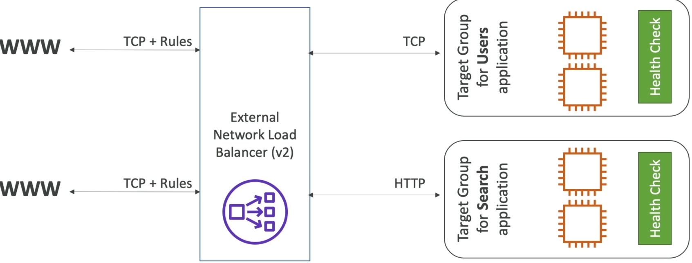
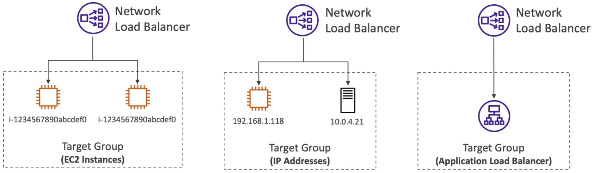

# Network Load Balancer (NLB)

NLB operates at **Layer 4** (Transport Layer) and us designed for ultimate performance and ultra-low latency. If the ALB is the "smart" load balancer, the NLB is the "blazing fast" speed machine.

## Key Takeaways

### Layer 4 Operation & Extreme Performance

- **Protocol Focus**: The NLB operates exclusively at the transport layer, handing raw **TCP and UDP** traffic. It doesn't look at HTTP headers, cookies, or URL paths.
- **Massive Throughput**: It is built for raw speed, capable of scaling to handle **millions of requests per second** automatically while maintaining ultra-low, sub-millisecond latency.
  

### Static and Elastic IP Support

- **The Network Identity**: Unlike an ALB (which uses dynamic IP addresses that constantly change under its DNS record), an NLB alocates exactly **one static IP address per AZ**.
- **Whitelisting Advantage**: You can manually assign a permanent **Elastic IP (EIP)** to each AZ target for the NLB. This allows downstream clients or corporate firewalls to easily whitelist a fixed set of IP addresses to communicate with your application safely.

### Target Group Options & Chaining

An NLB target group can point to three distinct types of backends:

- **EC2 Instances**: Routing raw TCP/UDP streams direcly to a fleet of compute servers/
- **Private IP Addresses**: Hardcoded private IPs. These can target internal VPC resources or connect over a VPN/Direct Connect to route traffic straight to **on-premises physical servers** in your own data center.
- **ALB Chaining (NLB in front of ALB)**: You can place an NLB directly in front of an ALB. This hybrid layout gives your architecture the absolute best of both worlds: the fixed, whitelisted static IPs of the NLB combined with the complex, layer 7 path-based routing rules of the ALB.
  

### Flexible Health Checking

- Even though the NLB routes the Layer 4 transport packets, its target groups are smart enough to assess application-level health.
- The NLB supports three protocols for its health check pings: **TCP**, **HTTP**, and **HTTPS**. If your backend server runs a web stack, the NLB can ping an HTTP route to verify stability.

## Exam Tips

- **The Static IP Clue**: If an exam scenario says, "A third-party corporate partner needs to access your backend API, but their security team requires a set of fixed, immutable IP addresses to whitelist in their firewall rules", the _ALB is an immediate wrong answer_. **You must deploy a Network Load Balancer (NLB) and assign Elastic IPs to it**.

- **The High Throughput/Non-HTTP Clue**: Watch out for keywords like "millions of request per second", "ultra-low latency", "gaming server backends (UDP), "IoT data ingestion streams". or "streaming raw TCP connections". These are immediate, explicit tells to pick NLB.
