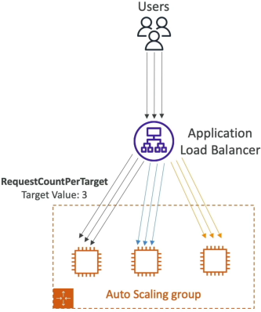
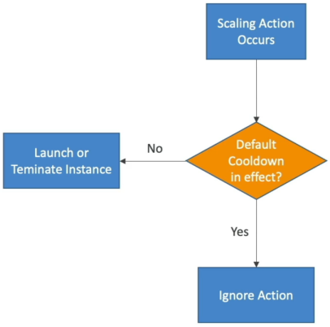

# ASG - Scaling Policies

Stephane breaks down the mechanics of the four core scaling methodologies and details how to manage the system's "cooldown" safety net so your infra doesn't spin out of control.

## Key Takeaways

### High-Level Summary
ASG Scaling Policies provide the algorithmic decision engine that dictates when to add compute capacity (Scale-Out) or remove it (Scale-In). By linking these policies to CloudWatch metrics, schedules, or machine learning forecasting algorithms, the infra dynamically optimizes itself to find the perfect equilibrium between system performance and structural run cost.

### Key Scaling Policy Classifications
- **Target Tracking Scaling (The Easiest & Most Common)**: You select a target metric boundary (e.g., "Keep average group CPU at 40%"). AWS automatically spins up and delete CloudWatch alarms behind the scenes to scale the capacity out or in dynamically to maintain that approximate state.

- **Step Scaling (The Precise Multi-Tiered Approach)**: You create custom CloudWatch alarms that trigger tiered incremental adjustments based on the severity of the metric breach (e.g., "If CPU hits 60%, add 1 instance; if CPU spikes straight to 85%, add 4 instances immediately").

- **Scheduled Scaling (The Known-Pattern Play)**: You hardcode explicit scaling actions to hit at precise calendar timelines based on predicatable human behaviour (e.g., "Add 3 instances every weekday at 8am when the office opens, and remove them at 6pm when everyone leaves").

- **Predictive Scaling (The AI Forecast Engine)**: The ASG looks at a consecutive 14-day trailing history of resource utilization data, charts a continous machine-learning forecast line, and proactively boots instances _ahead_ of time so they are fully warm before cyclical rush hits.

### Predefined Target Tracking Metrics
When using **Target Tracking**, you generally rely on one of these three standard predefined infrastructure metrics:
| Metric Name | Bottleneck Target | How it computes |
|-------------|-------------------|-----------------|
| ASGAverageCPUUtilization | Compute / Processing | Tracks the global mathematical average of CPU usage across the whole cluster. |
| ALBRequestCountPerTarget | Application / Request Volume | Scales based on the average number of live HTTP connections hit against each instance inside your ALB Target Group. |
| ASGAverageNetworkIn / Out | Network Bandwidth | Tracks the megabytes of raw network packet data traveling over the instance interfaces (ideal for file upload/download platforms). |

### The Critical Safety Guard: Scaling Cooldown
- **The Cooldown Protocol**: The moment a scaling action executes (instances are launched or terminated), the ASG enters a locked **Cooldown Period** (which defaults to 300 seconds / 5 minutes). During this active countdown window, the ASG will completely block and ignore any additional scaling instructions from simple scaling policies.
- **Why this matters**: When an EC2 instance turns on, it takes time to bootstrap, run user data, and take the load off your other servers. Without a cooldown period, an alarm would see that CPU is still high 30 seconds later and blindly launch _another_ instance, and another, causing your fleet to over-provision massively before the first machine even finishes booting.  

## Exam Tips
Stephane lays out an incredibly critical cloud-native performance pattern that shows up repeatedly on the developer test:
- **The Fast-Boot Architecture Pattern**: If a test scenario complains, "Our target tracking policies are scaling out our isntances, but under spike conditions, our website still drops connection requests because the new instances take over 7 minures to download dependencies and configure their software stacks before passing health checks", you need to accelerate the time-to-active. **The correct answer is to stop relying on heavy, long-running User Data bootstrap shell scripts. Instead, bake all your code, packages, and dependencies directly into a custom pre-configured AMI using tools like EC2 Image Builder/HashiCorp Packer.**
- **Detailed Monitoring Requirement**: By default, standard EC2 metrics only report to CloudWatch every 5 minutes. If your business experiences rapid flash-floods of users, 5 minutes is an eternity. To make your scaling policies responsive, you must enable Detailed Monitoring on your ASG's Launch Template to force the instances to stream performance data every 60 seconds.