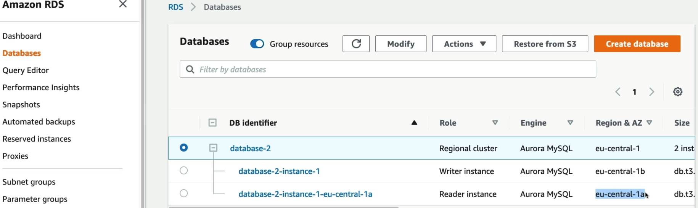
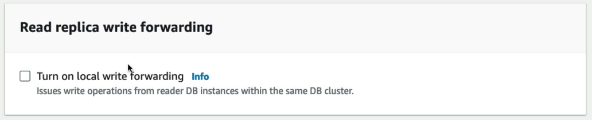
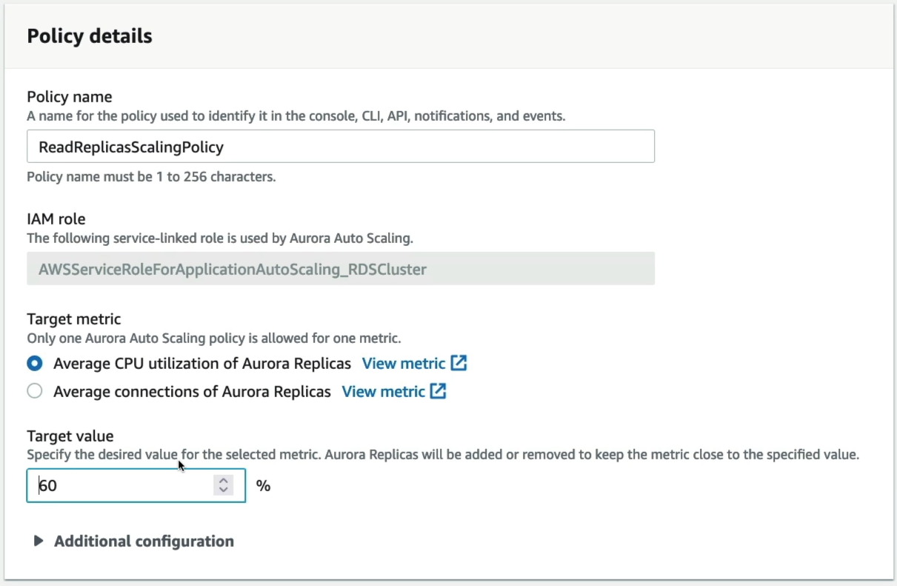

# Amazon Aurora Hands-On

The lab demonstrates the creation of a highly available, multi-node **Amazon Aurora MySQL-Compatible** regional cluster. By provisioning a single Writer (Master) node alongside a dedicated **Reader** node in a separate AZ, Stephane shows how Aurora builds a highly resilient routing environment using abstraction connection endpoints while exposing native features like Read Replica Auto Scaling and Global Database expansions.

## Key Takeaways

### Key Architecture: Cluster Topology & Advanced Provisions

When you deploy Aurora via the console, you are configuring a **Cluster** rather than a single database box:

- **Topology Definition**: Under the Production template, the engine automatically spins up a multi-node infrastructure. Ther primary compute node is designed as the **Writer Instance** (handling core transaction changes), and the secondary compute node is designed as the **Reader Instance** located in an isolated AZ to guarantee automatic failover protection.
  
- **Storage Tiers**: You face a choice between **Aurora Standard** (cost-effective for unpredictable or low-I/o app workloads) and **Aurora I/O-Optimized** (ideal for hyper-intense read/write applications requiring predictable flat-rate pricing for disk operations).
- **Serverless Scaling Choice (v2)**: If you select the serverless option, you stop provisioning raw instance sizing hardware (e.g., `db.t3.medium`). Instead, you select a min and max ceiling of **Aurora Capacity Units (ACUs)**, allowing the engine to upscale or downscale instantly on demand.

### The Live Cluster Connection Map

Once the cluster provisions, the AWS console displays the definitive routing architecture you need to know inside out for your application configuration strings:

- **Local Write Forwarding Capability**: You can toggle this feature in the settings. If your application code accidentally throws an `INSERT` or `UPDATE` statement at the **Reader Endpoint**, Aurora doesn't crash or return a read-only error. Instead, the replica node accepts the write data payload and **silently forwards it internally to the Writer instance** for execution, dramatically simplifying you application code logic.
  
- **Read Replica Auto Scaling**: He shows the automated engine configuration page where you can set a target metric limit (e.g., "Keep average replica CPU at 60%"). If traffic jumps, the ASG layer behind Aurora automatically spins up new read nodes (up to a max 15), and the **Reader Endpoint** instantly adds them to its DNS load balancing rotation.
  

### The Native Cluster Tear-Down Process

When you delete an Aurora cluster, you have the option to create a final snapshot backup before the entire cluster infrastructure is deprovisioned. This snapshot is stored in S3 and can be used to restore a new cluster with the exact same data state at a later time. If you choose not to create a final snapshot, the cluster and all its data are permanently deleted without any recovery option.

```
[Active Cluster] ──> (Attempt Cluster Delete: BLOCKED) ──> [Step 1: Delete Reader Node]
                                                                        │
[Cluster Vanishes] <── [Step 3: Cluster Container Self-Deletes] <── [Step 2: Delete Writer Node]
```

You cannot simply hit delete on the parent cluster instance. To successfully wipe the cluster and avoid zombie run-rate charges, you must enter each instance child leaf manually, initiate individual `Delete` commands, type the confirmation `delete me` in the pop-up, clears our the reader first, and then wipe the master writer node.

## Exam Tips

- **The Read-After-Write Consistency Dilemma**: If an exam scenario says, "You enabled Local Write Forwarding on your Aurora MySQL cluster so your application can send all traffic to a single endpoint. However, during heavy traffic bursts, users complain that right after they update their user profile, the page refreshes and still shows their old information", you are dealing with a session consistency configuration choice. **The Fix is to adjust the database parameter `aurora_replica_read_consistency` inside your session from `EVENTUAL` up to `SESSION`. This forces the reader instance to wait until the forward write has fully synchronized across the shared disk before responding to that specific user's read query**.
