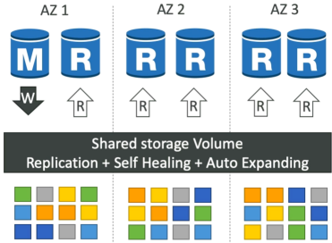
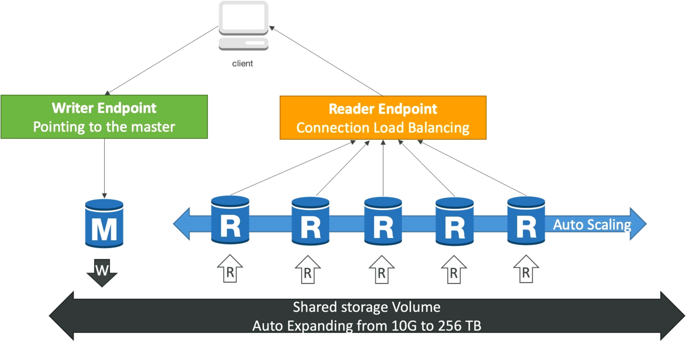

# Amazon Aurora

If RDS is like buying a reliable factory car, Aurora is like stepping into a custom-tuned supercar engineered by AWS from the ground-up. **Amazon Aurora** is AWS's proprietary, cloud-optimized relational database engine. While it is fully compatible with MySQL and PostgreSQL drivers and tools, its underlying storage layer is a completely detached, virtualized, and distributed flash array. By decoupling the compute nodes from the storage layer, Aurora delivers up to **5x the performance of standard MySQL** and **3x the performance of standard PostgreSQL** on traditional RDS.

## Key Takeaways

### Key Architecture: Shared Storage & High Availability

Aurora does not use standard EBS volume attached to an instance. Instead, it used a shared, virtualized **Storage Cluster Volume** that is inherently self-healing and hyper-replicated.

#### The Data Replication Blueprint:

Whenever you application writes a single block of data to Aurora, the storage layer silently forks that data into **6 copies distributed across 3 AZs (2 copies per AZ)**.

- **The Write Quorum**: Aurora only requires **4 out of 6 copies** to confirm a write operation as successful. If an entire AZ catches fire, your database can still process incoming writes with zero data loss.
- **The Read Quorum**: Aurora only requires **3 out of 6 copies** to satisfy a read request, ensuring extreme HA for data retrieval.
- **The Self-Healing Layer**: The background storage array constantly runs peer-to-peer data validation scripts. If a single disk sector or data block corrupts on one volume, Aurora fixes it instantly behind the scenes by pulling a clean block from its peers.
- **No Pre-Provisioning**: The storage volume starts at baseline of 10GB and **automatically scales in 10 GB increments up to 256 TB** as more data coms in. You never have to configure disk thresholds or worry about space allocation again.

### The Cluster Lifecycle: Drivers & Endpoint Routing

In an Aurora cluster, you separate your computing power into a single writer node and multiple read nodes, all hooked up to the same shared storage.

- **The Master Node**: You have exactly **1 Master (Primary) instance** that handles all `INSERT/UPDATE/DELETE` write traffic. If this mode dies failover to replica takes **less than 30 seconds**.
- **The Replicas**: You can spin **up to 15 Read Replicas** to offload read operations. Unlike RDS, replica lag here is lightning fast - typically **sub-10ms**, because all replicas pull directly from the exact same shared storage layer rather than maintaining separate disks.
- **Aurora Auto Scaling**: You can bind auto-scaling policies to your read replica pool to spin up or terminate read nodes automatically as user query volumes swing up or down.

### The Connection Endpoints (Crucial for the Exam)

To prevent you from having to update application connection strings every time a server fails or scales out, Aurora provides two clean, abstraction DNS endpoints:
|Endpoint Type|Purpose|Behavior|
|-------------|-------|--------|
|Writer Endpoint|Handles all data-altering traffic (INSERT, UPDATE).|A static DNS URL that always points directly to the current Master instance. If a failover occurs, AWS re-maps this DNS record to the newly promoted master within seconds.|
|Reader Endpoint|Handles all data retrieval traffic (SELECT).|A static DNS URL that provides connection-level load balancing across all available Read Replicas. When your application initiates a new connection, the reader endpoint automatically routes it to a different replica node.|

### Special Superpowers: Backtrack

- Instead of backing up your database to S3 and performing a slow multi-hour restoration to a new cluster, Backtrack lets your **rewind your existing live cluster straight backward or forward in time** in seconds.
- _The Developer Scenario_: If a junior developer runs a buggy migration script or an accidental `DELETE FROM users;` without a `WHERE` clause at 4:00PM, you can use Backtrack to literally roll the entire cluster database state back to exactly 3:59:59 PM instantly.

## Exam Tips

**The Statement-Level Load Balancing Mistake**: If an exam scenario says, "You pointed your reporting application at the Aurora Reader Endpoint, but you notice that a single massive, complex analytical dashboard script is overloading one specific read replica instance while the other replicas sit idle", you need to understand connection mechanics. **The Aurora Reader Endpoint load balances at the connection level, not the statement level. If an application opens a single persistent database connection and fire 50 heavy queries down that same pipe, they will all hit the exact same replica. The fix is to configure the application to open separate connection pools or use an RDS Proxy**.

- **The Sub-Minute Failover Requirement**: If a question states, "Your enterprise application demands a relational database architecture that can survive an entire availability zone outage and resume executing writes in under 30 seconds without requiring any manual operational intervention or code changes", the absolute best-practice answer is **Amazon Aurora configured with a Writer Endpoint**.
