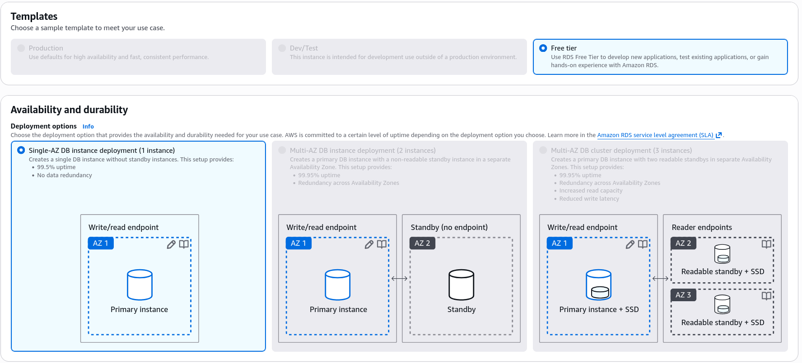
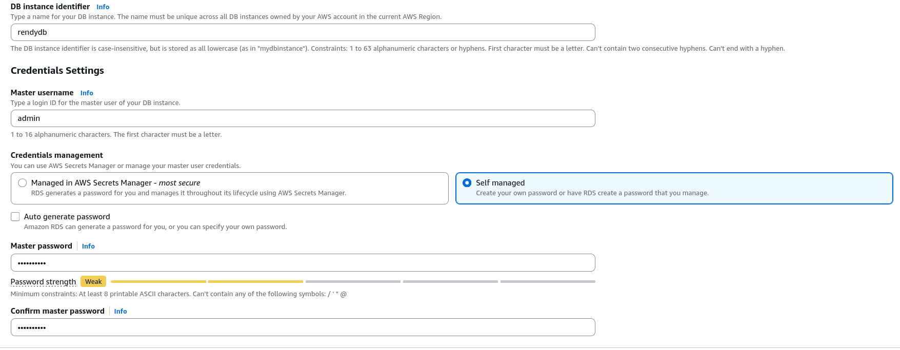
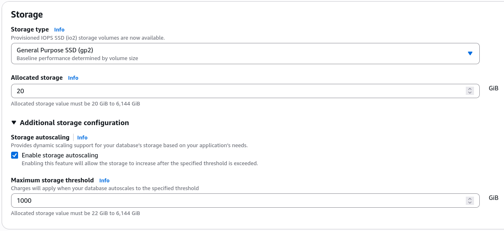
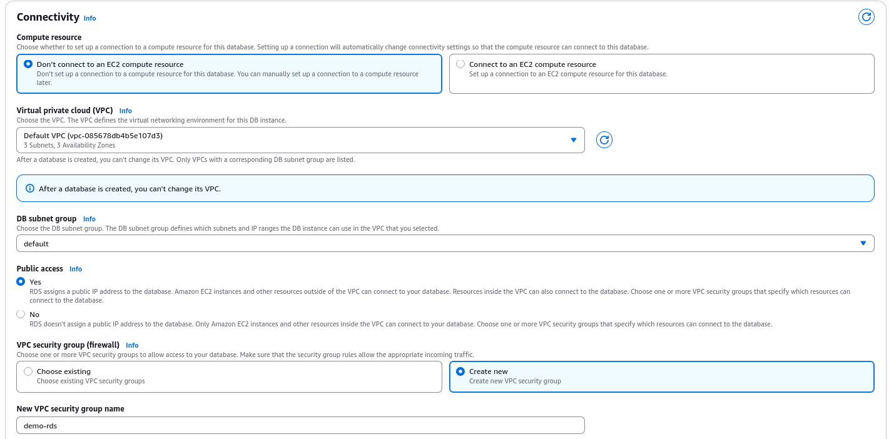
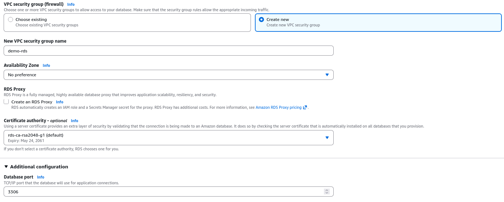
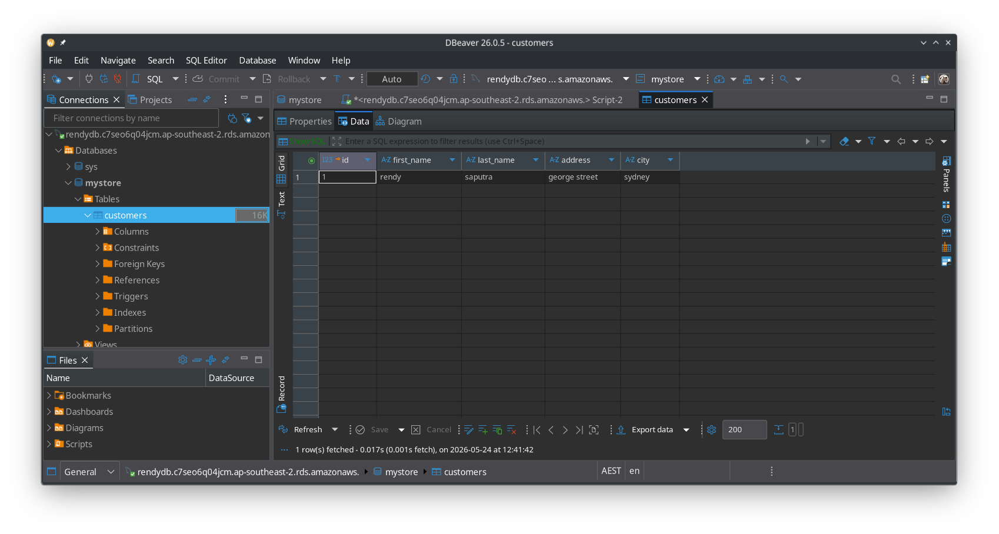

# Amazon RDS Hands-On

The lab demonstrates the deployment, connectivity, and lifecycle management of a fully managed **Amazon RDS MySQL** database. By spinning up a baseline single-AZ instance in the default VPC, modifying security group access parameters to isolate connection pathways, injecting data via an external SQL client, and executing a clean teardown sequence.

## Key takeaways

### The RDS Creation Workflow

1. **Engine Configuration**
   - **The Blueprint**: For this lab select the **MySQL** engine and **Full configuration** creation method.
   - **The Environment**: To keep everything completely free, select "Free tier" template. This automatically restricts the database architecture to a **Single-AZ instance deployment** (no passive standby) and provisions a baseline `db.t4g.micro` (or `db.t3.micro`) instance with **20GB of GP2 EBS Storage**.
     
2. **Credentials**
   - **The Credentials**: Stick to self-managed **Password authentication** (bypassing the paid AWS Secrets Manager tier for the lab) and sets a basic master password.
     
3. **Storage**
   - **Storage Automation**: He ensures **Storage Auto Scaling** is explicitly turned on with a maximum ceiling of 1000 GB to precent disk-full panics.
     
4. **Connectivity**
   - **The Network Pathway**: Selects the default VPC, selects **Publicly Accessible: Yes** and commands RDS to **Create a New Security Group** named `demo-rds`.
     
   - **The Firewall Isolation**: AWS automatically configs the new `demo-rds` security group to open **Inbound Port 3306 (MySQL)**, locking it down so it _only_ accepts traffic originating directly from your personal IP address.
     
5. **External Client Connectivity & Validation**
   - **The Connection Handshake**: Once the RDS console marks the database status as `Available`, grabs the unique **Endpoint string** and port (`3306`).
   - **The Client Query**: Boots an an external GUI SQL client (I use dbeaver), injects the endpoint connection string, and authenticate using the master admin credentials.
   - **Data Insertion**: Once the connection is established, I create a new database schema (`e.g. mystore`), create a new table (`e.g., customers`), and insert a single row of data to validate the read/write functionality of the database.
     

### Live Provisioning & Security Isolation Attributes

During creation, the RDS console requires you to make critical security, scale, and authentication structural decisions:

- **Credential Routing Options**: The engine gives you the choice to manually write a static password string or automatically offload credential rotation to **AWS Secrets Manager**. While Secrets Manager is the gold standard for enterprise security, it carries an active per-secret surcharge, which is why Stephane bypassed it for the lab.
- **Authentication Mechanisms**: You can use standard **Password Authentication** or choose **IAM Database Authentication**. IAM authentication allows your EC2 instances or Lambda functions to log in using dynamic, temporary tokens generated by their IAM execution roles, completely eliminating hardcoded passwords from your source code.
- **The Inbound Network Firewall**: Stephane launched the database with the `Publicly Accessible: Yes` flag, giving it a public IP address. To prevent the entire internet from hammering the instance, he built a new security group (`demo-rds`) that defaults to restricting inbound traffic on **Port 3306 (MySQL)** solely to his personal public workstation IP.

### Monitoring & Management Metrics

Once the instance status shifts to `Available`, the console populate the **Monitoring Tab** with live infrastructure metrics. On the developer test, you must know what these standard metrics represent:

- `CPUUtilization`: Tracks the compute strain on the database engine. If your queries are missing indices and forcing full table scans, this line will stay at 100%.
- `DBConnections`: The count of active client connections. This is crucial for developers because relational databases have a hard limit on open connections; if your application server pool autoscales up too aggressively, it can exhaust this pool.
- **Snapshots vs. Backups**: Stephane highlights the ability to take manual **Snapshots** (which persist forever until you explicitly delete them) and utilize **Point-in-Time Restore** (automated transaction logging allowing you to clone the database state back to any exact second within your retention window).

### The Administrative Deletion Chain

To protect against catastrophic accidental deletions in a production environment, AWS implements a multi-layer safety sequence that you must execute in order:

```
[Active Database] ──> (Attempt Delete: BLOCKED by Protection) ──> [Action: Modify Instance]
                                                                            │
[Database Deleted] <── (Run Delete: Uncheck Final Snapshot) <── [Disable Deletion Protection]
```

You cannot simply hit delete on an active production database. You must explicitly modify the instance attributes, un-toggle the **Deletion Protection** flag, choose "Apply Immediately" to force structural metadata change, and then initiate the final deletion command while acknowledging that you are opting out of a final automated safety snapshot.

## Exam Tips

- **The "Connection Timed Out" Scenario**: If an exam question says, "A developer has deployed a frontend application on an EC2 instance and a backend MySQL database on Amazon RDS within the same VPC. The database has public access enabled, but when the application attempts to initiate a connection string handshake on port 3306, it results in a 'Connection Timed Out' error", you are looking at a firewall blockage. **The correct fix is to go into the RDS Security Group and add inbound rule allowing TCP Port 3306 traffic originating from the security group attached to the EC2 instance**.

- **The Secret Storage Best Practice**: If a question demands a solution for an application that must connect to an RDS database without any passwords being stored in the app's git repository, **the correct architecture pattern is to store the RDS credentials in AWS Secrets Manager and use the AWS SDK inside your code to retrieve them at runtime**.
