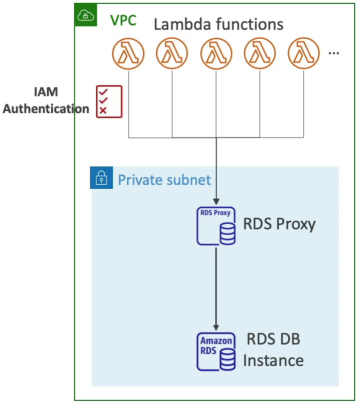

# Amazon RDS Proxy

**Amazon RDS Proxy** is an absolute lifesaver for microservice and serverless architectures. If you ever try to hook up highly scalable compute layers directly to a relational database, you will quickly realize that managing database connections at scale is a massive engineering bottleneck.

## Key Takeaways

### High-Level Summary

Amazon RDS Proxy is a fully managed, highly available, and serverless database proxy that sits directly between your application tier and your RDS/Aurora cluster. Instead of letting every app instance open its own persistent database channel, the proxy creates a centralized pool of of multiplexed connections. This dramatically optimizes memory utilization on your database host and completely shields your application code from connection timeouts and complex database failover logic.

### The Core Problems RDS Proxy Solves

#### 🧊 Connection Exhaustion

Relational databases like MySQL and PostgreSQL are stateful; every single open connection consumes a chunk of the database server's raw RAM and CPU.

- **The Serverless Trap**: Imagine you have an AWS Lambda function that scales out horizontally to **1000 parallel executions** to handle a traffic burst. If each Lambda instantiation opens its own direct database connection, your RDS instance will run out of memory. (`MaxConnectionsExceeded`) and crash under the load.
- **The Proxy Fix**: The 1000 Lambda functions connect instantly to the serverless RDS Proxy layer instead. The proxy pools and multiplexes those incoming packets down into just a fraction of persistent backend connection (e.g., maintaining only 50 open connections to the actual RDS hardware).

#### ⏱️ Slow Failover Recovery

When an RDS Multi-AZ or Aurora Master database crashes, AWS handle the failover by flipping internal DNS records over to the standby instance. This take-over normally takes 30 to 60 seconds because your application has to wait for its local DNS cache to expire before it discovers the new master IP.

- **The Proxy Fix**: Your application never drops its connection because it only talks to the proxy. The RDS Proxy senses the database failure immediately, bypasses standard DNS caches, and reroutes queries to the newly promoted standby instance in the backend. This **slashes database failover times by up to 66%**.

### Architecture Blueprint & Feature Matrix

| Attribute / Feature | Amazon RDS Proxy Specification                                                                                                    |
| ------------------- | --------------------------------------------------------------------------------------------------------------------------------- |
| Sizing & Scaling    | 100% Serverless & Auto Scaling. You don't manage its compute capacity or patch its OS.                                            |
| VPC Isolation       | Never publicly accessible. It lives inside your private VPC subnets and cannot be touched over the public internet.               |
| Supported Engines   | MySQL, PostgreSQL, MariaDB, Microsoft SQL Server, and Amazon Aurora (MySQL & PostgreSQL).                                         |
| Code Modifications  | Zero code changes required. You simply replace your application's raw RDS host URL string with the RDS Proxy endpoint URL string. |

### Advanced Security: Enforcing IAM Authentication

RDS Proxy servers as an incredible security gatekeeper for your data layer.

**The Zero-Password Vault Setup**: Instead of distributing database passwords to your application teams, your store your master database credentials security inside **AWS Secrets Manager**. You then enable **IAM Authentication** on the RDS Proxy. Your application instances or Lambda functions can now authenticate to the RDS Proxy using their native IAM execution roles. The Proxy validates the IAM role, pulls the real password silently from Secrets Manager behind the scenes, and establishes the database handshake. Your app code never sees a single database credentials.

## Exam Tips

The exam pairs RDS Proxy almost exclusively with serverless workloads and credential rotation strategies:

- **The Lambda Max Connection Scenario**: If an exam question states, "You have a high-throughput serverless application utilizing AWS Lambda functions that execute thousands of times per minute to read and write data to an RDS PostgreSQL database. During peak traffic hours, users receive database timeout errors and logs show the database is hitting its maximum parallel connection limit", look for the solution mentioning **Amazon RDS Proxy**. It is the absolute gold standard for caching and pooling connections between Lambda and relational data engines.

- **The Legacy App Failover Requirement**: If a question says, "You are migrating a legacy application to AWS that handles failovers very poorly, if the database drops connection for more than 5 seconds, the application crashes completely and requires a manual restart. How can you deploy an RDS database to survive a Multi-AZ failover cleanly?", **The answer is to place an RDS Proxy between the legacy application and the RDS Multi-AZ database instance to maintain persistent client connections throughout the backend infrastructure swap**.
