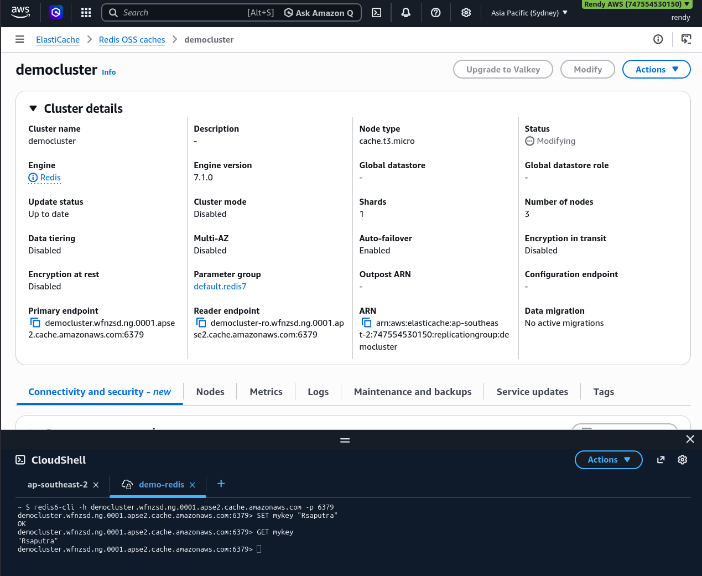

# ElastiCache Hands-On

The lab demonstrates the full creation, infrastructure configuration, and cleanup lifecycle of a node-based **ElastiCache for Redis** database cluster. By disabling multi-shard cluster modes to run a cost-effective single-node instance inside a dedicated subnet group, Stephane maps out the security parameters (like Redis AUTH vs ACLs) and operational metrics used to construct highly responsive, isolated cloud caching systems.

## Key Takeaways

### Key Architecture: Core Console Configurations

During the creation phase, ElastiCache forces you to make critical architectural design decisions:

- **The Engine**: The console list Redis OSS, Memcached, and **Valkey**. Valkey is the community-driven, fully open-source fork created after Redis changed its licensing model. AWS actively recommends Valkey because it delivers identical drop-in functionality but is priced significantly lower than traditional Redis engines.
- **The Cluster Topology Mode**:
  - _Cluster Mode Disabled_: Creates a single master primary shard that handles writes, attached to up to 5 read replicas. This is the baseline setup for a single-node cluster.
  - _Cluster Mode Enabled_: Utilizes **Sharding** to partition your keyspace across multiple distinct master nodes simultaneously, allowing your cache to scale past the memory limitation of a single physical server host.
- **Subnet Group Isolations**: Just like an RDS database, an ElastiCache node cannot drift loosely in a VPC. You must map a custom **Cache Subnet Group** linking specific backend subnets to tell AWS exactly which isolated AZs are permitted to host the caching machines.



### The Security & Authentication Layers

Stephane highlights that turning on data-in-transit protection alters how your backend applications must connect to the cluster endpoints:
|Security State|Encryption Type|Authentication Engine Access|
|--------------|---------------|-------------------------|
|Transit Disabled|Open network packet streaming.|Standard anonymous endpoint handshakes. Controlled purely by VPC Security Groups.
|Transit Enabled|Strict TLS/SSL tunnel wrapping.|Unlocks the choice between Redis AUTH (requiring a static, hardcoded access token string) or modern Role-Based Access Control Lists (ACLs) to manage multi-user permissions.|

### Application Connectivity & Clean Wiping

Once the infrastructure status flips to `Available`, the console generates the unique endpoint strings you feed into your backend code blocks:

```
[Cache Shard Primary Node] ──> Provides: Primary Endpoint (Handles App Reads & Writes)
[Cache Shard Replica Node] ──> Provides: Reader Endpoint  (Handles Offloaded App Reads Only)
```

Because ElastiCache is a high-performance database cluster, the teardown sequence requires explicit commands. Unlike RDS, there is no deletion protection toggle block. You choose the cluster node, trigger `Delete`, uncheck the automation backup string option, type the cluster name to confirm you understand that volatile RAM contents are about to vanish, and execute the wipe.

## Exam Tips

**The Connection Timed Out**: If an exam scenario says, "A developer is trying to run a test script from an EC2 instance to seed data into a newly created ElastiCache cluster, but the scripts hangs indefinitely and returns a connection timeout error", look past the engine code. **Because ElastiCache behaves exactly like RDS from a network footprint perspective, a timeout means the cluster's VPC SG is actively blocking inbound traffic from the EC2's instance security group on Port 6379 (redis) or Port 11211 (memcached)**.

**The Cache Data Security Mandate**: If a question demands a caching setup that encrypts all customer payloads travelling across the internal cloud network while ensuring that distinct application services have isolated, granular read/write access privileges within the data store, **the architecture play is to enable in Transit Encryption and deploy ElastiCache User Groups/Redis Access Control Lists (ACLs) to manage the identities.**
