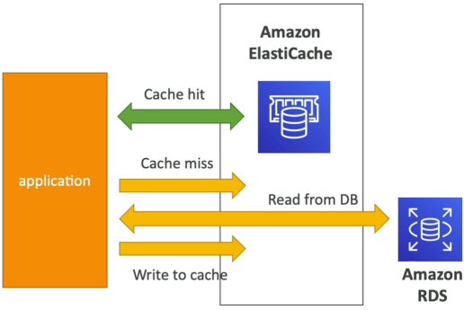
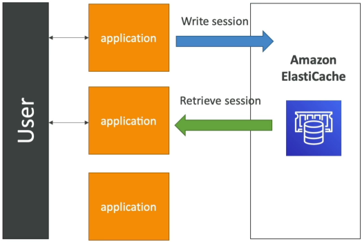

# ElastiCache Overview

If RDS and Aurora are your heavy-duty structural filling cabinets, ElastiCache is the sticky note on your monitor with your most frequently used numbers. Amazon ElastiCache is a fully managed, in-memory caching and database service. By keeping frequently requested data in volatile RAM instead of fetching it from traditional disk storage, it delivers **sub-millisecond latencies**. Its two primary use cases are drastically reducing the read strain on relational backends and storing transient data (like user login sessions) to make your web servers completely stateless.

## Key Takeaways

### Key Architecture: Cache Hits vs Cache Misses

Unlike turning on a feature in RDS, **implementing ElastiCache requires major application code updates**. Your code has to act as the traffic cop between the caching tier and the database tier.

- **The Cache Hit**: Your application needs a piece of data. It checks ElastiCache first. If the data is present, there is a **Cache Hit**. The app pulls the data directly out of RAM instantly, saving a costly, slow round-trip query down to your RDS instance.
- **The Cache Miss**: Your application checks ElastiCache, but the data isn't there. The app is forced to execute a slow query down to RDS to fetch the truth. To optimize future flows, the application code then writes that freshly retrieved data back up into ElastiCache so next identical query results in a lightning-fast hit.
- **The Invalidation Problem**: Because data inside a cache is a duplicate copy of disk records, you must design robust **Cache Invalidation Strategies** (Like TTL Expirations or Event-Driven Deletes) to ensure your app doesn't server stale data to your users.

### The Stateless Application Strategy

Another primary design pattern for ElastiCache is storing volatile application state data like e-commerce shopping carts or user login sessions.

If an instance inside your ASG dies or your ALB routes a user to a different web server instance mid-session, the new instance doesn't ask the user to login again. It simply reaches down into the centralized ElastiCache cluster, pulls the user's active session state, and handle the request completely uninterrupted. Your compute tier stays **100% stateless**.

### Engine Comparison: Redis vs Memcached

| Feature / Attribute            | Redis (The Heavyweight)                                                                         | Memcached (The Simple Cluster)                                                                         |
| ------------------------------ | ----------------------------------------------------------------------------------------------- | ------------------------------------------------------------------------------------------------------ |
| Data Architecture              | Multi-AZ deployments with Automatic Failover and up to 5 read replicas.                         | Pure Horizontal Sharding. Data is partitioned across multiple parallel nodes.                          |
| Resilience & High Availability | High. Supports data durability (AOF persistence) along with automated backup/restore snapshots. | ❌ Low. No native replication layer. If a standard self-managed node crashes, the data on it vanishes. |
| Data Structures                | Advanced types (Strings, Hashes, Lists, Sets, and Sorted Sets for gaming leaderboards).         | Simple Key-Value string pairs only.                                                                    |
| Threading Model                | Historically single-threaded (highly optimized for atomic operations).                          | Multi-threaded architecture (scales beautifully out across multi-core CPU hosts).                      |

## Exam Tips

The developer exam expects you to recognize exactly when to inject an in-memory caching tier into a lagging distributed landscape:

**The Gaming Leaderboard Requirement**: If an exam question states, "You are building a high-throughput mobile multiplayer game and need an architectural component that can track global user scores in real-time, generate dynamic top-100 player leaderboards with sub-millisecond read updates, and survive AZ failures", look for **Amazon Elasticache for Redis**. The key buzzwords are "Sorted Sets" and "Auto-Failover Resilience".

**The "My Database is Meltdown" Scenario: If a question says, "Your primary RDS instance is running at 98% CPU utilization because millions of unique users are hitting the home page every hour to fetch the exact same static product catalog array", do not scale the RDS instance vertically. **The correct cloud answer is to refactor the application code to implement an ElastiCache layer to handle the product catalog reads, blocking the traffic from ever hitting your RDS instance in the first place\*\*.
