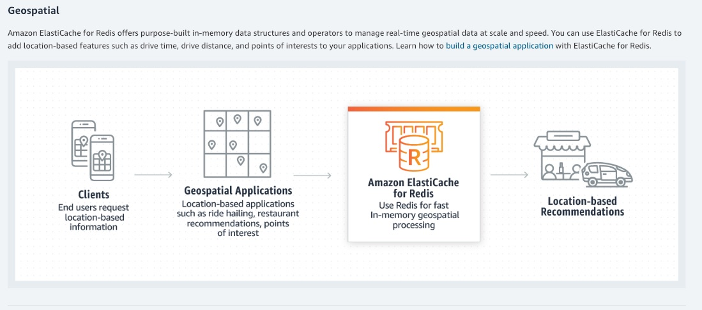

# ElastiCache Overview

If RDS and Aurora are your heavy-duty structural filling cabinets, ElastiCache is the sticky note on your monitor with your most frequently used numbers. Amazon ElastiCache is a fully managed, in-memory caching and database service. By keeping frequently requested data in volatile RAM instead of fetching it from traditional disk storage, it delivers **sub-millisecond latencies**. Its two primary use cases are drastically reducing the read strain on relational backends and storing transient data (like user login sessions) to make your web servers completely stateless.

## Key Takeaways

### Key Architecture: Cache Hits vs Cache Misses

Unlike turning on a feature in RDS, **implementing ElastiCache requires major application code updates**. Your code has to act as the traffic cop between the caching tier and the database tier.

- **The Cache Hit**: Your application needs a piece of data. It checks ElastiCache first. If the data is present, there is a **Cache Hit**. The app pulls the data directly out of RAM instantly, saving a costly, slow round-trip query down to your RDS instance.
- **The Cache Miss**: Your application checks ElastiCache, but the data isn't there. The app is forced to execute a slow query down to RDS to fetch the truth. To optimize future flows, the application code then writes that freshly retrieved data back up into ElastiCache so next identical query results in a lightning-fast hit.
- **The Invalidation Problem**: Because data inside a cache is a duplicate copy of disk records, you must design robust **Cache Invalidation Strategies** (Like TTL Expirations or Event-Driven Deletes) to ensure your app doesn't server stale data to your users.

### The Stateless Application Strategy

Another primary design pattern for ElastiCache is storing volatile application state data like e-commerce shopping carts or user login sessions.

If an instance inside your ASG dies or your ALB routes a user to a different web server instance mid-session, the new instance doesn't ask the user to login again. It simply reaches down into the centralized ElastiCache cluster, pulls the user's active session state, and handle the request completely uninterrupted. Your compute tier stays **100% stateless**.

### Engine Comparison: Redis vs Memcached

| Feature / Attribute            | Redis (The Heavyweight)                                                                         | Memcached (The Simple Cluster)                                                                         |
| ------------------------------ | ----------------------------------------------------------------------------------------------- | ------------------------------------------------------------------------------------------------------ |
| Data Architecture              | Multi-AZ deployments with Automatic Failover and up to 5 read replicas.                         | Pure Horizontal Sharding. Data is partitioned across multiple parallel nodes.                          |
| Resilience & High Availability | High. Supports data durability (AOF persistence) along with automated backup/restore snapshots. | ❌ Low. No native replication layer. If a standard self-managed node crashes, the data on it vanishes. |
| Data Structures                | Advanced types (Strings, Hashes, Lists, Sets, and Sorted Sets for gaming leaderboards).         | Simple Key-Value string pairs only.                                                                    |
| Threading Model                | Historically single-threaded (highly optimized for atomic operations).                          | Multi-threaded architecture (scales beautifully out across multi-core CPU hosts).                      |

## Exam Tips

The developer exam expects you to recognize exactly when to inject an in-memory caching tier into a lagging distributed landscape:

**The Gaming Leaderboard Requirement**: If an exam question states, "You are building a high-throughput mobile multiplayer game and need an architectural component that can track global user scores in real-time, generate dynamic top-100 player leaderboards with sub-millisecond read updates, and survive AZ failures", look for **Amazon Elasticache for Redis**. The key buzzwords are "Sorted Sets" and "Auto-Failover Resilience".

**The "My Database is Meltdown" Scenario**: If a question says, "Your primary RDS instance is running at 98% CPU utilization because millions of unique users are hitting the home page every hour to fetch the exact same static product catalog array", do not scale the RDS instance vertically. **The correct cloud answer is to refactor the application code to implement an ElastiCache layer to handle the product catalog reads, blocking the traffic from ever hitting your RDS instance in the first place**.

### Scenario Practice

**Question 1**: A company uses Amazon RDS as its database. For improved user experience, it has been decided that a highly reliable fully-managed caching layer has to be configured in front of RDS.

Which of the following is the right choice, keeping in mind that cache content regeneration is a costly activity?

- [ ] Migrate the database to Amazon Redshift
- [ ] Implement Amazon ElastiCache Memcached
- [ ] Install Redis on an Amazon EC2 instance
- [ ] Implement Amazon ElastiCache Redis in Cluster Mode

Correct Answer

- [ ] Migrate the database to Amazon Redshift
  - **Explanation**: Amazon Redshift belongs to "Big Data as a Service" cloud facility, while Redis can be primarily classified under "In-Memory Databases". "Data Warehousing" is the primary reason why developers consider Amazon Redshift over the competitors, whereas "Performance" is the key factor in picking Redis.
- [ ] Implement Amazon ElastiCache Memcached
  - **Explanation**: Redis and Memcached are popular, open-source, in-memory data stores. Although they are both easy to use and offer high performance, there are important differences to consider when choosing an engine. Memcached is designed for simplicity while Redis offers a rich set of features that make it effective for a wide range of use cases. Redis offers snapshots facility, replication, and supports transactions, which Memcached cannot and hence ElastiCache Redis is the right choice for our use case.
- [ ] Install Redis on an Amazon EC2 instance
  - **Explanation**: It is possible to install Redis directly onto Amazon EC2 instance. But, unlike ElastiCache for Redis, which is a managed service, you will need to maintain and manage your Redis installation.
- [x] Implement Amazon ElastiCache Redis in Cluster Mode
  - **Explanation**: One can leverage ElastiCache for Redis with cluster mode enabled to enhance reliability and availability with little change to your existing workload. Cluster mode comes with the primary benefit of horizontal scaling of your Redis cluster, with almost zero impact on the performance of the cluster.

    When building production workloads, you should consider using a configuration with replication, unless you can easily recreate your data. Enabling Cluster-Mode provides a number of additional benefits in scaling your cluster. In short, it allows you to scale in or out the number of shards (horizontal scaling) versus scaling up or down the node type (vertical scaling). This means that Cluster-Mode can scale to very large amounts of storage (potentially 100s of terabytes) across up to 90 shards, whereas a single node can only store as much data in memory as the instance type has capacity for.

        Redis Cluster config:
        

**Question 2**: A development team is considering Amazon ElastiCache for Redis as its in-memory caching solution for its relational database.

Which of the following options are correct while configuring ElastiCache? (Select two)

- [ ] All the nodes in a Redis cluster must reside in the same region
- [ ] While using Redis with cluster mode enabled, asynchronous replication mechanisms are used to keep the read replicas synchronized with the primary. If cluster mode is disabled, the replication mechanism is done synchronously
- [ ] If you have no replicas and a node fails, you experience no loss of data when using Redis with cluster mode enabled
- [ ] You can scale write capacity for Redis by adding replica nodes
- [ ] While using Redis with cluster mode enabled, you cannot manually promote any of the replica nodes to primary

Correct Answers

- [x] All the nodes in a Redis cluster must reside in the same region
  - **Explanation**: All the nodes in a Redis cluster (cluster mode enabled or cluster mode disabled) must reside in the same region.
- [ ] While using Redis with cluster mode enabled, asynchronous replication mechanisms are used to keep the read replicas synchronized with the primary. If cluster mode is disabled, the replication mechanism is done synchronously
  - **Explanation**: When you add a read replica to a cluster, all of the data from the primary is copied to the new node. From that point on, whenever data is written to the primary, the changes are asynchronously propagated to all the read replicas, for both the Redis offerings (cluster mode enabled or cluster mode disabled).
- [ ] If you have no replicas and a node fails, you experience no loss of data when using Redis with cluster mode enabled
  - **Explanation**: If you have no replicas and a node fails, you experience loss of all data in that node's shard, when using Redis with cluster mode enabled. If you have no replicas and the node fails, you experience total data loss in Redis with cluster mode disabled.
- [ ] You can scale write capacity for Redis by adding replica nodes
  - **Explanation**: This increases only the read capacity of the Redis cluster, write capacity is not enhanced by read replicas.
- [x] While using Redis with cluster mode enabled, you cannot manually promote any of the replica nodes to primary
  - **Explanation**: While using Redis with cluster mode enabled, there are some limitations:
    - You cannot manually promote any of the replica nodes to primary.
    - Multi-AZ is required.
    - You can only change the structure of a cluster, the node type, and the number of nodes by restoring from a backup.

**Question 3**: A company wants to add geospatial capabilities to the cache layer, along with query capabilities and an ability to horizontally scale. The company uses Amazon RDS as the database tier.

Which solution is optimal for this use-case?

- [ ] Leverage the capabilities offered by ElastiCache for Redis with cluster mode enabled
- [ ] Use CloudFront caching to cater to demands of increasing workloads
- [ ] Migrate to Amazon DynamoDB to utilize the automatically integrated DynamoDB Accelerator (DAX) along with query capability features
- [ ] Leverage the capabilities offered by ElastiCache for Redis with cluster mode disabled

Correct Answer

- [x] Leverage the capabilities offered by ElastiCache for Redis with cluster mode enabled
  - **Explanation**: You can use Amazon ElastiCache to accelerate your high volume application workloads by caching your data in-memory providing sub-millisecond data retrieval performance. When used in conjunction with any database including Amazon RDS or Amazon DynamoDB, ElastiCache can alleviate the pressure associated with heavy request loads, increase overall application performance and reduce costs associated with scaling for throughput on other databases.

    Amazon ElastiCache makes it easy to deploy and manage a highly available and scalable in-memory data store in the cloud. Among the open source in-memory engines available for use with ElastiCache is Redis, which added powerful geospatial capabilities in its newer versions.

    You can leverage ElastiCache for Redis with cluster mode enabled to enhance reliability and availability with little change to your existing workload. Cluster Mode comes with the primary benefit of horizontal scaling up and down of your Redis cluster, with almost zero impact on the performance of the cluster.

    Enabling Cluster Mode provides a number of additional benefits in scaling your cluster. In short, it allows you to scale in or out the number of shards (horizontal scaling) versus scaling up or down the node type (vertical scaling). This means that Cluster Mode can scale to very large amounts of storage (potentially 100s of terabytes) across up to 90 shards, whereas a single node can only store as much data in memory as the instance type has capacity for.  
    Cluster Mode also allows for more flexibility when designing new workloads with unknown storage requirements or heavy write activity. In a read-heavy workload, one can scale a single shard by adding read replicas, up to five, but a write-heavy workload can benefit from additional write endpoints when cluster mode is enabled.

    Geospatial on Amazon ElastiCache for Redis:  
     

- [ ] Use CloudFront caching to cater to demands of increasing workloads
  - **Explanation**: One of the purposes of using CloudFront is to reduce the number of requests that your origin server must respond to directly. With CloudFront caching, more objects are served from CloudFront edge locations, which are closer to your users. This reduces the load on your origin server and reduces latency. However, the use case mentions that in-memory caching is needed for enhancing the performance of the application. So, this option is incorrect.
- [ ] Migrate to Amazon DynamoDB to utilize the automatically integrated DynamoDB Accelerator (DAX) along with query capability features
  - **Explanation**: Amazon DynamoDB Accelerator (DAX) is a fully managed, highly available, in-memory cache for DynamoDB that delivers up to a 10x performance improvement – from milliseconds to microseconds – even at millions of requests per second. Database migration is a more elaborate effort compared to implementing and optimizing the caching layer.
- [ ] Leverage the capabilities offered by ElastiCache for Redis with cluster mode disabled
  - **Explanation**: For a production workload, you should consider using a configuration that includes replication to enhance the protection of your data. Also, only vertical scaling is possible when cluster mode is disabled. The use case mentions horizontal scaling as a requirement, hence disabling cluster mode is not an option.

