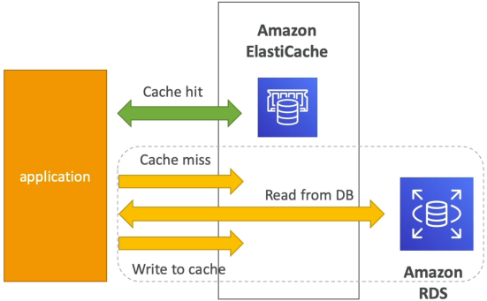
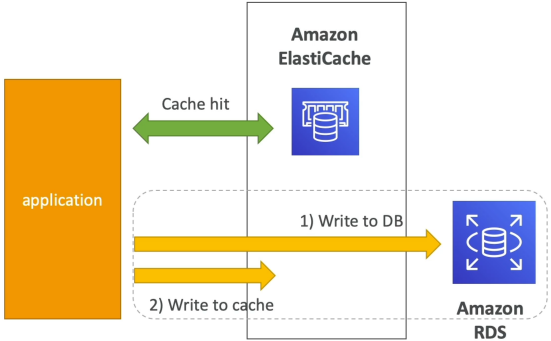

# ElastiCache Strategies

Caching strategies dictate the exact sequencing your application code uses to manage traffic flows between an in-memory database (ElastiCache) and a persistent disk database (RDS). **Lazy Loading** is a reactive pattern that only saves data when an user explicitly reads it, creating an ultra-lean cache footprint but risking stale data. **Write-Through** is a proactive design that forces the application to mirror database changes inside RAM instantly upon every write operation, eliminating data staleness at the cost of slower save cycle.

## Key Takeaways

### 🏎️ Lazy Loading (Cache-Aside/Lazy Population)

This is a **reactive** read-optimization pattern. The application treats the database as the master of truth and only populates the cache on a complete cache miss.



**Operational Blueprint Flow**:

1. Application initiates a data read request. It checks ElastiCache first.
2. **The Cache Hit (best case)**: Data is present in RAM. It instantly returns the data to the client with sub-millisecond latency. One network call.
3. **The Cache Mis (worse case)**: Data is missing. The application triggers three consecutive network hops:
   - **Hop 1**: Ask Cache > get back (`none`)
   - **Hop 2**: Ask RDS > Run SQL Query to fetch the live row
   - **Hop 3**: Run a `set` command to store that row in ElastiCache so the next reader hits the fast path

#### The Pseudocode logic pattern

```python
def get_user(user_id):
    # Step 1: Check the caching ring first
    record = cache.get(user_id)

    # Step 2: The Cache Miss Logic Gate
    if record is None:
        record = db.query("SELECT * FROM users WHERE id = ?", user_id) # Fetch true state
        cache.set(user_id, record)                                     # Populate for next time

    return record
```

The exam expects you to look at a code snippet and immediately identify the pattern. Notice how the database layer is only invoked inside the `if record is None` block.

- **The Pros**: Highly cost-effective. Your cache only allocates memory for keys that users are actually reading. A complete node failure isn't fatal, it just requires a temporary latency spike while the cache "warms up" again.
- **The Cons**: Data can easily become state if a separate background process modifies RDS without updating ElastiCache.

### 🛡️ Write-Through

This is a **proactive** write-optimization pattern. Instead of waiting for a reader to encounter a slow cache miss, the system updates the memory tier immediately when data changes.



**Operational Blueprint Flow**:

1. Application receives an insert or modify request (`POST`, `PUT`, `DELETE`).
2. **The Database Commit**: The application executes a query directly against RDS.
3. **The Cache Mirror**: Immediately following a successful database commit, the code fires an atomic write up to ElastiCache, swapping or creating the identical key inside RAM.

#### The Pseudocode Logic Pattern

```python
def save_user(user_id, values):
    # Step 1: Write the updated truth to the permanent disk tier
    record = db.query("UPDATE users SET values = ? WHERE id = ?", values, user_id)

    # Step 2: Immediately force the cache to match the disk state
    cache.set(user_id, record)

    return record
```

Notice how this logic explicitly targets mutating data operations (`save_user`) rather than lookup actions (`get_user`).

- **The Pros**: Data in cache is **never stale**. Read operations are guaranteed to be blazing fast and completely avoid the triple-roundtrip cache-miss penalty. It also shifts deployment overhead to the write phase, where users naturally expect a tiny processing delay.
- **The Cons**: Infrequently requested data is permanently pushed into RAM, risking high **Cache Churn** and filling up expensive memory slots with zombie keys that are never read.

### Eviction, Thrashing, and the TTL Guardrail

Because RAM is expensive, highly limited resource compared to massive multi-terabyte database disks, you must manage your cache size using two distinct safety valves:

- **Cache Evictions (LRU)**: When ElastiCache hits 100% memory capacity, the database engine executes a **Least Recently Used (LRU)** eviction policy. It automatically drops the oldest, cold keys from memory to open slots for incoming data. If your cloud monitoring dashboards indicate a massive spike in Evictions, it means your cache is too small (**Cache Thrashing**) and you must scale your instance sizes up or add shards.
- **Time-To-Live (TTL)**: An explicit integer flag representing the lifespan of a cached key in seconds. Setting a conservative TTL (e.g., 300 seconds) acts as a beautiful hybrid guardrail. It guarantees that even if you use the Lazy Loading strategy, stale-data will self-destruct within 5 minutes, forcing clean, up-to-date database on the next request.

## Exam Tips

**The "Zombie Storage" Optimization"**: If an exam questions says, "You deployed a Write-Through caching layer over an RDS database that handles billions of transactional rows. Over time, your ElastiCache costs spike significantly, and logs show that 90% of the data mirrored into RAM is never read by consumer before getting evicted.", you are dealing with bad cache design. **The best practice solution is to refactor your code to utilized Lazy Loading as your foundation tier, and only implement Write-Through on highly targeted, specific keys that experience intense, repeated read traffic (like user session tokens or site setting array)**.
