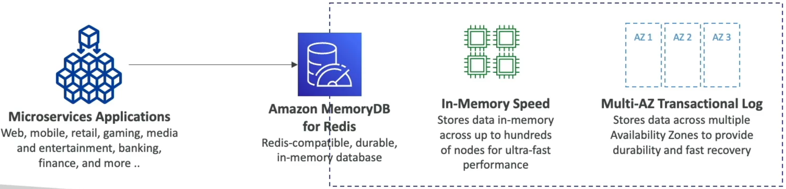

# Amazon MemoryDB for Redis

**Amazon MemoryDB for Redis** is where AWS completely blurs the line between volatile caching speen and permanent database durability.

Amazon MemoryDB for Redis is a fully managed, **cloud-native, relational-grade durable database** that keeps 100% of its primary dataset directly in RAM. Unlike standard ElastiCache (where Redis treats disk storage as an afterthought or an emergency backup snapshot), MemoryDB mandates a synchronous **Multi-AZ Transaction Log** write before it ever acknowledges a successful operation.This gives you microseconds read latencies, single-digit millisecond write latencies, and absolute data persistence.

## Key Takeaways

### The Core Multi-AZ Architecture

Under the hood, MemoryDB splits your cluster into compute shards and a completely decoupled, hyper-durable transaction log stream layer.

**The Write Lifecycle Flow**:

1. Your application issues a write query (like an `HSET` or `LPUSH`) to the MemoryDB Primary Node.
2. The Primary Node **does not** just write to RAM and return a success code. Instead, it immediately streams that modification to an off-instance, distributed **Multi-AZ Transaction Log**.
3. One that transaction log safely commits the data across multiple AZs, the Primary node officially responds to your application with a success handshake.
4. The background replicas pull from that transaction log asynchronously to synchronize their local RAM tables.

### The Definitive Showdown: ElastiCache vs MemoryDB

| Feature / Metric           | Amazon ElastiCache for Redis                                             | Amazon MemoryDB for Redis                                                                                |
| -------------------------- | ------------------------------------------------------------------------ | -------------------------------------------------------------------------------------------------------- |
| Primary Architectural Role | Caching Layer (Sits in front of an RDS/DynamoDB master of truth).        | Primary Database (It is the master of truth).                                                            |
| Data Durability Guarantee  | Ephemeral/Volatile. If an entire cluster loses power, data can be lost." | Ultra-Durable. Uses a synchronous, distributed Multi-AZ ledger.                                          |
| Performance Profile        | Sub-millisecond reads and sub-millisecond writes.                        | Sub-millisecond reads, but single-digit millisecond writes (due to the transaction log commit overhead). |
| Scale Range                | Limited by the instance RAM sizing of your cluster shard.                | Scales seamlessly from gigabytes up to hundreds of terabytes across a distributed cluster topology.      |

### Primary Use Cases

Because it supports over **160 million requests per second**, MemoryDB is built for distributed microservices that demand maximum velocity without the complexity of managing a separate cache-aside loop over a traditional SQL database:

- **E-Commerce User Profiles & Active Carts**: You don't have to write code to sync a shopping cart between Redis and RDS; MemoryDB handles the speed and ensures the card survives an entire data center outage.
- **Financial Ledgers & Token Balances**: High-speed accounting entries that require microseconds lookups but can never be dropped or corrupted.
- **Massive Online Gaming States**: Tracking live player inventories, positions, and session mechanics across a hyper-scalable microservice web.

## Exam Tips

- **The "Cache as Truth" Compliance Trap**: If an exam question states, "Your company is building a mobile banking using microservices. The development team wants to use the Redis API due to its ultra-fast speed and sortin capabilities. However, compliance regulations dictate that every single financial transaction log must be durably stored across multiple distinct data centers with zero risk of data loss during an unexpected cluster crash", choosing ElastiCache is a trap. **The correct cloud architecture choice is Amazon MemoryDB for Redis because it satisfies the Redis API requirement while guaranteeing Multi-AZ transactional ledger durability.**
