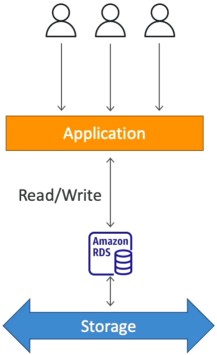

# Amazon RDS Overview

**Amazon Relational Database Serviec (RDS)** is a fully managed, relational database service that uses SQL as its query language. Instead of manually installing a database engine on an EC2 instance, patching the OS, and scripting backups, RDS automates the entire infrastructure lifecycle. Because it is a managed service, **AWS blocks all SSH access to the underlying server**, so we can only interact with the database via client applications.

## Key Takeaways

### Supported Database Engines Matrix

You need to commit the six standard relational engines (plus AWS's cloud-native premium tier) to memory, as the exam will cross-reference them:

- **Open Source**: MySQL, PostgreSQL, MariaDB
- **Commercial License**: Oracle, Microsoft SQL Server, IBM DB2
- **AWS Proprietary**: Amazon Aurora (highly testable, has its own rule)

### The Management Trade-Off: EC2 vs. RDS

| Task / Feature               | Self-Managed on EC2                     | Fully Managed Amazon RDS                                    |
| ---------------------------- | --------------------------------------- | ----------------------------------------------------------- |
| OS Patching & Provisioning   | ❌ Manual (You handle security updates) | Automated (Handled in designated maintenance windows)       |
| Backups & Disaster Recovery  | ❌ Manual scripts to S3 snapshots       | Automated Continuous Backups + Point-in-Time Recovery       |
| Scaling Architecture         | ❌ Complex clustering setups            | Horizontal (Read Replicas) & Vertical (Instance Resizing)   |
| Host Operating System Access | Full SSH Access                         | ❌ No SSH Allowed (Strictly forbidden by the service layer) |

### Under the Hood: RDS Storage Auto-Scaling

This is an elegant feature designed to prevent your database from locking up due to a full disk (`DiskFull` status). RDS storage is backed by Amazon EBS, and with Auto-Scaling enabled, it will dynamically increase your volume size on the fly without causing a single second of production downtime.

**The 3-Part Trigger Blueprint**: For RDS to rigger an automatic storage scale-up, the volume must breach three specific structural threshold simultaneously:

1. **The Capacity Gate**: Available free storage drops to **less than 10%** of the currently allocated volume size.
2. **The Duration Gate**: This low stroage condition must persist for **at least 5 minutes**.
3. **The Cooldown Gate**: At least **6 hours** must have passed since the last storage modification action (to prevent rapid back-to-back volume extensions).

To prevent your storage costs from running wild under this auto-scaling mechanism, you _must_ configure a **Maximum Storage Threshold** ceiling when turning this on.

## Exam Tips

The exam loves to challenge your understanding of the service boundaries and storage features.

- **The "Locked Box" Scenario**: If an exam question asks, "A developer needs to tweak a low-level Linux kernel parameter or install a custom monitoring daemon directly inside the operating system hosting a MySQL database", using standard Amazon RDS is completely wrong. **Because RDS strictly denies SSH/root OS access, the developer must either migrate to hosting the database manually on EC2, or look at a specialized hybrid tier called RDS custom (available for Oracle and SQL server)**.
- **The Flash-Sale Database Freeze**: If a question states, "An e-commerce application is heading into a viral flash-sale event. The application team expects a massive influx of transaction logs that could fill the database disk within an hour, risking an application crash due to storage exhaustion", the best practice solution is to **Enable RDS Storage Auto-Scaling and set an ample Maximum Storage Threshold**. This guarantees zero operational overhead or downtime while the storage expands dynamically behind the scenes.
