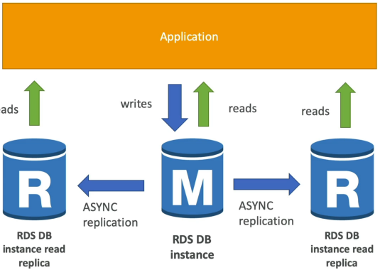
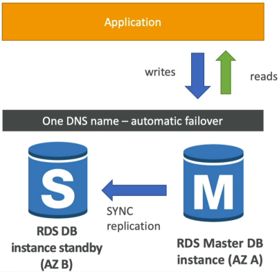
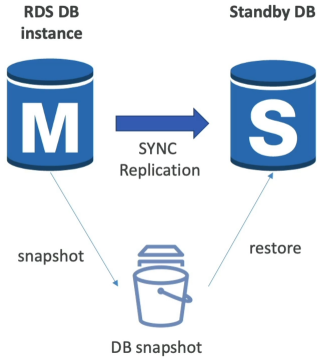
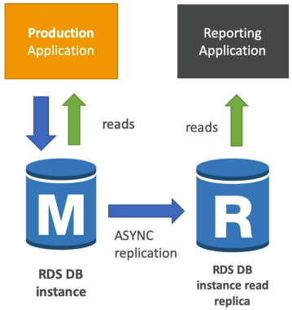

# RDS Read Replicas Vs. Multi-AZ

Amazon RDS **Read Replicas** create _read-only_ copies of your database to offload `SELECT` statements and maximize application performance using **asynchronous** replication. **Multi-AZ deployments**, on the other hand, build a completely passive, synchronous copy of your database in a separate availability zone purely as a high-availability insurance policy. If the primary node dies, Multi-AZ automatically handles the failover behind the scenes with zero manual code modifications.

## Key takeaways

### Architectural Blueprint & Breakdown

🏎️ **Read Replicas (Scalability & Performance)**

- **The Limit**: You can provision up to **15** Read Replicas per primary database.
- **The Boundary**: They can live in the same AZ, across different AZs, or completely cross-region (ideal for reducing latency for global users).
- **The Replication Type: Asynchronous**. This means data updates hit the replicas slightly after the primary database commits them. Because it's **eventually consistent**, a rapid read right after write might briefly return old data.
- **The Code Requirement**: Your application code _must_ be updated to use separate connection strings. Your main app sends `INSERT/UPDATE/DELETE` queries to the primary instance endpoint, and your reporting or read-heavy code points directly to the Read Replica endpoints.
- **The Promotion Feature**: You can manually "promote" any Read Replica to become its own fully independent, standalone read-write database, breaking it out of the replication loop permanently.

🛡️ **Multi-AZ (Disaster Recovery & Uptime)**

- **The Limit**: Strictly **1** passive standby instance per master database.
- **The Boundary**: Spans across exactly **2** different AZs within the same region.
- **The Replication Type: Synchronous**. When your app executes a write query, the master instance forces the standby node to write that exact block to disk before returning a success code back to your app. There is zero data loss, and consistency is absolute.
- **The Code Requirement: Zero code changes**. AWS provisions a single, unified DNS connection string endpoint. You point your app at that one URL. If an entire data center goes dark, AWS alters the internal routing map to point that exact same URL to the standby machine within 60 seconds.
- **The Restrictions**: The standby instance does nothing until a failover occurs. You cannot run `SELECT` queries against it, and you cannot offload traffic to it.

### Feature Comparison Matrix

| Feature / Metric          | RDS Read Replicas                                   | RDS Multi-AZ                                   |
| ------------------------- | --------------------------------------------------- | ---------------------------------------------- |
| Primary Use Case          | Horizontal Read Scaling                             | High Availability & Disaster Recovery (DR)     |
| Replication Engine        | Asynchronous (Eventually Consistent)                | Synchronous (Strictly Consistent)              |
| Failover Mechanics        | ❌ Manual (Must promote to standalone)              | 100% Automated (Via DNS swap)                  |
| Connection Strategy       | Unique endpoint per replica (Code updates required) | Single master DNS endpoint (Zero code changes) |
| Same-Region Network Cost  | 100% Free (Managed service perk)                    | Included in the Multi-AZ instance surcharge    |
| Cross-Region Network Cost | ⚠️ Standard Data Transfer Fees Apply                | N/A (Multi-AZ is strictly single-region)       |

### Zero-Downtime Conversion Mechanics

Stephane highlights a classic scenario: transitioning a live production setup from Single-AZ to Multi-AZ.

  
This is an entirely online operation. Your application keeps processing traffic normally while AWS snaps the storage blocks, transfer them to the sister AZ, spins up the sister instance, and establishes the synchronous replication pipeline.

## Exam Tips

- **The Analytics Congestion Scenario**: If an exam question says, "Your primary production database is chocking because the business intelligence team is running massive, long-running data reporting queries every hour, causing standard consumer transaction to fail or time out" do not update the instance size (vertical scaling). **The correct cloud answer is to deploy an RDS Read Replica specifically for the BI team's analytics tool, forcing them to use the replica's read-only endpoint.**  
  

- **The Combination Play**: Can you combine these two features? Absolutely. The exam loves to throw out a high-stakes prod requirement demanding _both_ absolute high availability and massive read performance. **The architecture play is to configure your primary database as a Multi-AZ deployment for zero-downtime failover, and then attach multiple Read Replicas to that cluster to offload application read strain**.
