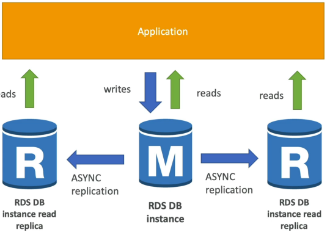
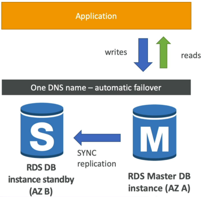
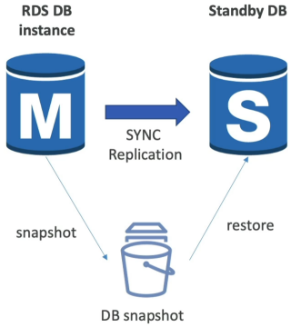
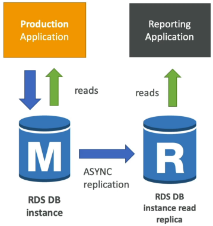
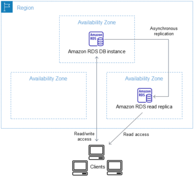

# RDS Read Replicas Vs. Multi-AZ

Amazon RDS **Read Replicas** create _read-only_ copies of your database to offload `SELECT` statements and maximize application performance using **asynchronous** replication. **Multi-AZ deployments**, on the other hand, build a completely passive, synchronous copy of your database in a separate availability zone purely as a high-availability insurance policy. If the primary node dies, Multi-AZ automatically handles the failover behind the scenes with zero manual code modifications.

## Key takeaways

### Architectural Blueprint & Breakdown

🏎️ **Read Replicas (Scalability & Performance)**

- **The Limit**: You can provision up to **15** Read Replicas per primary database.
- **The Boundary**: They can live in the same AZ, across different AZs, or completely cross-region (ideal for reducing latency for global users).
- **The Replication Type: Asynchronous**. This means data updates hit the replicas slightly after the primary database commits them. Because it's **eventually consistent**, a rapid read right after write might briefly return old data.
- **The Code Requirement**: Your application code _must_ be updated to use separate connection strings. Your main app sends `INSERT/UPDATE/DELETE` queries to the primary instance endpoint, and your reporting or read-heavy code points directly to the Read Replica endpoints.
- **The Promotion Feature**: You can manually "promote" any Read Replica to become its own fully independent, standalone read-write database, breaking it out of the replication loop permanently.

🛡️ **Multi-AZ (Disaster Recovery & Uptime)**

- **The Limit**: Strictly **1** passive standby instance per master database.
- **The Boundary**: Spans across exactly **2** different AZs within the same region.
- **The Replication Type: Synchronous**. When your app executes a write query, the master instance forces the standby node to write that exact block to disk before returning a success code back to your app. There is zero data loss, and consistency is absolute.
- **The Code Requirement: Zero code changes**. AWS provisions a single, unified DNS connection string endpoint. You point your app at that one URL. If an entire data center goes dark, AWS alters the internal routing map to point that exact same URL to the standby machine within 60 seconds.
- **The Restrictions**: The standby instance does nothing until a failover occurs. You cannot run `SELECT` queries against it, and you cannot offload traffic to it.

### Feature Comparison Matrix

| Feature / Metric          | RDS Read Replicas                                   | RDS Multi-AZ                                   |
| ------------------------- | --------------------------------------------------- | ---------------------------------------------- |
| Primary Use Case          | Horizontal Read Scaling                             | High Availability & Disaster Recovery (DR)     |
| Replication Engine        | Asynchronous (Eventually Consistent)                | Synchronous (Strictly Consistent)              |
| Failover Mechanics        | ❌ Manual (Must promote to standalone)              | 100% Automated (Via DNS swap)                  |
| Connection Strategy       | Unique endpoint per replica (Code updates required) | Single master DNS endpoint (Zero code changes) |
| Same-Region Network Cost  | 100% Free (Managed service perk)                    | Included in the Multi-AZ instance surcharge    |
| Cross-Region Network Cost | ⚠️ Standard Data Transfer Fees Apply                | N/A (Multi-AZ is strictly single-region)       |

### Zero-Downtime Conversion Mechanics

Stephane highlights a classic scenario: transitioning a live production setup from Single-AZ to Multi-AZ.

  
This is an entirely online operation. Your application keeps processing traffic normally while AWS snaps the storage blocks, transfer them to the sister AZ, spins up the sister instance, and establishes the synchronous replication pipeline.

## Exam Tips

- **The Analytics Congestion Scenario**: If an exam question says, "Your primary production database is chocking because the business intelligence team is running massive, long-running data reporting queries every hour, causing standard consumer transaction to fail or time out" do not update the instance size (vertical scaling). **The correct cloud answer is to deploy an RDS Read Replica specifically for the BI team's analytics tool, forcing them to use the replica's read-only endpoint.**  
  

- **The Combination Play**: Can you combine these two features? Absolutely. The exam loves to throw out a high-stakes prod requirement demanding _both_ absolute high availability and massive read performance. **The architecture play is to configure your primary database as a Multi-AZ deployment for zero-downtime failover, and then attach multiple Read Replicas to that cluster to offload application read strain**.

### Practice Test

**Question**: A retail company is migrating its on-premises database to Amazon RDS for PostgreSQL. The company has read-heavy workloads. The development team at the company is looking at refactoring the code to achieve optimum read performance for SQL queries.  
Which solution will address this requirement with the least current as well as future development effort?

- [ ] Configure Elasticache for Memcached to act as a caching layer for Amazon RDS. Refactor the application code so that the queries use the Elasticache for Memcached endpoint
- [ ] Set up Amazon RDS in the multi-AZ configuration with a single standby instance. Refactor the application code so that the queries use the standby instance endpoint
- [ ] Configure Elasticache for Redis to act as a caching layer for Amazon RDS. Refactor the application code so that the queries use the Elasticache for Redis endpoint
- [ ] Set up Amazon RDS with one or more read replicas. Refactor the application code so that the queries use the endpoint for the read replicas

Correct Answer

- [ ] Configure Elasticache for Memcached to act as a caching layer for Amazon RDS. Refactor the application code so that the queries use the Elasticache for Memcached endpoint
- [ ] Configure Elasticache for Redis to act as a caching layer for Amazon RDS. Refactor the application code so that the queries use the Elasticache for Redis endpoint
  - **Explanation**: Both Redis and Memcached are popular, open-source, in-memory data stores (also known as in-memory caches). These are not relational databases and cannot be used to run SQL queries. So, both these options are incorrect.
- [ ] Set up Amazon RDS in the multi-AZ configuration with a single standby instance. Refactor the application code so that the queries use the standby instance endpoint
  - **Explanation**: In an Amazon RDS Multi-AZ deployment with a single standby instance, Amazon RDS automatically creates a primary database (DB) instance and synchronously replicates the data to an instance in a different AZ. When it detects a failure, Amazon RDS automatically fails over to a standby instance without manual intervention. You cannot route the read queries from an application to the standby instance of a multi-AZ RDS database as it's not accessible for the read traffic in the single standby instance configuration.
- [x] Set up Amazon RDS with one or more read replicas. Refactor the application code so that the queries use the endpoint for the read replicas
  - **Explanation**: Amazon RDS uses the PostgreSQL DB engine's built-in replication functionality to create a special type of DB instance called a read replica from a source DB instance. The source DB instance becomes the primary DB instance. Updates made to the primary DB instance are asynchronously copied to the read replica. You can reduce the load on your primary DB instance by routing read queries from your applications to the read replica. Using read replicas, you can elastically scale out beyond the capacity constraints of a single DB instance for read-heavy database workloads. For the given use case, you can achieve optimum read performance for SQL queries by using the read-replica endpoint for the read-heavy workload.  
    

