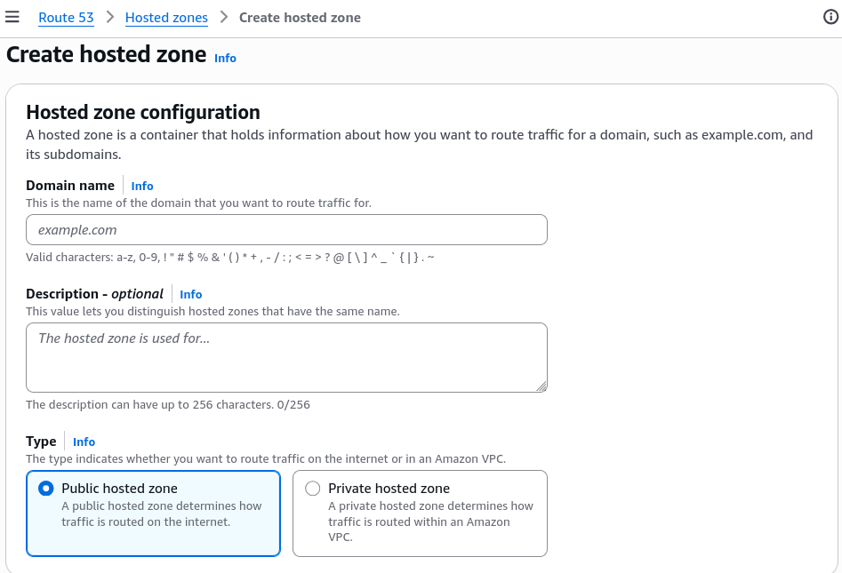
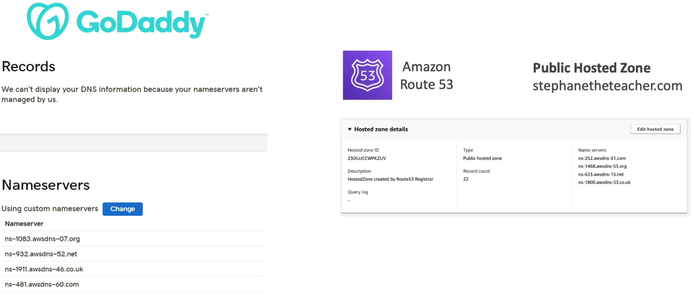

# 3rd Party Domains & Route 53

A **Domain Registrar** is an authorized entity that sells you the legal rights to an available text name string (like `example.com`) under a specific Top-Level Domain (TLD) registry (like `.com`). A **DNS Service Provider** is the network hosting infrastructure that actively answers public queries translating that domain name into actionable server IP coordinates. By swapping out your registrar's default Name Server (`NS`) for AWS's Anycast server array, you delegate all traffic authority to a Route 53 Public Hosted Zone.

## Key Takeaways

### Cross-Provider Delegation Workflow

When hooking an external domain name up tp your AWS ecosystem, you execute a 3-step delegation loop to pass authority over to Route 53:

```
[ Step 1: AWS Console ] ──> Create Public Hosted Zone ──> Generates 4 Unique AWS Name Servers
                                                                    │
[ Step 2: GoDaddy/Registrar ] ──> Edit Domain Properties <──────────┘
                                        │
                                        ▼
                                  Paste 4 AWS Name Server URLs (Overwriting defaults)
                                        │
                                        ▼
[ Step 3: Global Web Plane ] ───> Proves Route 53 is now the Absolute Authoritative Source!
```

- **Step 1:Provision the Container box in AWS**: Inside Route 53, you hit _Create Hosted Zone_. You input your exact domain name string (e.g., `mybrand.com`) and choose **Public Hosted Zone**. The second the box generates, AWS writes a default `NS` record populated with **four unique distributed name servers** (e.g., `ns-123.awsdns-44.net`).
  
- **Step 2: Sever the Third-Party DNS Ties**: You log straight into your external registrar panel (like RumahWeb). You navigate to your domain's _DNS Management/Nameserver_ tab and toggle the setting to **"Use Custom Nameservers."**.
- **Step 3: Glue the Stacks Together**: You copy the four raw name server strings from Route 53, paste them into the registrar's input slots, and save.
  

:::warning
**The 48-hour TTL Propagation Window**: The moment you click save inside your external registrar's panel, the routing won't shift instantaneously. The old registrar's name servers are cached in in recursive resolvers all over the globe with a high parent TTL. It **can take anywhere from a few minutes up to 48 hours for global internet traffic to naturally drain away from your old manager and fully recognize Route 53 as the new source of truth**.
:::

:::info
**The Registrar DNS Panel**: Once you update your name servers at the registrar to point to AWS, registrar's local DNS record panel become completely useless**. If you add an `A` record or an `MX` mail record inside the registrar's dashboard, the internet will completely ignore it. Every single DNS transaction must now be written programmatically or manually inside your **Route 53 Hosted Zone\*\* screen.
:::

## Exam Tips

**The Subdomain Delegation Pattern**: If an exam question states, _"Your company's primary root domain (`company.com`) is locked down securely inside an external enterprise registrar account that your development team is forbidden from modifying. However, you need to deploy an automated microservice stack on AWS and use CloudFormatio to dynamically script subdomains like `api.dev.company.com`. How can you achieve this without modifyinf the root registrar properties?"_ **The textbook cloud solution is Subdomain Delegation**. You create a Public Hosted Zone in Route 53 for the specific subdomain chunk (e.g., `dev.company.com`). You grab those 4 unique AWS name server, go to whoever owns the parent registrar panel, and ask them to write just one single `NS` **record** for `dev` pointing directly to your AWS endpoints. Now, Route 53 has total, unhindered authoritative control over `dev.company.com` and any childs records beneath it, completely bypassing the root lockdown!
