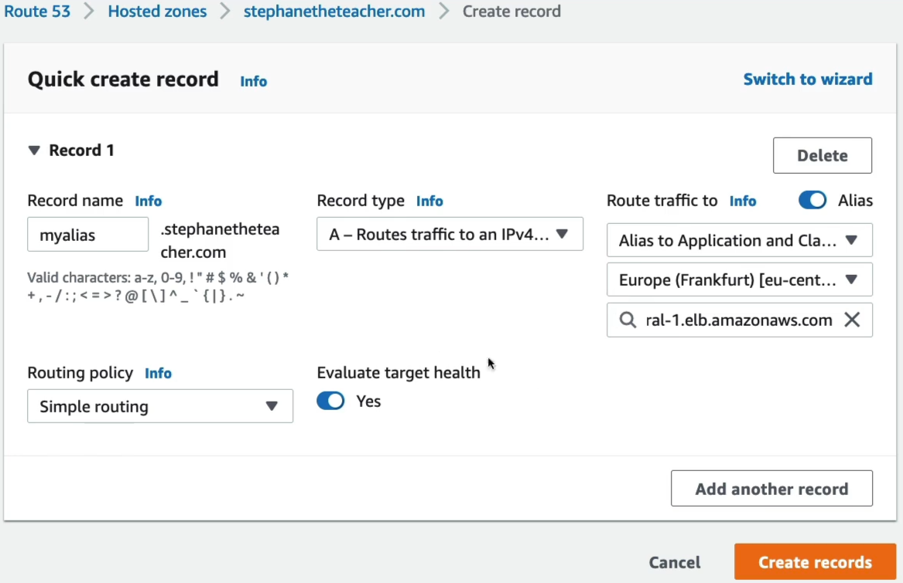

# CNAME vs Alias

A **CNAME (Canonical Name)** is a universal DNS standard that points one hostname text string directly to another hostname text string, forcing a client browser to make a costly secondary look-up step. An **Alias Record** is a proprietary, cloud native AWS Route 53 extension that maps a domain name directly to the underlying AWS infrastructure target. Because it resolves directly to IP addresses at the AWS DNS edge layer, it is faster, accepts zone apex routing, and cuts your query bill down to zero.

## Key Takeaways

### The Resolution Lifecycle Mechanics

The fundamental difference lies in the how a client's network layer learns the final destination IP address.

#### 🐢 The CNAME Handoff (Double-Hop Latency)

When a user visits a domain mapped via a standard CNAME record, their browser has to work twice:

```
[ Client Device ] ──(1. What is app.domain.com?)──> [ Route 53 Nameserver ]
        ▲                                                      │
        │ <──(2. It's a CNAME! Go ask: alb-123.aws.com)────────┘
        │
        ├───(3. What is alb-123.aws.com?)──────────> [ Global AWS Infrastructure ]
        ▼                                                      │
 [ Target Web IP ] <──(4. Finally returns: 54.x.x.x)───────────┘
```

1, The client requests `app.domain.com.` 2. Route 53 looks at its zone file and replies: "I don't know the IP, but that text string maps to `alb-123.aws.com`." 3. The client's resolver is forced to close that session, open a completely new query, and lookup the load balancer's URL to extract the real hosting server IP address. **This extra hop adds measurable network latency**.

#### 🏎️ The Alias Short-Circuit (Single-Hop Speed)

When you utilize a native Route 53 Alias record, AWS intercepts the calculation internally:

```
[ Client Device ] ──(1. What is myalias.domain.com?)──> [ Route 53 Nameserver ]
        ▲                                                           │
        │                                             (2. AWS intercepts inside the zone)
        ▼                                                           ▼
 [ Target Web IP ] <──(3. Returns Direct IP: 54.x.x.x)─────── [ Maps directly to ALB ]
```

1. The client requests `myalias.domain.com.`
2. Route 53 senses the internal Alias link, tracking the underlying ALB scale properties instantly.
3. **Route 53 does the heavy lifting behind the scenes and return the naked IPv4 address directly on the first attempt**. The client gets a straight answer instantly, speeding up site loading times.

### The Definitive Showdown

| Feature / Metric            | Standard CNAME Record                                                                  | Proprietary Route 53 Alias Record                                                        |
| --------------------------- | -------------------------------------------------------------------------------------- | ---------------------------------------------------------------------------------------- |
| **Target Type**             | Any text hostname URL string anywhere on the public internet.                          | Strictly AWS Resources (ALB, CloudFront, API Gateway, S3 Web Buckets, etc.).             |
| **Zone Apex Compatibility** | ❌ Strictly Forbidden. You cannot legally put a CNAME at the root domain (domain.com). | Fully Supported. You can safely route your root domain directly to cloud stacks.         |
| **AWS Query Billing**       | Standard lookup rates apply.                                                           | 💰 100% Free of Charge when pointing directly to supported AWS infrastructure resources. |
| **TTL Sizing Config**       | Mandated configuration field required during creation wizard.                          | Managed automatically by AWS. The field is stripped from the wizard panel.               |
| **Native Health Tracking**  | No.                                                                                    | Yes. Features native Target Health Evaluation toggles.                                   |

### The Absolute Target Restrictions

As Stephane calls out, you cannot point an Alias at just anything with an Amazon badge. You must memorize what is valid and what is blocked for production deployments:

- ✅ **Valid Alias Targets**: Elastic Load Balancers (ALB, NLB, CLB), CloudFront Distributions, AWS API Gateway custom domains, AWS Elastic Beanstalk endpoints, **S3 Buckets configured as Static Websites**, and VPC Interface Endpoints.
- ❌ **Invalid Alias Targets**: **An individual EC2 instance's default public DNS hostname** (e.g., `ec2-54-123-45-67.compute-1.amazonaws.com`). You cannot alias an EC2 hostname. If you need to route a domain straight to a single standalone EC2 machine, you must allocate an **Elastic IP (EIP)** to that instance and map it using a standard, non-alias `A` **record**.

## Exam Tips

**The Broken Naked Domain Launch**: If an exam scenario says, "Your marketing team just launched a brand new marketing campaign. They want users to be able to type the root naked domain name (`mybrand.com`) directly into their phone browsers to reach an application sitting behind an AWS Application Load Balancer. The Junior developer states they cannot configure this because standard DNS prohibits CNAME records at the Zone Apex", look for cloud-native solution. \*\*the correct cloud answer is to create an `A` record inside your Route 53 Hosted Zon, leave te subdomain prefix blank to target the Zone Apex, toggle 'Alias' to 'Yes', and select your ALB from the resource dropdown menu.

