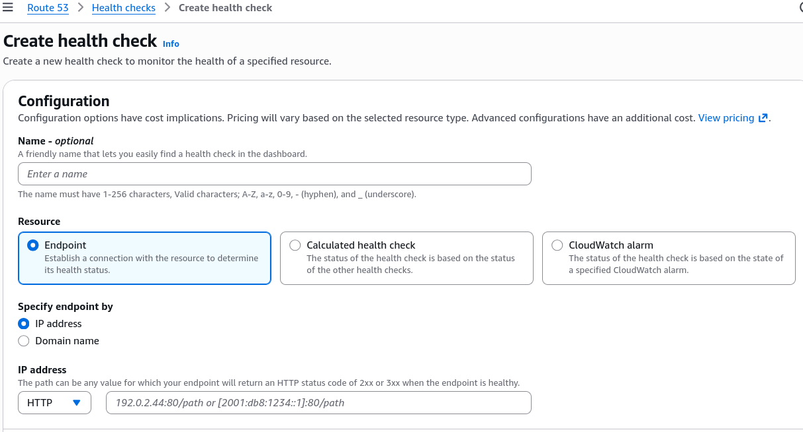
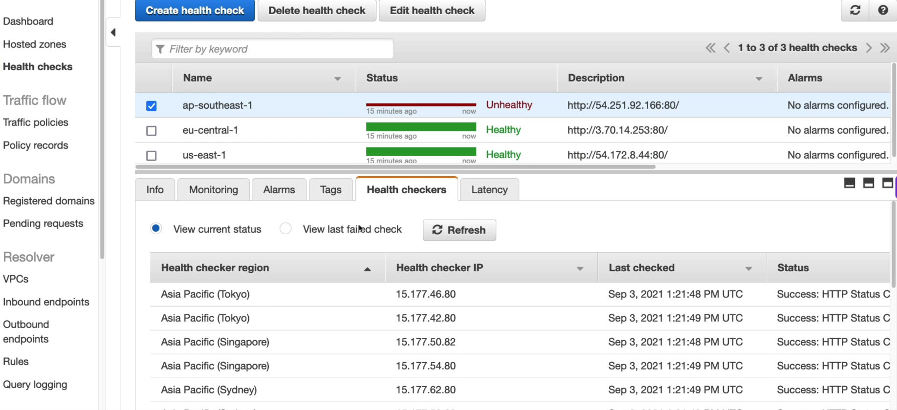
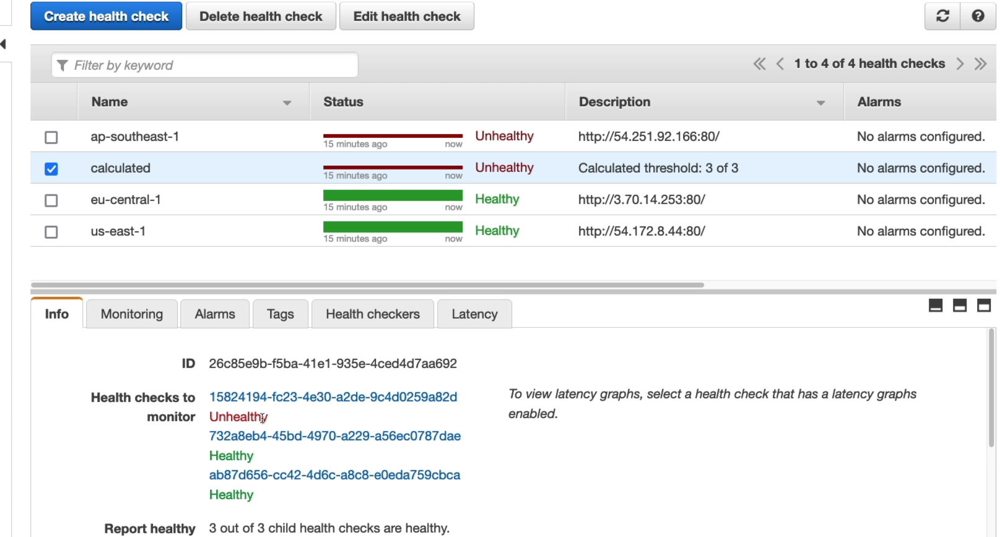

# Health Checks Hands On

The lab walks through building a multi-node health fabric by provisioning independent **Endpoint Health Checks** against the public IPv4 targets of our three regional EC2 instances. By intentionally stripping the inbound HTTP security group rule on the Singapore (`ap-southeast-1`) instance, Stephane demonstrates how Route 53 catches a firewall-induced `Connection Timeout`, flags the nodes as `Unhealthy`, and cascades the failure state up to a parent **Calculated Health Check** container.



## Key Takeaways

### The Anatomy of an Endpoint Failure

WHen Stephane deletes the inbound port 80 rule from the Singapore instance's SG, he creates an immediate cloud firewall block. Here is exactly how Route 53 analyzes and surfaces that drop:

- **The Connection TImeout Error**: When the 15 global probing nodes try to hit the Singapore public IP,the packets are silently dropped by the EC2 security group layer. The checkers don't receive an HTTP `404` or `500`; they get an absolute **connection timeout**.
- **The Console Diagnostic Panel**: Inside the Route 53 dashboard, clicking the **"View last failed check"** exposes the precise network failure signature. This tells your operations team instantly that the issue is a routing, firewall, or SG misconfiguration rather than application-layer crash.



### Calculated Health Checks

Stephane introduces the **Calculated Health Check** to evaluate the entire matrix as a single status. By setting a rule that requires **all** underlying children to be healthy,the parent container behaves like strict boolean `AND` engine.

```
                  ┌───────────────────────────────┐
                  │    Calculated Health Check    │ ──> [ STATUS: UNHEALTHY ]
                  │       (Rule: ALL Healthy)     │     (Because Singapore dropped)
                  └───────────────────────────────┘
                     /            │            \
                    /             │             \
                   ▼              ▼              ▼
           ┌───────────┐    ┌───────────┐    ┌────────────┐
           │  US-East  │    │EU-Central │    │AP-Southeast│
           │ (Healthy) │    │ (Healthy) │    │(UNHEALTHY) │
           └───────────┘    └───────────┘    └────────────┘
```

If you modify the parent threshold property to _"Report healthy if 2 or more child checks pass"_, the parent container would dynamically switch back to a green `Healthy` state, perfectly absorbing the single regional failure without sounding the global alarm.



## Exam Tips

The developer exam expects you to know exactly how Route 53 health checking behaves under various configuration constraints:

- **The Health Endpoint Path Pitfall**: In the lab, Stephane leaves the health check route path set to the default root apex (`/`). In real production microservices, **this is a major anti-pattern**. If your web server process (like Apache or Nginx) is up, hitting `/` will return a `200 OK` even if your underlying backend database has completely crashed! **The textbook cloud practice is to write a dedicated `/health` or `/status` endpoint in your application code**. This route should execute a quick query against your database, ensure your cache layer is connected and _only_ return a `200 OK` if the failure data dependency stack is fully operational.
