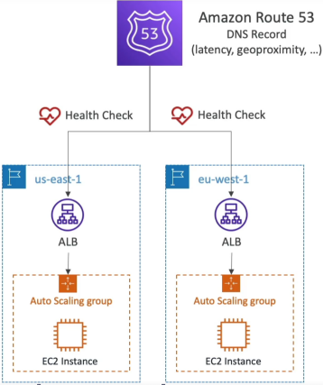
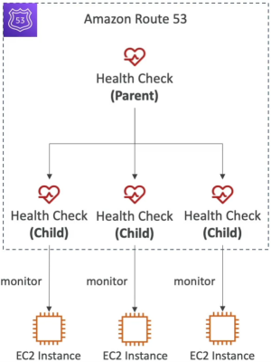
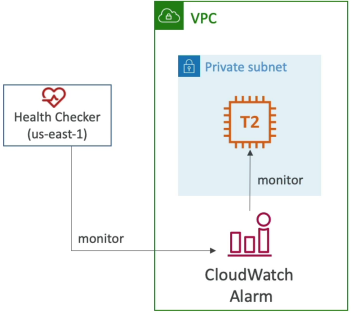

# Route 53 Health Checks

Global multi-region is completely useless if a data center drops offline and your DNS keeps blindly sending users to the dead IP address. **Route 53 Health Checks** are the exact architectural glue that turns static DNS maps into an automated, self-healing global traffic grid.

Route 53 Health Checks provide active, real-time monitoring of your application endpoints to orchestrate **Automated DNS Failover**. By constantly validating resource availability, Route 53 dynamically rewrites its active zone respones, stripping out dead or failing server arrays and ensuring user traffic is strictly routed to surviving infrastructure nodes.

## Key Takeaways

### Deep Dive: The 3 Health Check Types

AWS splits its health monitoring mechanics into three distinct design patterns based on where your resource lives and how you want to evaluate its performance:

#### 🌐 Type 1: Endpoint Monitoring (Public-Facing Resources)

This is the default **proactive probing** mechanism. A distributed array of roughly **15 global AWS health checkers** located all over the planet continuously throw automated network requests at your public endpoint.

- **The Healthy Threshold Matrix**: To pass, your endpoint must respond with a standard HTTP `2xx` or `3xx` status code within the configured time constraint.
- **String Matching Superpower**: For deep application layer checks, you can configure **String Matching**. Route 53 will scrape and read the first **5,120 bytes** of your server's HTML/text response body looking for an explicit confirmation keyword (like `HEALTHY` or `status_ok`).
- **The Frequency Profiles**:
  - _Standard_: Runs probes every **30 seconds** (Default, cost-effective)
  - _Fast Check_: Runs probes every **10 seconds** (Higher billing surcharge, but drops your failover detection window dramatically)
- **The Global Consensus Rule**: Route 53 aggregates the results of all 15 global probing nodes. **If more than 18% of the global checkers report that the server is alive, Route 53 keeps the endpoint marked as healthy.** If accessible drop to 18% or lower, it trigger a system failover event.
- **Firewall Perimeter Rule**: For this to work, your SGs and Network ACLs **must explicitly allow inbound traffic from the [official Route 53 Health Checks IP range](https://ip-ranges.amazonaws.com/ip-ranges.json)**. If you block them, the checkers will register a timeout and pull your healthy server offline by accident.



#### 🔮 Type 2: Calculated Health Checks (The Logic Evaluator)

Calculated health checks do not ping any servers directly. Instead, they act as a **parent container** that watches the other "child" health checks and combines them using standard boolean operators (`AND`, `OR`, `NOT`).

- **The Scale Capacity**: A single parent can monitor up to **256 distinct child health checks**.
- **The Production Playbook**: You can configure a rule stating: _"This parent check is healthy as long as at least 2 out of our 3 redundant backend EC2 instances are responding."_ This allows your operation team to gracefully take an individual server offline for maintenance without triggering a global catastrophic DNS failover alarm.
  

#### 🛡️ Type 3: CloudWatch Alarm Monitoring (The Private VPC / On-Premises Shield)

Because Route 53's external health checkers live on the public internet, **they are physically blocked from reaching private resources** sitting inside locked-down private subnets (`10.0.x.x) or on-premises corporate infrastructure over a VPN.



To bridge this air-gap, you utilize a **reactive metrics loop**:

1. You configure internal resource tracking (like an EC2 instance's CPU Utilization, memory exhaustion, or private RDS query latencies).
2. You map a **CloudWatch Alarm** to that specific metric.
3. You link Route 53 straight to that alarm status. If the alarm trips into the `ALARM` **state**, Route 53 flags the associated health check as unhealthy on the spot, routing public traffic away from the impacted private stack seamlessly.

## Exam Tips

**The Calculated Failover Equation**: The exam will expect you to calculate how long it takes for a system to complete a cross-region failover. The total time required is governed by a strict equation:

```
Total Failover Time = Record TTL + (Check Interval × Failure Threshold)
```

If a scenario states, _"Your records has a TTL of 60 seconds, your health check runs on a fast 10-second interval, and your Failure Threshold is set to 3 consecutive failures"_, the math works out to

```
Total Failover Time = 60 + (10 × 3) = 90 seconds
```
