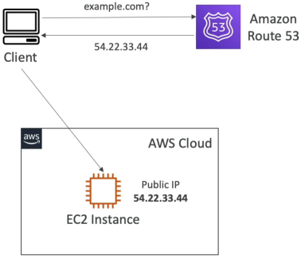
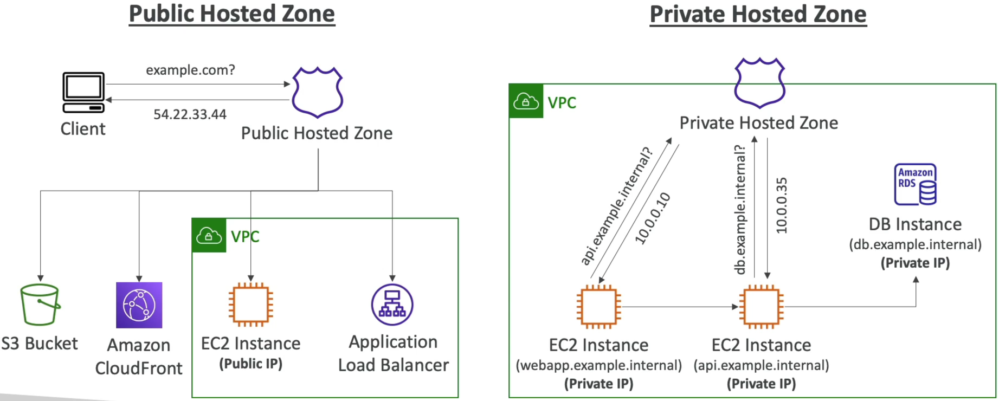

# Route 53 Overview

Amazon Route 53 is a fully managed, highly available, scalable and **authoritative Domain Name System (DNS)** service alongside functioning as a domain registrar. As an authoritative service, it holds the master copy of your domain's zone configurations, giving you programmatic control over how incoming global traffic is filtered, checked for system health, and routed down to specific infrastructure resources.

## Key Takeaways

### The Core DNS Record Arsenal

Every record you create inside Route 53 instructs a client's network layer how to resolve a target string. You must know these core types inside out for the DVA-C02:

| Record Type    | Primary Structural Purpose                                                                           | Practical Example Mapping                          |
| -------------- | ---------------------------------------------------------------------------------------------------- | -------------------------------------------------- |
| `A` Record     | Maps a hostname text string directly to a traditional **IPv4 address**.                              | `example.com → 54.22.33.44`                        |
| `AAAA` Record  | Maps a hostname text string directly to a next-generation **IPv6 address**.                          | `example.com → 2001:db8::ff00:42:8329`             |
| `CNAME` Record | Canonical Name. Maps a hostname text string to **another text hostname string**.                     | `api.example.com → internal-alb-123.amazonaws.com` |
| `NS` Record    | Name Server. Identifies the authoritative server IPs/URLs permitted to answer queries for that zone. | `example.com → ns-123.awsdns-55.com`               |

### ⚠️ The Zone Apex CNAME Constraint

As a senior engineer, this is a rule you will face constantly in production. **You cannot legally create a standard CNAME record for the Top Node or "Zone Apex" of a domain.**

- You can create a CNAME for subdomains (e.g., `www.example.com` or `api.example.com`)
- You cannot create a CNAME for the root apex (e.g., `example.com`). If you need to route apex traffic to an AWS ELB or a CloudFront distribution, you must use AWS's proprietary **Alias Records** instead.

### Public vs. Private Hosted Zones

A **Hosted Zone** acts as the container file storing your collection of records. AWS cleanly splits this service down the middle depending on who is asking for the records:

#### 🌐 Public Hosted Zones

- **The Audience**: The entire open public internet.
- **The Mechanics**: Resolves internet queries targeting public facing applications (like an e-commerce storefront or a landing page portfolio).
- **The Sizing/Cost**: Carries the flat **$0.50/month infrastructure fee** per zone placeholder.

#### 🔒 Private Hosted Zones

- **The Audience**: Strictly internal compute resources locked inside specific **Virtual Private Clouds (VPCs)**.
- **The Mechanics**: Resolves private, internal domain names (like `database.company.internal` or `microservice-A.backend.local`). This allows your internal application layers to discover each other dynamically without exposing their internal private IP arrays (`10.0.x.x`) to public internet lookup scans.

## Exam Tips

- **The Ghost Private Resolution Failure**: If an exam question says, "You created a Private Hosted Zone named `dev.local` and added internal A records for your backend services. However, EC2 instances running inside your custom VPC are completely failing to resolve the internal domain addresses", do not look at your code configuration or SG. **The solution is a foundational VPC attribute setting, for Private Hosted Zones to operate cleanly, you must explicitly enable the two VPC parameters `enableDnsHostnames` and `enableDnsSupport` within your VPC infrastructure properties**.
