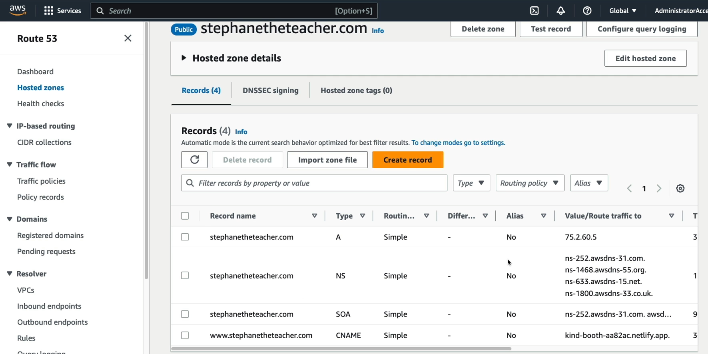

# Registering a Domain

The lab walks through using Amazon Route 53 as an official **Domain Registrar**, to register a domain name availability, purchase a unique top-level domain (TLD), and configure it with privacy protections. The most critical takeaways is the automated side-effect: purchasing a domain through Route 53 instantly provisions a matching **Public Hosted Zone** pre-configured with Authoritative Name Servers (`NS`) and Start of Authority (`SOA`) records, locking in AWS as your immediate source of truth for the internet.

## Key Takeaways

### Step-by-Step Purchase Process

When Stephane goes through the wizard, several critical steps are happening at the infrastructure layer:

1. **Availability Check**: Route 53 queries the central registry for your chosen TLD extension (like `.com`) to ensure the text string hasn't been claimed.
2. **The Auto-Renew Choice**: If you turn **Auto-Renew Off**, the domain will explicitly drop and return to the open public market exactly one year later. In production environment, leaving this _On_ is a non-negotiable security practice to prevent malicious actors from sniping-purchasing your expired business assets.
3. **WHOIS Privacy Protection**: This hides your physical registrant contact information (email, phone, address) behind a proxy mask. Leaving this disabled means marketing scrapers will immediately flood your inbox with spam.

### The Instant Default Zone Records

The moment the global TLD registry confirms your purchase, Route 53 build a **Public Hosted Zone Container** for you. By default, it automatically generate the two baseline records you need to know for the DVA-C02 exam:

```
[ Your New Domain: example.com ]
               │
               ▼
┌────────────────────────────────────────────────────────┐
│             Route 53 Public Hosted Zone                │
├────────────────────────────────────────────────────────┤
│ 1. NS Record  ──> Points to 4 Unique AWS Name Servers  │
│ 2. SOA Record ──> Contains Zone Admin & Sync Metadata  │
└────────────────────────────────────────────────────────┘
```

1. **The NS (Name Server) Record**: Contains for unique, distributed Anycast name server URLs allocated by AWS. These specific endpoints tell the rest of the internet's recursive resolvers exactly which physical AWS clusters hold the master records for your domain.
2. **The SOA (Start of Authority) Record**: A mandatory administrative record that stores metadata about your zone file, including the primary source name server, the administrator's email, and operational timers tracking zone refresh and expiry intervals.

### Billing and Cost Implications

- **The Registration Fee**: This is a flat, annual charge determined by the TLD extension (e.g., around **$13/year** for a standard `.com`). This goes toward maintaining your text name rights.
- **The Hosting Fee**: The moment Route 53 generates that Public Hosted Zone, **you are billed $0.50/month, completely prorated**. Even if you delete all your application code and never add a single web server records, that zone box sitting in your dashboard will cost you $6 a year just to exist.



## Exam Tips

**The Frozen Domain Migration**: Ifa an exam scenario says, "A developer just registered a brand new `.com` domain on Route 53 for quick client project. The client decides two weeks later they want to move the domain registration over to their internal corporate GoDaddy account", **the migration will fail**, under strict ICANN regulatory rules, any newly registered domain is hit with an absolute **60-day transfer lock**. You can still change your records or use external name servers, but the actual ownership registration cannot leave AWS until that 60-day window expires.
